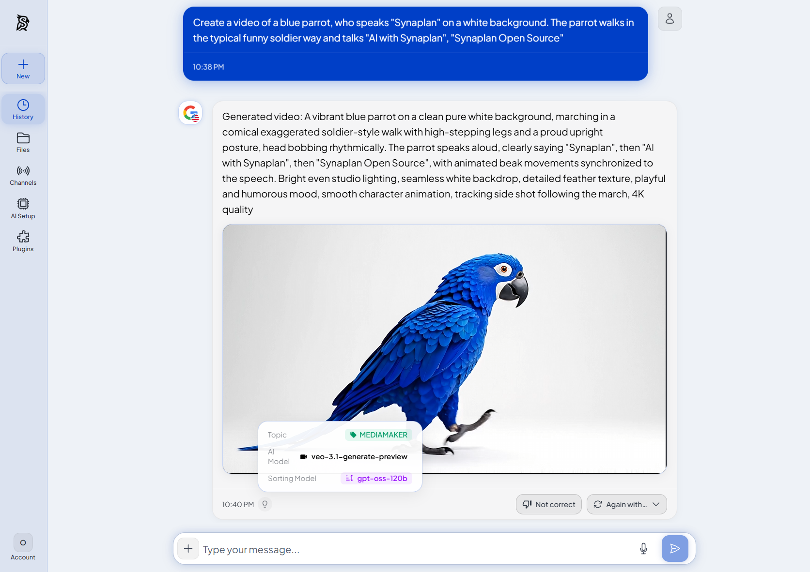

# Synaplan

AI-powered knowledge management with RAG, chat widgets, and multi-channel integration.

[](LICENSE)

> **Live instance**: [web.synaplan.com](https://web.synaplan.com/) &nbsp;|&nbsp; **Docs**: [docs.synaplan.com](https://docs.synaplan.com/) &nbsp;|&nbsp; **API**: [Swagger UI](https://web.synaplan.com/api/doc)



---

## Prerequisites

- **Docker** + **Docker Compose v2** (Docker Desktop on macOS/Windows, or Docker Engine + the Compose plugin on Linux)
- **Git**
- **8 GB RAM** minimum (16 GB recommended for the local-AI standard install)
- **~9 GB free disk** for the standard install (~5 GB for minimal)
- Free TCP ports `5173`, `8000`, `8082`, `8025`, `3307`, `6333`, `11435`

> **Apple Silicon (M1–M4) Macs:** Synaplan's container images are published for `linux/amd64`, so they run under emulation on Apple Silicon. In **Docker Desktop → Settings → General**, enable **"Use Rosetta for x86/amd64 emulation on Apple Silicon"** (macOS 13+) for much faster, more stable containers than the default QEMU. Everything works without it — just slower, and the first build takes longer.

## Quick Start

```bash
git clone https://github.com/metadist/synaplan.git
cd synaplan
docker compose up -d
```

Open http://localhost:5173 — the **UI is ready in ~2 minutes**. With the standard install, local Ollama models (`gpt-oss:20b`, `bge-m3`, ~14 GB total) continue downloading in the background — chat that uses local AI will start working once that download finishes (`docker compose logs -f backend` shows progress). For the fastest first experience, use the [Minimal](#install-options) install below.

---

## Install Options

| Mode | Command | Size | Best For |
|------|---------|------|----------|
| **Standard** | `docker compose up -d` | ~9 GB | Full features, local AI |
| **Minimal** | `docker compose -f docker-compose-minimal.yml up -d` | ~5 GB | Cloud AI only (Groq/OpenAI) |

For the minimal install, set your API key **before** starting the stack so the first boot already sees it (avoids a restart). Get a free key at [console.groq.com](https://console.groq.com):

```bash
echo "GROQ_API_KEY=your_key" >> backend/.env
docker compose -f docker-compose-minimal.yml up -d
```

Already started without a key? Add it and restart the backend:
```bash
echo "GROQ_API_KEY=your_key" >> backend/.env && docker compose restart backend
```

---

## Access

| Service | URL |
|---------|-----|
| App | http://localhost:5173 |
| API | http://localhost:8000 |
| API Docs | http://localhost:8000/api/doc |
| phpMyAdmin | http://localhost:8082 |
| MailHog | http://localhost:8025 |

**Default Login Credentials:**

| Email | Password | Level |
|-------|----------|-------|
| admin@synaplan.com | admin123 | ADMIN |
| demo@synaplan.com | demo123 | PRO |
| test@example.com | test123 | NEW (unverified) |

---

## Features

- **AI Chat** — Ollama, OpenAI, Anthropic, Groq, Gemini
- **Multi-Task Routing** — An AI planner decomposes complex requests into a task graph (extract → summarize → generate → reply) and streams live task cards while the steps execute
- **RAG Search** — Semantic document search with MariaDB VECTOR or Qdrant
- **Chat Widget** — Embed on any website ([widget guide](https://docs.synaplan.com/index.php/widget))
- **Live Support** — Realtime WebSocket layer (Centrifugo + Redis): human takeover of widget chats, typing indicators, operator notifications ([realtime guide](docs/REALTIME.md))
- **WhatsApp** — Meta Business API integration
- **Email** — AI-powered email responses
- **Audio** — Whisper transcription (input) + optional [synaplan-tts](https://github.com/metadist/synaplan-tts) (output)
- **Documents** — PDF, Word, Excel, images with OCR
- **AI Memories** — User profiling with Qdrant vector search
- **Feedback System** — Feedback capture and analysis powered by Qdrant
- **Plugins** — Non-invasive plugin system ([plugin guide](https://docs.synaplan.com/index.php/plugins))
- **MCP Server** *(early access)* — Connect AI clients (Claude, Cursor, …) over the Model Context Protocol; your RAG and memories become tools at `POST /mcp` ([MCP guide](https://docs.synaplan.com/index.php/mcp))
- **MCP Client** *(early access)* — Connect *your* MCP servers (CRM, wiki, n8n, …) under **Channels → MCP Servers**; the multi-task planner pulls live data from them via `mcp_fetch` DAG nodes — read-only, SSRF-guarded, per-topic opt-in. Enabled by seeded `BCONFIG` flags (`MCP.CLIENT_ENABLED`, `MULTITASK.MCP_FETCH_ENABLED` — `app:seed` sets them ON on deploy; an explicit `0` row is the operator kill switch). See [docs/MULTITASK_DATA_NODES.md](docs/MULTITASK_DATA_NODES.md)

---

## Qdrant Vector Database

Qdrant runs as an internal Docker service — no configuration needed. It powers AI memories, RAG document search, and the feedback system.

Starts automatically with `docker compose up -d`. Synaplan works fully without it (memories and vector search will be disabled).

---

## Realtime & Background Processing

Both compose files also start three internal services (no host ports, no setup needed):

| Service | Role |
|---------|------|
| `redis` | Mandatory shared infrastructure: cache, sessions, locks, rate limits, message queues (Redis Streams), Centrifugo engine |
| `centrifugo` | WebSocket gateway for realtime features (live chat takeover, typing indicators, operator notifications) — browsers connect same-origin via `/connection/websocket` |
| `worker` | Symfony Messenger consumer that executes async jobs (AI processing, document indexing, widget crawling) |

In a multi-node cluster all nodes share one Redis, so WebSocket events published on one node reach browsers connected to any other. Details: [docs/REALTIME.md](docs/REALTIME.md).

---

## Text-to-Speech (Optional)

For voice output, run [synaplan-tts](https://github.com/metadist/synaplan-tts) alongside Synaplan:

```bash
git clone https://github.com/metadist/synaplan-tts.git && cd synaplan-tts && docker compose up -d
```

---

## Common Commands

```bash
# Logs
docker compose logs -f backend

# Restart
docker compose restart backend

# Reset database
docker compose down -v && docker compose up -d

# Run tests
make test

# Code quality
make lint
```

---

## Documentation

User-facing & API docs live at **[docs.synaplan.com](https://docs.synaplan.com/)**. Source: [`metadist/synaplan-docs`](https://github.com/metadist/synaplan-docs).

In-repo guides (for developers working on this codebase):

| Guide | Description |
|-------|-------------|
| [Installation](docs/INSTALLATION.md) | Detailed setup instructions |
| [Configuration](docs/CONFIGURATION.md) | Environment variables, API keys |
| [Development](docs/DEVELOPMENT.md) | Commands, testing, architecture |
| [Realtime / WebSockets](docs/REALTIME.md) | Centrifugo + Redis realtime layer, multi-node deployment |
| [RAG System](docs/RAG.md) | Document search and processing |
| [Chat Widget](docs/WIDGET.md) | Embed chat on websites |
| [WhatsApp](docs/WHATSAPP.md) | Meta Business API setup |
| [Email](docs/EMAIL.md) | Email channel integration |

## Related Repositories

| Repo | Purpose |
|------|---------|
| [synaplan](https://github.com/metadist/synaplan) | Main app (this repo) |
| [synaplan-docs](https://github.com/metadist/synaplan-docs) | Public docs site (docs.synaplan.com) |
| [synaplan-tts](https://github.com/metadist/synaplan-tts) | Optional Piper TTS service |
| [synaplan-sortx](https://github.com/metadist/synaplan-sortx) | Document-sorting plugin + local tool |
| [synaplan-charts](https://github.com/metadist/synaplan-charts) | Helm charts for Kubernetes |
| [synaplan-platform](https://github.com/metadist/synaplan-platform) | Production deployment configs |

---

## Project Structure

```
synaplan/
├── backend/        # Symfony PHP API
├── frontend/       # Vue.js SPA
├── docs/           # Documentation
├── _docker/        # Docker configs
└── plugins/        # Plugin system
```

---

## Contributing

See [AGENTS.md](AGENTS.md) for development guidelines and code standards.

---

## License

[Apache-2.0](LICENSE)
