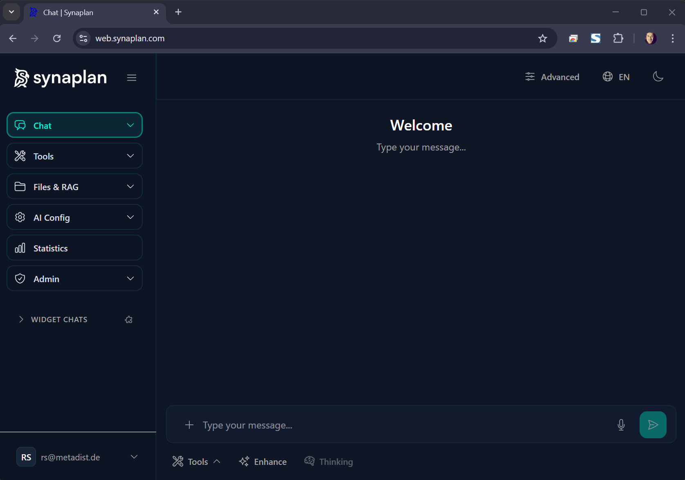

# Synaplan

AI-powered knowledge management with RAG, chat widgets, and multi-channel integration.

[](LICENSE)

> **Live instance**: [web.synaplan.com](https://web.synaplan.com/)



---

## Quick Start

```bash
git clone <repository-url>
cd synaplan
docker compose up -d
```

Open http://localhost:5173 — ready in ~2 minutes.

---

## Install Options

| Mode | Command | Size | Best For |
|------|---------|------|----------|
| **Standard** | `docker compose up -d` | ~9 GB | Full features, local AI |
| **Minimal** | `docker compose -f docker-compose-minimal.yml up -d` | ~5 GB | Cloud AI only (Groq/OpenAI) |

For minimal install, add your API key:
```bash
echo "GROQ_API_KEY=your_key" >> backend/.env && docker compose restart backend
```

---

## Access

| Service | URL |
|---------|-----|
| App | http://localhost:5173 |
| API | http://localhost:8000 |
| API Docs | http://localhost:8000/api/doc |
| phpMyAdmin | http://localhost:8082 |
| MailHog | http://localhost:8025 |

**Default Login Credentials:**

| Email | Password | Level |
|-------|----------|-------|
| admin@synaplan.com | admin123 | ADMIN |
| demo@synaplan.com | demo123 | PRO |
| test@example.com | test123 | NEW (unverified) |

---

## Features

- **AI Chat** — Ollama, OpenAI, Anthropic, Groq, Gemini
- **RAG Search** — Semantic document search with MariaDB VECTOR or Qdrant
- **Chat Widget** — Embed on any website
- **WhatsApp** — Meta Business API integration
- **Email** — AI-powered email responses
- **Audio** — Whisper transcription
- **Documents** — PDF, Word, Excel, images with OCR
- **AI Memories** — User profiling with Qdrant vector search
- **Feedback System** — False-positive detection and learning

---

## Qdrant Vector Database

Qdrant is included in `docker-compose.yml` and starts automatically. It powers:
- **AI Memories** — remembers user preferences across sessions
- **RAG Document Vectors** — semantic search over uploaded documents
- **Feedback System** — false-positive detection and learning

Configure in `backend/.env`:
```bash
QDRANT_URL=http://qdrant:6333
QDRANT_API_KEY=              # optional in dev, recommended in prod
```

Qdrant is **optional** — Synaplan works fully without it (memories and vector search will be disabled).

---

## Common Commands

```bash
# Logs
docker compose logs -f backend

# Restart
docker compose restart backend

# Reset database
docker compose down -v && docker compose up -d

# Run tests
make test

# Code quality
make lint
```

---

## Documentation

| Guide | Description |
|-------|-------------|
| [Installation](docs/INSTALLATION.md) | Detailed setup instructions |
| [Configuration](docs/CONFIGURATION.md) | Environment variables, API keys |
| [Development](docs/DEVELOPMENT.md) | Commands, testing, architecture |
| [RAG System](docs/RAG.md) | Document search and processing |
| [Chat Widget](docs/WIDGET.md) | Embed chat on websites |
| [WhatsApp](docs/WHATSAPP.md) | Meta Business API setup |
| [Email](docs/EMAIL.md) | Email channel integration |

---

## Project Structure

```
synaplan/
├── backend/        # Symfony PHP API
├── frontend/       # Vue.js SPA
├── docs/           # Documentation
├── _docker/        # Docker configs
└── plugins/        # Plugin system
```

---

## Contributing

See [AGENTS.md](AGENTS.md) for development guidelines and code standards.

---

## License

[Apache-2.0](LICENSE)
