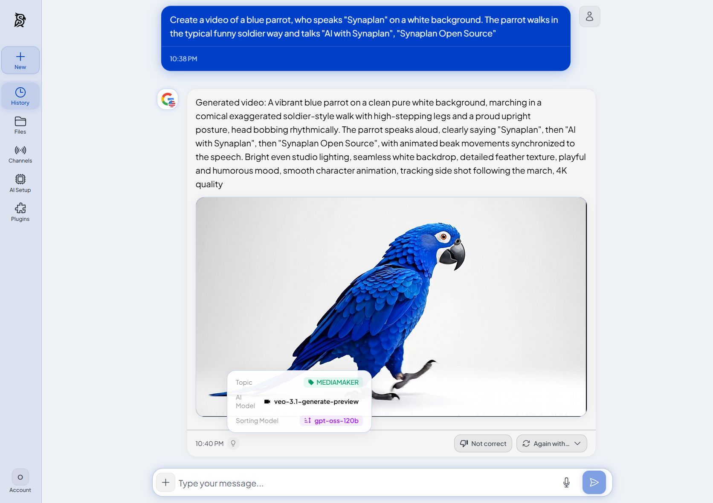

# Synaplan

AI-powered knowledge management with RAG, chat widgets, and multi-channel integration.

[](LICENSE)

> **Live instance**: [web.synaplan.com](https://web.synaplan.com/) &nbsp;|&nbsp; **Docs**: [docs.synaplan.com](https://docs.synaplan.com/) &nbsp;|&nbsp; **API**: [Swagger UI](https://web.synaplan.com/api/doc)

[](https://www.youtube.com/watch?v=WjO9mE43uec)

<p align="center"><a href="https://www.youtube.com/watch?v=WjO9mE43uec">▶ Watch the demo on YouTube</a></p>

---

## Prerequisites

- **Docker** + **Docker Compose v2** (Docker Desktop on macOS/Windows, or Docker Engine + the Compose plugin on Linux)
- **Git**
- **8 GB RAM** minimum (16 GB recommended for the local-AI standard install)
- **~9 GB free disk** for the standard install (~5 GB for minimal, +~14 GB if you enable the local chat model)
- Free TCP ports `5173`, `8000`, `8082`, `8025`, `3307`, `6333`, `11435`

> **Apple Silicon (M1–M4) Macs:** Synaplan's container images are published for `linux/amd64`, so they run under emulation on Apple Silicon. In **Docker Desktop → Settings → General**, enable **"Use Rosetta for x86/amd64 emulation on Apple Silicon"** (macOS 13+) for much faster, more stable containers than the default QEMU. Everything works without it — just slower, and the first build takes longer.

## Quick Start

```bash
git clone https://github.com/metadist/synaplan.git
cd synaplan
docker compose up -d
```

Open http://localhost:5173 — the **UI is ready in ~2 minutes**. The standard install downloads the local embedding model (`bge-m3`, ~1 GB) in the background for RAG and semantic search; progress is shown in the app.

**Then connect an AI provider:** log in as `admin@synaplan.com` / `admin123` and open **Admin → AI Providers** — paste any provider key (free tier: [Groq](https://console.groq.com)), it is tested live, stored encrypted, and chat works immediately.

**Want chat without any cloud key?** Start the stack with `ENABLE_LOCAL_GPT_OSS=true docker compose up -d` to also pull a local chat model (`gpt-oss:20b`, ~14 GB, GPU or strong CPU recommended). Chat starts working when that download finishes — `docker compose logs -f backend` shows progress.

---

## Install Options

| Mode | Command | Size | Best For |
|------|---------|------|----------|
| **Standard** | `docker compose up -d` | ~9 GB | Full features, local embeddings (local chat model optional, +~14 GB) |
| **Minimal** | `docker compose -f docker-compose-minimal.yml up -d` | ~5 GB | Cloud AI only (Groq/OpenAI) |

**Connecting a cloud AI provider (recommended: the UI).** Log in as admin and open **Admin → AI Providers** (`/admin/setup`): paste a key, it is tested live, stored **encrypted in the database**, and active immediately — no restart, no `.env` editing. Get a free key at [console.groq.com](https://console.groq.com).

Prefer the shell? Keys in `backend/.env` still work — the backend reads that file when the container starts and imports the key into the encrypted store on first use. Write the key before starting, or restart the containers afterwards:

```bash
echo "GROQ_API_KEY=your_key" >> backend/.env
docker compose -f docker-compose-minimal.yml up -d
# already running? pick up the new key with:
# docker compose restart backend worker
```

---

## Access

| Service | URL |
|---------|-----|
| App | http://localhost:5173 |
| API | http://localhost:8000 |
| API Docs | http://localhost:8000/api/doc |
| phpMyAdmin | http://localhost:8082 |
| MailHog | http://localhost:8025 |

**Default Login Credentials:**

| Email | Password | Level |
|-------|----------|-------|
| admin@synaplan.com | admin123 | ADMIN |
| demo@synaplan.com | demo123 | PRO |
| test@example.com | test123 | NEW (unverified) |

---

## Features

- **AI Chat** — Ollama, OpenAI, Anthropic, Gemini, Groq, Mistral, xAI, TrustedTokens (DE), HuggingFace ([provider list](#ai-providers--models))
- **Multi-Task Routing** — An AI planner decomposes complex requests into a task graph (extract → summarize → generate → reply) and streams live task cards while the steps execute
- **RAG Search** — Semantic document search with MariaDB VECTOR or Qdrant
- **Chat Widget** — Embed on any website ([widget guide](https://docs.synaplan.com/index.php/widget))
- **Live Support** — Realtime WebSocket layer (Centrifugo + Redis): human takeover of widget chats, typing indicators, operator notifications ([realtime guide](docs/REALTIME.md))
- **WhatsApp** — Meta Business API integration
- **Email** — AI-powered email responses
- **Audio** — Whisper transcription (input) + optional [synaplan-tts](https://github.com/metadist/synaplan-tts) (output)
- **Documents** — PDF, Word, Excel, images with OCR
- **AI Memories** — User profiling with Qdrant vector search
- **Feedback System** — Feedback capture and analysis powered by Qdrant
- **Plugins** — Non-invasive plugin system ([plugin guide](https://docs.synaplan.com/index.php/plugins))
- **MCP Server** *(early access)* — Connect AI clients (Claude, Cursor, …) over the Model Context Protocol; your RAG and memories become tools at `POST /mcp` ([MCP guide](https://docs.synaplan.com/index.php/mcp))
- **MCP Client** *(early access)* — Connect *your* MCP servers (CRM, wiki, n8n, …) under **Channels → MCP Servers**; the multi-task planner pulls live data from them via `mcp_fetch` DAG nodes — read-only, SSRF-guarded, per-topic opt-in. Enabled by seeded `BCONFIG` flags (`MCP.CLIENT_ENABLED`, `MULTITASK.MCP_FETCH_ENABLED` — `app:seed` sets them ON on deploy; an explicit `0` row is the operator kill switch). See [docs/MULTITASK_DATA_NODES.md](docs/MULTITASK_DATA_NODES.md)

---

## AI Providers & Models

Synaplan is provider-neutral: connect the providers you want in **Admin → AI Providers** (keys are validated live and stored encrypted in the database, active without a restart), or set the env variables below in `backend/.env` — those are read at container start and imported into the encrypted store on first use. Each user picks a different model **per task** (chat, vision, image, video, audio, embeddings) — nothing is hardcoded.

| Provider | Variable in `backend/.env` | Models |
|----------|---------------------------|--------|
| OpenAI | `OPENAI_API_KEY` | GPT-5.6 Sol / Terra / Luna, GPT-5.5 (+ Pro), GPT-5.4 (+ mini / nano), GPT Image, Whisper, text-embedding-3 |
| Anthropic | `ANTHROPIC_API_KEY` | Claude Opus 5, Sonnet 5, Fable 5, Opus 4.8, Haiku 4.5 (chat + vision) |
| Google Gemini | `GOOGLE_GEMINI_API_KEY` | Gemini 3.x / 2.5 chat + vision, Imagen 4, Nano Banana, Veo 3.1, Gemini TTS |
| Groq | `GROQ_API_KEY` | Llama 3.3 70B, Llama 3.1 8B Instant, Qwen3 32B, GPT-OSS 20B/120B, Whisper Large v3 |
| Mistral 🇫🇷 | `MISTRAL_API_KEY` | Mistral Medium 3.5 (+ vision), Mistral Large 3, Voxtral transcription + TTS |
| xAI | `XAI_API_KEY` | Grok 4.5 (+ vision, 500K context), Grok Imagine image + video (incl. Pro / 1.5 tiers), Grok TTS + STT |
| [TrustedTokens](https://trustedtokens.eu/) 🇩🇪 | `TRUSTEDTOKENS_API_KEY` | GLM 5.2, Qwen3.6 35B (+ vision), GPT OSS 120B — sovereign inference on German GPUs (TNG), zero data retention |
| HuggingFace | `HUGGINGFACE_API_KEY` | Kimi K2.5 / K2.6 / K2.7 Code (chat + vision) |
| TheHive | `THEHIVE_API_KEY` | Flux Schnell, SDXL |
| Higgsfield | `HIGGSFIELD_API_KEY` + `HIGGSFIELD_API_SECRET` | Soul, Reve, DoP, Kling 2.1 |
| Cloudflare Workers AI | `CLOUDFLARE_ACCOUNT_ID` + `CLOUDFLARE_API_TOKEN` | bge-m3 embeddings (also usable as embedding fallback) |
| Ollama 🇩🇪 self-hosted | `OLLAMA_BASE_URL` (no key) | Any local model — chat, vision, bge-m3 embeddings |

**Transparent pricing.** Every model carries its provider's own rate (USD per 1M tokens in/out, or per image / second / character for media) — no proprietary credit unit in between. The selector shows a Free / Low / Mid / High cost badge next to each model and on every answer, `GET /api/v1/config/models` returns `priceIn` / `priceOut`, and the Statistics page logs the real cost of each call. On the hosted instance at [web.synaplan.com](https://web.synaplan.com/) that same catalog is what your plan meters against; self-hosted with Ollama, the per-token cost is simply zero. Details: [Model pricing & cost transparency](https://docs.synaplan.com/index.php/faq).

> Model catalog changes (new models, retired generations, price updates) ship as seeders plus a migration, so an existing install is repointed to a supported successor instead of silently keeping a dead model. See [docs/PRICING_MAINTENANCE.md](docs/PRICING_MAINTENANCE.md).

---

## Qdrant Vector Database

Qdrant runs as an internal Docker service — no configuration needed. It powers AI memories, RAG document search, and the feedback system.

Starts automatically with `docker compose up -d`. Synaplan works fully without it (memories and vector search will be disabled).

---

## Realtime & Background Processing

Both compose files also start three internal services (no host ports, no setup needed):

| Service | Role |
|---------|------|
| `redis` | Mandatory shared infrastructure: cache, sessions, locks, rate limits, message queues (Redis Streams), Centrifugo engine |
| `centrifugo` | WebSocket gateway for realtime features (live chat takeover, typing indicators, operator notifications) — browsers connect same-origin via `/connection/websocket` |
| `worker` | Symfony Messenger consumer that executes async jobs (AI processing, document indexing, widget crawling) |

In a multi-node cluster all nodes share one Redis, so WebSocket events published on one node reach browsers connected to any other. Details: [docs/REALTIME.md](docs/REALTIME.md).

---

## Text-to-Speech (Optional)

For voice output, run [synaplan-tts](https://github.com/metadist/synaplan-tts) alongside Synaplan:

```bash
git clone https://github.com/metadist/synaplan-tts.git && cd synaplan-tts && docker compose up -d
```

---

## Common Commands

```bash
# Logs
docker compose logs -f backend

# Restart
docker compose restart backend

# Reset database
docker compose down -v && docker compose up -d

# Run tests
make test

# Code quality
make lint
```

---

## Documentation

User-facing & API docs live at **[docs.synaplan.com](https://docs.synaplan.com/)**. Source: [`metadist/synaplan-docs`](https://github.com/metadist/synaplan-docs).

In-repo guides (for developers working on this codebase):

| Guide | Description |
|-------|-------------|
| [Installation](docs/INSTALLATION.md) | Detailed setup instructions |
| [Configuration](docs/CONFIGURATION.md) | Environment variables, API keys |
| [AI Model Pricing](docs/PRICING_MAINTENANCE.md) | Model catalog, provider prices, retiring a model |
| [Development](docs/DEVELOPMENT.md) | Commands, testing, architecture |
| [Realtime / WebSockets](docs/REALTIME.md) | Centrifugo + Redis realtime layer, multi-node deployment |
| [RAG System](docs/RAG.md) | Document search and processing |
| [Chat Widget](docs/WIDGET.md) | Embed chat on websites |
| [WhatsApp](docs/WHATSAPP.md) | Meta Business API setup |
| [Email](docs/EMAIL.md) | Email channel integration |

## Related Repositories

| Repo | Purpose |
|------|---------|
| [synaplan](https://github.com/metadist/synaplan) | Main app (this repo) |
| [synaplan-docs](https://github.com/metadist/synaplan-docs) | Public docs site (docs.synaplan.com) |
| [synaplan-tts](https://github.com/metadist/synaplan-tts) | Optional Piper TTS service |
| [synaplan-sortx](https://github.com/metadist/synaplan-sortx) | Document-sorting plugin + local tool |
| [synaplan-charts](https://github.com/metadist/synaplan-charts) | Helm charts for Kubernetes |
| [synaplan-platform](https://github.com/metadist/synaplan-platform) | Production deployment configs |

---

## Project Structure

```
synaplan/
├── backend/        # Symfony PHP API
├── frontend/       # Vue.js SPA
├── docs/           # Documentation
├── _docker/        # Docker configs
└── plugins/        # Plugin system
```

---

## Contributing

See [AGENTS.md](AGENTS.md) for development guidelines and code standards.

---

## License

[Apache-2.0](LICENSE)
