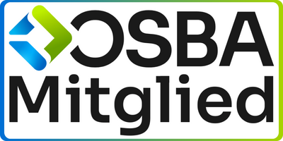

<div align="center">

<a href="https://www.synaplan.com"></a>

**The open-source AI platform — chat, knowledge, media and agents on infrastructure you control.**

[Website](https://www.synaplan.com) &nbsp;·&nbsp; [Docs](https://docs.synaplan.com/) &nbsp;·&nbsp; [Live instance](https://web.synaplan.com/) &nbsp;·&nbsp; [iOS](https://apps.apple.com/app/id6784278288?ct=github-readme) &nbsp;·&nbsp; [Android](https://play.google.com/store/apps/details?id=com.synaplan.app&referrer=utm_source%3Dgithub-readme) &nbsp;·&nbsp; [Desktop](https://github.com/metadist/synaplan-desktop) &nbsp;·&nbsp; [Outlook Add-in](https://github.com/metadist/Synamail) &nbsp;·&nbsp; [Discord](https://discord.com/invite/kQB3eDjWfF)

[](LICENSE)
[](#your-first-answer-in-three-steps)
[](https://apps.apple.com/app/id6784278288?ct=github-readme)
[](https://play.google.com/store/apps/details?id=com.synaplan.app&referrer=utm_source%3Dgithub-readme)
[](https://discord.com/invite/kQB3eDjWfF)
[](https://web.synaplan.com/api/doc)

</div>

---

## Why Synaplan?

- **We open-source artificial intelligence.** The complete platform — backend, frontend, widgets, plugins — is Apache-2.0, Dockerized, and starts with one command. No core/enterprise split, no functional downgrade: self-hosted is the same software as our cloud.
- **Hundreds of models, one platform.** OpenAI, Anthropic, Google Gemini, Groq, Mistral, xAI, HuggingFace, sovereign EU providers, and any local model via Ollama — swap providers per task in the UI, without touching a config file. No vendor lock-in, ever.
- **DAG task routing that saves tokens.** An AI planner decomposes complex requests into a directed task graph (extract → summarize → generate → reply) and routes every step to the model that fits it — a cheap fast model for extraction, a strong one only where reasoning is needed. Live task cards stream while the graph executes, and every answer shows what it cost.
- **Sovereign by design.** Run on-prem, in the EU cloud, or fully air-gapped: chat, RAG knowledge search, document processing, transcription and speech run with zero internet connection. No training on your data, no forced telemetry — proven in production up to 5,000-workplace offline deployments.
- **Everywhere you work.** Web app, [iPhone](https://apps.apple.com/app/id6784278288?ct=github-readme) and [Android](https://play.google.com/store/apps/details?id=com.synaplan.app&referrer=utm_source%3Dgithub-readme) apps, [Desktop](https://github.com/metadist/synaplan-desktop), [Outlook add-in](https://github.com/metadist/Synamail), embeddable chat widget, WhatsApp, email — plus the tools you already run: Microsoft 365, Dropbox, Nextcloud / ownCloud, calendars, Jira and Confluence, and [OpenCloud](https://github.com/metadist/synaplan-opencloud).
- **Extensible without forking.** A non-invasive plugin system, an OpenAPI-documented REST API, an MCP server *and* client, and an Anthropic-compatible endpoint for Claude Code and friends. Optional sidecars stay optional: file work, office conversion and local search never leak a half-working control when they are off.

---

## Your first answer in three steps

One line — the installer checks Docker, fetches Synaplan, and starts the stack:

```bash
curl -fsSL https://raw.githubusercontent.com/metadist/synaplan/main/install.sh | bash
```

Or do exactly the same by hand:

```bash
git clone https://github.com/metadist/synaplan.git
cd synaplan
make up
```

1. **Open <http://localhost:5173> immediately.** A live status screen appears within seconds and shows every boot step — database, backend, AI model download, interface — then switches to the app automatically the moment it is ready (first start: 5–15 minutes; every later start: seconds). It also lists which [optional building blocks](#lean-by-design-core-vs-optional-building-blocks) (Qdrant, Centrifugo, Collabora, …) this install is running and how to switch each on or off. The same notes print in `docker compose logs -f startup-notes`.
2. **Log in** as `admin@synaplan.com` / `admin123` — the status screen shows these too.
3. **Connect an AI provider — the app takes you there.** Until a key is in place, chat answers in demo mode and points you to the setup. Open **AI provider setup**, paste one key (free: [Groq](https://console.groq.com)), and you are chatting. **You never touch a config file.**

That is the whole local-hosting onboarding. After chat works, open **Channels → Connections** to hook up Outlook, Nextcloud, Dropbox, a calendar, or Jira / Confluence — then you can say *"summarize the latest mail from X"* or *"create a picture and put it in nextcloud"*.

### Key management, the short version

- **The first-run screen is the setup.** You do not have to hunt through Admin: an empty install blocks chat with a single **Go to AI provider setup** button. The same wizard lives at **Admin → AI Providers** (`/admin/setup`) later.
- **Tested before it's saved.** The key is validated against the live provider API, so a typo fails immediately instead of at your first chat.
- **Encrypted at rest.** It lives encrypted in your own database, not in a plaintext file on disk.
- **Active instantly.** No restart and no rebuild — the next message already uses it.
- **Defaults repair themselves.** If the default chat model points at a provider you have no key for, Synaplan repoints it to one that works, so chat is never dead on a fresh install.
- **Local-model progress is visible.** A download card in the setup wizard (and in `docker compose logs -f backend`) shows how far the optional Ollama pull has got; cloud chat works while it runs.
- **`.env` still works.** Keys already in `backend/.env` are imported into the encrypted store on first use, and a key you later save in the UI wins permanently.

**No cloud key at all?** Start with `COMPOSE_PROFILES=local-ai ENABLE_LOCAL_GPT_OSS=true docker compose up -d` to run Ollama and pull a local chat model (`gpt-oss:20b`, ~14 GB, GPU or a strong CPU recommended). Chat begins working when the download finishes.

### Host it on your own server

The commands above start the **development** stack (source build, Vite, MailHog, phpMyAdmin). For a production install on a Linux box, the same installer drives the published image and the `deploy/` contract — it writes `deploy/.env` for you (the step most installs stumble over), pins the latest release, creates the first administrator, and runs the full lifecycle (prepare → pull → validate → start → smoke-test). Secrets are generated on first start and recorded in `deploy/data/secrets.env`:

```bash
curl -fsSL https://raw.githubusercontent.com/metadist/synaplan/main/install.sh | \
  bash -s -- --mode server --domain https://ai.example.com
```

Prefer manual control? The identical steps by hand:

```bash
cp deploy/selfhost.env.example deploy/.env
# Set SYNAPLAN_VERSION, public URL, and BOOTSTRAP_ADMIN_* (or leave both admin vars empty and sign up later)
deploy/scripts/prepare.sh
docker compose --env-file deploy/.env -f deploy/compose.yaml pull
deploy/scripts/validate-release.sh
docker compose --env-file deploy/.env -f deploy/compose.yaml up -d
```

After login, the **same first-run provider screen** applies. Full walkthrough: [Installation](docs/INSTALLATION.md) · [deploy/README.md](deploy/README.md).

---

## Take the tour


<p align="center"><a href="https://www.youtube.com/watch?v=WjO9mE43uec">▶ Watch the full demo on YouTube</a></p>

Click any screenshot to see it full size.

<table>
  <tr>
    <td width="25%" align="center">
      <a href="docs/images/tour/chat.webp"></a><br>
      <sub><b>Chat</b><br>Every answer shows what it cost</sub>
    </td>
    <td width="25%" align="center">
      <a href="docs/images/tour/provider-setup.webp"></a><br>
      <sub><b>Provider setup</b><br>One key, tested and encrypted</sub>
    </td>
    <td width="25%" align="center">
      <a href="docs/images/tour/model-selection.webp"></a><br>
      <sub><b>Model choice</b><br>A different model per task</sub>
    </td>
    <td width="25%" align="center">
      <a href="docs/images/tour/rag-search.webp"></a><br>
      <sub><b>RAG search</b><br>Semantic search over your files</sub>
    </td>
  </tr>
  <tr>
    <td width="25%" align="center">
      <a href="docs/images/tour/media-generation.webp"></a><br>
      <sub><b>Media generation</b><br>Images, video and audio in chat</sub>
    </td>
    <td width="25%" align="center">
      <a href="docs/images/tour/chat-widget.webp"></a><br>
      <sub><b>Chat widget</b><br>One snippet, any website</sub>
    </td>
    <td width="25%" align="center">
      <a href="docs/images/tour/system-prompts.webp"></a><br>
      <sub><b>AI instructions</b><br>Your own system prompts</sub>
    </td>
    <td width="25%" align="center">
      <a href="docs/images/tour/file-manager.webp"></a><br>
      <sub><b>Files</b><br>Uploads become knowledge</sub>
    </td>
  </tr>
  <tr>
    <td width="25%" align="center">
      <a href="docs/images/tour/plugins.webp"></a><br>
      <sub><b>Plugins</b><br>Extend without forking</sub>
    </td>
    <td width="25%" align="center">
      <a href="docs/images/tour/admin-panel.webp"></a><br>
      <sub><b>Admin</b><br>Users, usage and health</sub>
    </td>
    <td width="25%" align="center">
      <a href="docs/images/tour/branding.webp"></a><br>
      <sub><b>Branding</b><br>White-label the whole app</sub>
    </td>
    <td width="25%"></td>
  </tr>
</table>

<sub>Regenerate these assets after a UI change with <code>scripts/build-readme-tour.sh</code>.</sub>

---

## One AI, everywhere you work

The same assistant, the same knowledge base, the same model policy — on every channel your team already uses. Connect a system once under **Channels**; the planner can then read from it and deliver results into it.

### Conversation surfaces

| Surface | What it does | Get it |
|---------|--------------|--------|
| **Web app** | Full chat + admin UI, light/dark, five languages | This repo — `docker compose up -d` |
| **Mobile apps** | Chat, documents and voice on iPhone and Android — pointed at web.synaplan.com or your own server | [App Store](https://apps.apple.com/app/id6784278288?ct=github-readme) · [Google Play](https://play.google.com/store/apps/details?id=com.synaplan.app&referrer=utm_source%3Dgithub-readme) |
| **Desktop Client** | Pair a computer, keep research local, run Agents on this machine | [metadist/synaplan-desktop](https://github.com/metadist/synaplan-desktop) |
| **Outlook add-in** | Bring Synaplan into Outlook (Web, new & classic, Mac) — find and process mail without sending it anywhere | [metadist/Synamail](https://github.com/metadist/Synamail) |
| **Chat widget** | Embed your assistant on any website with one snippet — cross-origin ready, human takeover included | [Widget guide](https://docs.synaplan.com/index.php/widget) |
| **WhatsApp & Email** | The AI answers on the channel the question came in on | [WhatsApp](docs/WHATSAPP.md) · [Email](docs/EMAIL.md) |
| **MCP & Claude Code** | Your RAG and memories as MCP tools; Anthropic-compatible `POST /v1/messages` endpoint | [MCP guide](https://docs.synaplan.com/index.php/mcp) · [guide](docs/ANTHROPIC_COMPATIBLE_API.md) |

### Connected systems

Set these up under **Channels → Connections** (or **Channels → MCP servers** / **Channels → Email**). In chat, use the channel word shown as a pill on the Connections page — for example *nextcloud*, *dropbox*, *outlook*.

| Channel | What it unlocks | Setup |
|---------|-----------------|-------|
| **Microsoft 365** | Live Outlook mail search, calendar events (`outlook`), send from your own mailbox | **Channels → Connections** — OAuth, no password stored |
| **Dropbox** | Save generated files into a Dropbox folder (`dropbox`) | **Channels → Connections** — OAuth |
| **Nextcloud / ownCloud / WebDAV** | File results into a folder you own (`nextcloud` / `folder`) | **Channels → Connections** — app password, never your account password |
| **CalDAV calendar** | Put generated meetings into a calendar you own (`calendar`) | Same Nextcloud preset can create folder + calendar in one step |
| **IMAP mailbox** | Live search of any IMAP inbox, merged with Microsoft 365 results | **Channels → Email** |
| **Jira & Confluence** | Search and summarize; create tickets or pages when you allow writes | **Channels → MCP servers** — Atlassian quick-start presets |
| **Saved Tasks** | Pin a plan and run it on demand or on a schedule (hourly / daily / weekdays) | **Channels → Saved Tasks** |
| **Nextcloud / OpenCloud apps** | Use files from those clouds as AI knowledge — the file store stays in charge | [synaplan-nextcloud](https://github.com/metadist/synaplan-nextcloud) · [synaplan-opencloud](https://github.com/metadist/synaplan-opencloud) |

Details and channel words: [docs/CONNECTIONS.md](docs/CONNECTIONS.md).

---

## The Synaplan ecosystem

Everything below is the same platform, packaged for different homes. Pick what fits — nothing else is required.

| Project | What it is |
|---------|------------|
| **[synaplan](https://github.com/metadist/synaplan)** | The platform itself (this repo): backend, frontend, widget, plugins, dev stack, and the `deploy/` production contract with Elestio, AWS Marketplace, and Umbrel adapters |
| **[synaplan-charts](https://github.com/metadist/synaplan-charts)** | Helm charts for Kubernetes — for partners and enterprises running K8s clusters |
| **[Mobile apps](https://github.com/metadist/synaplan-apps)** | Native iOS and Android — [App Store](https://apps.apple.com/app/id6784278288?ct=github-readme) · [Google Play](https://play.google.com/store/apps/details?id=com.synaplan.app&referrer=utm_source%3Dgithub-readme) |
| **[synaplan-desktop](https://github.com/metadist/synaplan-desktop)** | Desktop Client — pair a computer and run Agents locally |
| **[Synamail](https://github.com/metadist/Synamail)** | Outlook add-in (Web, new & classic, Mac) — Synaplan inside your mailbox |
| **[synaplan-nextcloud](https://github.com/metadist/synaplan-nextcloud)** / **[synaplan-opencloud](https://github.com/metadist/synaplan-opencloud)** | Apps for Nextcloud / OpenCloud — use those files as AI knowledge while the file store stays in charge (ownCloud works via the built-in WebDAV connection) |
| **[synaplan-tts](https://github.com/metadist/synaplan-tts)** | Optional self-hosted text-to-speech service for voice output |
| **[synaplan-base-php](https://github.com/metadist/synaplan-base-php)** | The base Docker image (FrankenPHP + gRPC + whisper.cpp) the platform builds on |

---

## Prerequisites

- **Docker** + **Docker Compose v2** (Docker Desktop on macOS/Windows, or Docker Engine + the Compose plugin on Linux)
- **Git**
- **8 GB RAM** minimum (16 GB recommended once you add the `local-ai` profile)
- **~4 GB free disk** for the standard install (includes file work + spoken answers; +~1 GB for `local-ai`, +~14 GB if you also enable the local chat model)
- Free TCP ports `5173`, `8000`, `8082`, `8025`, `3307`, `6333`, `11435`

> **Apple Silicon (M1–M4) Macs — build the backend image, don't pull it.** The three-step start above already does this: `docker compose up -d` builds the backend and worker locally from a multi-arch base image, so PHP/FrankenPHP runs **natively on `arm64`** with no emulation tax. That is by far the fastest setup, and it is the default — you don't have to do anything special. The pre-built `ghcr.io/metadist/synaplan` image published for production deployments is `linux/amd64` only, so pulling it instead means running the whole backend under emulation. The first local build takes a few minutes; every later start is a cache hit. Two optional dev tools (phpMyAdmin, MailHog) are still amd64-only upstream images — if you keep them, enable **Docker Desktop → Settings → General → "Use Rosetta for x86/amd64 emulation on Apple Silicon"** (macOS 13+) so those two emulate quickly.

---

## Install Options

| Mode | Command | Size | Best For |
|------|---------|------|----------|
| **One-liner** | `curl -fsSL https://raw.githubusercontent.com/metadist/synaplan/main/install.sh \| bash` | ~3 GB | Easiest start — checks prerequisites, fetches, and starts the standard stack (`--minimal` and `--mode server` available) |
| **Standard** | `docker compose up -d` | ~4 GB | Local try-out: chat, file work, spoken answers — add one provider key and it works |
| **+ local AI** | `COMPOSE_PROFILES=local-ai docker compose up -d` | ~5 GB | Adds Ollama and the `bge-m3` embedding model on your own hardware (local chat model optional, +~14 GB) |
| **Production** | `install.sh --mode server` or `deploy/` compose + scripts | published image | Self-host on a Linux server — see [Installation](docs/INSTALLATION.md) |
| **Kubernetes** | [synaplan-charts](https://github.com/metadist/synaplan-charts) | published image | Helm-based cluster deployments for partners and enterprises |

No AI weights are downloaded by default, so the first boot is dominated by the Docker images and `npm ci`. `COMPOSE_PROFILES=local-ai` is the same switch a self-hosted install uses in `deploy/.env`, and it pulls the local embedding model (`bge-m3`, ~1 GB) in the background for RAG and semantic search; progress is shown in the app.

Prefer the shell to the UI for provider keys? Keys in `backend/.env` still work — the backend reads that file when the container starts and imports the key into the encrypted store on first use. Write the key before starting, or restart the containers afterwards:

```bash
echo "GROQ_API_KEY=your_key" >> backend/.env
docker compose up -d
# already running? pick up the new key with:
# docker compose restart backend worker
```

---

## Access

| Service | URL |
|---------|-----|
| App | http://localhost:5173 |
| API | http://localhost:8000 |
| API Docs | http://localhost:8000/api/doc |
| phpMyAdmin | http://localhost:8082 |
| MailHog | http://localhost:8025 |

**Default Login Credentials:**

| Email | Password | Level |
|-------|----------|-------|
| admin@synaplan.com | admin123 | ADMIN |
| demo@synaplan.com | demo123 | PRO |
| test@example.com | test123 | NEW (unverified) |

---

## Features

- **AI Chat** — Ollama, OpenAI, Anthropic, Gemini, Groq, Mistral, xAI, TrustedTokens (DE), A2Agent (CN), HuggingFace ([provider list](#ai-providers--models))
- **Self-aware assistant** — Ask "What can you do here?" or type `/help`; the AI assistant answers from this installation's live capabilities, not a generic brochure
- **Multi-Task DAG Routing** — An AI planner decomposes complex requests into a directed task graph (extract → summarize → generate → reply), routes each step to the model that fits it, and streams live task cards while the steps execute — cheaper models for simple steps means fewer wasted tokens
- **RAG Search** — Semantic document search with MariaDB VECTOR or Qdrant
- **Chat Widget** — Embed on any website ([widget guide](https://docs.synaplan.com/index.php/widget))
- **Mobile Apps** — Chat, documents and voice on iPhone and Android, pointed at web.synaplan.com or at your own server ([App Store](https://apps.apple.com/app/id6784278288?ct=github-readme) · [Google Play](https://play.google.com/store/apps/details?id=com.synaplan.app&referrer=utm_source%3Dgithub-readme))
- **Desktop Client** — Pair a computer and run Agents locally ([synaplan-desktop](https://github.com/metadist/synaplan-desktop))
- **AI assistants** — Saved recipes (instructions, knowledge folders, tools, triggers) that you publish in versions ([assistants](https://docs.synaplan.com/assistants))
- **Tools & approvals** — One tool registry; write-class actions pause under **Approvals** ([tools](https://docs.synaplan.com/tools-and-approvals))
- **People & groups** — Share folders, chats, assistants and tasks; **Operate → People** ([people](https://docs.synaplan.com/people-and-groups))
- **File work** — Short Python or Node runs on *copies* of files you picked, in an isolated sidecar ([guide](docs/COMPUTE.md))
- **Live Support** — Realtime WebSocket layer (Centrifugo + Redis): human takeover of widget chats, typing indicators, operator notifications ([realtime guide](docs/REALTIME.md))
- **WhatsApp** — Meta Business API integration
- **Email** — AI-powered email responses, plus live mailbox search (IMAP and Microsoft 365)
- **Connections** — Microsoft 365, Dropbox, Nextcloud / ownCloud / WebDAV, CalDAV — read mail, file results, write calendar events ([connections guide](docs/CONNECTIONS.md))
- **Saved Tasks** — Pin a multi-step plan and run it on demand or on a schedule, with a **Steps** editor and webhook trigger (**Manage → Automations → Saved Tasks**)
- **Watched pages** — Save a URL, compare it on a schedule, and mail the diff when it changes
- **Audio** — Whisper transcription (input) + optional [synaplan-tts](https://github.com/metadist/synaplan-tts) (output; four baked voices, UI language selects the voice)
- **Documents** — PDF, Word, Excel, images with OCR; the assistant can also build and revise Office files; optional Collabora CODE sidecar for thumbnails, PDF export, preview and combine ([office documents](https://docs.synaplan.com/index.php/office-documents))
- **AI Memories** — User profiling with Qdrant vector search
- **Feedback System** — Feedback capture and analysis powered by Qdrant
- **Plugins** — Non-invasive plugin system ([plugin guide](https://docs.synaplan.com/index.php/plugins))
- **MCP Server** *(early access)* — Connect AI clients (Claude, Cursor, …) over the Model Context Protocol; your RAG and memories become tools at `POST /mcp` ([MCP guide](https://docs.synaplan.com/index.php/mcp))
- **MCP Client** *(early access)* — Connect *your* MCP servers (Jira, Confluence, CRM, wiki, n8n, …) under **Channels → MCP Servers**. The planner pulls live data via `mcp_fetch` and, when you enable **allow write actions** on that server, can create tickets or pages via `mcp_action` — destructive tools stay refused. SSRF-guarded, per-topic opt-in. Seeded `BCONFIG` flags (`MCP.CLIENT_ENABLED`, `MULTITASK.MCP_FETCH_ENABLED`, `MULTITASK.MCP_ACTION_ENABLED`) turn this on; an explicit `0` row is the operator kill switch. See [docs/MULTITASK_DATA_NODES.md](docs/MULTITASK_DATA_NODES.md)
- **Claude Code & Anthropic-compatible API** — Point Claude Code or any Anthropic-protocol client at your instance (`POST /v1/messages`); configure under **Channels → AI Agents** ([guide](docs/ANTHROPIC_COMPATIBLE_API.md))

---

## AI Providers & Models

Synaplan is provider-neutral: connect the providers you want in **Admin → AI Providers** (keys are validated live and stored encrypted in the database, active without a restart), or set the env variables below in `backend/.env` — those are read at container start and imported into the encrypted store on first use. Each user picks a different model **per task** (chat, vision, image, video, audio, embeddings) — nothing is hardcoded.

| Provider | Variable in `backend/.env` | Models |
|----------|---------------------------|--------|
| OpenAI | `OPENAI_API_KEY` | GPT-5.6 Sol / Terra / Luna, GPT-5.5 (+ Pro), GPT-5.4 (+ mini / nano), GPT Image, Whisper, text-embedding-3 |
| Anthropic | `ANTHROPIC_API_KEY` | Claude Opus 5, Sonnet 5, Fable 5, Opus 4.8, Haiku 4.5 (chat + vision) |
| Google Gemini | `GOOGLE_GEMINI_API_KEY` | Gemini 3.x / 2.5 chat + vision, Nano Banana (incl. Pro / Lite), Veo 3.1, Gemini TTS |
| Groq | `GROQ_API_KEY` | Qwen 3.6 27B (chat + vision), GPT-OSS 20B/120B, Whisper Large v3 |
| Mistral 🇫🇷 | `MISTRAL_API_KEY` | Mistral Medium 3.5 (+ vision), Mistral Large 3, Voxtral transcription + TTS |
| xAI | `XAI_API_KEY` | Grok 4.5 (+ vision, 500K context), Grok Imagine image + video (incl. Pro / 1.5 tiers) |
| [TrustedTokens](https://trustedtokens.eu/) 🇩🇪 | `TRUSTEDTOKENS_API_KEY` | GLM 5.2 / 5.3 (+ Flash vision), Chimera, Qwen3.6 35B (+ vision), GPT OSS 120B — sovereign inference on German GPUs (TNG), zero data retention |
| [A2Agent](https://a2agent.me/) 🇨🇳 | `A2AGENT_API_KEY` | Qwen3.8 MAX / Flash (+ vision), DeepSeek V4 Pro / Flash, MiniMax M3 — Chinese frontier models via the A2Agent gateway |
| HuggingFace | `HUGGINGFACE_API_KEY` | Kimi K3 / K2.5 / K2.6 / K2.7 Code (chat + vision) |
| TheHive | `THEHIVE_API_KEY` | Flux Schnell, SDXL |
| Higgsfield | `HIGGSFIELD_API_KEY` + `HIGGSFIELD_API_SECRET` | Soul, Reve, DoP, Kling 2.1 |
| Cloudflare Workers AI | `CLOUDFLARE_ACCOUNT_ID` + `CLOUDFLARE_API_TOKEN` | bge-m3 embeddings (also usable as embedding fallback) |
| Ollama 🇩🇪 self-hosted | `OLLAMA_BASE_URL` (no key) | Any local model — chat, vision, bge-m3 embeddings |

**Transparent pricing.** Every model carries its provider's own rate (USD per 1M tokens in/out, or per image / second / character for media) — no proprietary credit unit in between. The selector shows a Free / Low / Mid / High cost badge next to each model and on every answer, `GET /api/v1/config/models` returns `priceIn` / `priceOut`, and the Statistics page logs the real cost of each call. On the hosted instance at [web.synaplan.com](https://web.synaplan.com/) that same catalog is what your plan meters against; self-hosted with Ollama, the per-token cost is simply zero. Details: [Model pricing & cost transparency](https://docs.synaplan.com/index.php/faq).

> Model catalog changes (new models, retired generations, price updates) ship as seeders, so an existing install is repointed to a supported successor instead of silently keeping a dead model — a retirement records the successor and every install is switched off on the next deploy. See [docs/PRICING_MAINTENANCE.md](docs/PRICING_MAINTENANCE.md).

---

## Lean by design: core vs optional building blocks

`docker compose up -d` starts a complete platform, but the **core is deliberately small**: the app, its database and Redis. Everything else is a building block that adds one capability and costs RAM. Switch a block on when you need it and off when you don't — Synaplan keeps running either way and simply hides the matching feature. The boot status screen at <http://localhost:5173> lists the live on/off state of every block, and **Admin → System Status** (`/admin/features`) does the same after login.

| Block | Gives you | Default | Switch |
|-------|-----------|---------|--------|
| **Core** — `frontend`, `backend`, `worker`, `db` (MariaDB), `redis` | The app, its API, async jobs, storage, cache and queues | always on | — |
| **Ollama** (`ollama`) | Local AI on your hardware: `bge-m3` embeddings for document search, optional local chat (`ENABLE_LOCAL_GPT_OSS=true`) | **off** | `COMPOSE_PROFILES=local-ai docker compose up -d` — the same switch as `deploy/.env` in production |
| **Qdrant** (`qdrant`) | Vector database for AI memories, feedback analysis and large-scale RAG | on | `docker compose stop qdrant` — document search itself runs on **MariaDB VECTOR** (the default `VECTOR_STORAGE_PROVIDER`), so RAG keeps working; memories pause |
| **Centrifugo** (`centrifugo`) | Live support: human takeover of widget chats, typing indicators, operator notifications ([realtime guide](docs/REALTIME.md)) | on | `REALTIME_ENABLED=false docker compose up -d` (then `docker compose stop centrifugo`) — the dashboard falls back to plain REST refreshes |
| **Apache Tika** (`tika`) | Text extraction from PDF, Word, Excel and 1000+ formats for RAG | on | `docker compose stop tika` — uploads then index plain text / OCR only |
| **Collabora CODE** (`collabora`) | Office files: thumbnails, “Download as PDF”, inline preview, “Combine as PDF” (~2 GB RAM) — [details](#office-documents-optional-collabora-code) | **off** | `docker compose --profile office up -d` |
| **Docling** (`docling`) | Layout-aware extraction (tables, headings) in front of Tika — [module](https://docs.synaplan.com/modules/docling) | **off** | `docker compose --profile docling up -d` |
| **SearXNG** (`searxng`) | Self-hosted web search so queries stay on your network — [module](https://docs.synaplan.com/modules/searxng) | **off** | `docker compose --profile searxng up -d` |
| **File work** (`compute`) | Short Python / Node jobs on copies of files you pick — [details](#file-work) | **on** | `COMPUTE_URL=disabled docker compose up -d` |
| **Text-to-speech** (`tts`) | Spoken answers, four built-in voices — [details](#text-to-speech) | **on** | `docker compose stop tts` |
| **Keycloak** (`keycloak`) | SSO test realm for OIDC development ([configuration](docs/CONFIGURATION.md)) | **off** | `docker compose --profile oidc up -d` |

**Keep a default-on block off across restarts.** `docker compose stop` is undone by the next `up -d`. To make a block opt-in permanently, give it a profile in a `docker-compose.override.yml` (not tracked by git) — plain `up -d` then skips it, `--profile optional` brings it back:

```yaml
services:
  qdrant:
    profiles: [optional]
```

Production follows the same rule set: [`deploy/compose.yaml`](deploy/README.md) ships the core plus Qdrant, Centrifugo, Tika and spoken answers, with `office`, `local-ai` and `compute` as profiles (`COMPOSE_PROFILES=office,local-ai,compute` in `deploy/.env`). Kubernetes installs wire the same services via [synaplan-charts](https://github.com/metadist/synaplan-charts). The other dev-only containers (`phpmyadmin`, `mailhog`, `frontend-widgets`, `startup-notes`) never ship to production.

---

## Realtime & Background Processing

Both compose files also start three internal services (no host ports, no setup needed):

| Service | Role |
|---------|------|
| `redis` | Mandatory shared infrastructure: cache, sessions, locks, rate limits, message queues (Redis Streams), Centrifugo engine |
| `centrifugo` | WebSocket gateway for realtime features (live chat takeover, typing indicators, operator notifications) — browsers connect same-origin via `/connection/websocket` |
| `worker` | Symfony Messenger consumer that executes async jobs (AI processing, document indexing, widget crawling) |

In a multi-node cluster all nodes share one Redis, so WebSocket events published on one node reach browsers connected to any other. Details: [docs/REALTIME.md](docs/REALTIME.md).

---

## Text-to-Speech

Voice output starts with `docker compose up` — [synaplan-tts](https://github.com/metadist/synaplan-tts), image [`ghcr.io/metadist/synaplan-tts`](https://github.com/metadist/synaplan-tts/pkgs/container/synaplan-tts). The image already contains **four Piper voices** (English, German, Spanish, Turkish). Stop the `tts` container to hide the speaker control.

```bash
# Already running after `docker compose up`. Standalone on another machine:
docker run -d --name synaplan-tts -p 127.0.0.1:10200:10200 ghcr.io/metadist/synaplan-tts:latest
```

The backend looks at `SYNAPLAN_TTS_URL` (compose default `http://tts:10200`).

**The UI language selects the voice.** Chat sends the active frontend locale (`en` / `de` / `es` / `tr`); if the backend detects a different reply language, that wins. Piper then maps the short code to the matching baked voice (German UI → Thorsten, Spanish → davefx, …). There is no separate voice picker. Add more Piper models by dropping `.onnx` + `.onnx.json` into the extra-voices volume — see [synaplan-tts README](https://github.com/metadist/synaplan-tts#adding-more-voices) and [docs.synaplan.com/tts](https://docs.synaplan.com/index.php/tts).

---

## Office documents (Optional Collabora CODE)

Office thumbnails, “Download as PDF”, inline preview, officemaker PDF output,
legacy / Apple format conversion, and “Combine as PDF” need a **Collabora CODE**
sidecar (`collabora/code`). Chat, Tika RAG and officemaker DOCX / XLSX / PPTX
work without it. The sidecar is **off by default** (`--profile office`) so
`docker compose up -d` does not pull the image or spend the extra ~2 GB RAM.

```bash
# Dev / minimal — compose already defaults OFFICE_CONVERT_URL to http://collabora:9980
docker compose --profile office up -d

# Production (deploy/) — env, not backend/.env
# in deploy/.env:  COMPOSE_PROFILES=office
docker compose --env-file deploy/.env -f deploy/compose.yaml --profile office up -d

# Already running CODE (Nextcloud, OpenCloud, another compose)
OFFICE_CONVERT_URL=http://<existing-collabora-host>:9980 docker compose up -d
```

Do **not** put `OFFICE_CONVERT_URL` in `backend/.env`: Compose injects the
variable, so the file cannot override it. Deployments set the env on the host
or in compose. `OFFICE_CONVERT_URL=disabled` turns the engine off.

**Collabora never sees Synaplan users.** Convert-to is a server-to-server POST
of a file; identity stays in Synaplan (login + file ownership). No Collabora
accounts, no WOPI token on this path. HTTP 403 is usually CODE’s
`net.post_allow.host` rejecting the compose subnet.

Full operator guide: [docs.synaplan.com/office-documents](https://docs.synaplan.com/index.php/office-documents).
Kubernetes / reuse in other projects:
[synaplan-charts `docs/collabora-office-engine.md`](https://github.com/metadist/synaplan-charts/blob/docs/collabora-office-engine/docs/collabora-office-engine.md).

---

## File work

The assistant can run a **short Python or Node program** on *copies* of files
you already picked and hand the result back as files — a chart from a CSV, a
merged spreadsheet, a renamed folder of PDFs. The program runs in an isolated
sidecar. PHP never talks to Docker.

`git clone` and `docker compose up` start it. Compose builds the sidecar and
the Python/Node runtimes from this repo, wires a local token, and turns the
feature on. No profile, no image pin, no extra `.env`.

To hide it: `COMPUTE_URL=disabled docker compose up -d` (or
`FEATURE_COMPUTE_ENABLED=false`). Never publish port `8080`. Production
self-host adds `compute` to `COMPOSE_PROFILES` in `deploy/.env` —
`prepare.sh` writes the token. Cloud uses a **separate** gVisor box, not this
T1 sidecar on the web nodes.

Full guide: [docs/COMPUTE.md](docs/COMPUTE.md) ·
[docs.synaplan.com — Secure compute](https://docs.synaplan.com/modules/compute).

---

## Common Commands

```bash
# Startup progress ("please wait..." notes + READY message)
docker compose logs -f startup-notes

# Logs
docker compose logs -f backend

# Restart
docker compose restart backend

# Reset database
docker compose down -v && docker compose up -d

# Run tests
make test

# Code quality
make lint
```

---

## Documentation

User-facing & API docs live at **[docs.synaplan.com](https://docs.synaplan.com/)**. Source: [`metadist/synaplan-docs`](https://github.com/metadist/synaplan-docs).

In-repo guides (for developers working on this codebase):

| Guide | Description |
|-------|-------------|
| [Installation](docs/INSTALLATION.md) | Local development stack and production self-hosting (`deploy/`) |
| [Configuration](docs/CONFIGURATION.md) | Environment variables, API keys |
| [Feature flags](docs/FEATURE_FLAGS.md) | Every wave feature (people & sharing, assistants, tools, saved-task steps, desktop, file work, …): admin toggle, `FEATURE_*` env pin, defaults |
| [File work / compute](docs/COMPUTE.md) | Optional sidecar: flags, compose profile, quotas, workspaces |
| [Connections](docs/CONNECTIONS.md) | Microsoft 365, Dropbox, Nextcloud / WebDAV, CalDAV, Jira / Confluence |
| [AI Model Pricing](docs/PRICING_MAINTENANCE.md) | Model catalog, provider prices, retiring a model |
| [Development](docs/DEVELOPMENT.md) | Commands, testing, architecture |
| [Realtime / WebSockets](docs/REALTIME.md) | Centrifugo + Redis realtime layer, multi-node deployment |
| [Observability](docs/OBSERVABILITY.md) | Request correlation ids, redacted event ring, admin logs API |
| [Office documents](https://docs.synaplan.com/index.php/office-documents) | Optional Collabora CODE sidecar (PDF export, previews, convert-to) |
| [RAG System](docs/RAG.md) | Document search and processing |
| [Chat Widget](docs/WIDGET.md) | Embed chat on websites |
| [WhatsApp](docs/WHATSAPP.md) | Meta Business API setup |
| [Email](docs/EMAIL.md) | Email channel integration |
| [Anthropic-compatible API](docs/ANTHROPIC_COMPATIBLE_API.md) | Claude Code / Messages API gateway (`POST /v1/messages`) |
| [Secure compute (user docs)](https://docs.synaplan.com/modules/compute) | What people see: File work card, Workspace, quotas |

## Related Repositories

| Repo | Purpose |
|------|---------|
| [synaplan](https://github.com/metadist/synaplan) | Main app (this repo) |
| [synaplan-docs](https://github.com/metadist/synaplan-docs) | Public docs site (docs.synaplan.com) |
| [Synamail](https://github.com/metadist/Synamail) | Outlook add-in |
| [synaplan-desktop](https://github.com/metadist/synaplan-desktop) | Desktop Client (Windows, macOS, Linux) |
| [synaplan-apps](https://github.com/metadist/synaplan-apps) | iOS and Android apps — [App Store](https://apps.apple.com/app/id6784278288) · [Google Play](https://play.google.com/store/apps/details?id=com.synaplan.app) |
| [synaplan-nextcloud](https://github.com/metadist/synaplan-nextcloud) | Nextcloud integration |
| [synaplan-opencloud](https://github.com/metadist/synaplan-opencloud) | OpenCloud integration |
| [synaplan-tts](https://github.com/metadist/synaplan-tts) | Optional Piper TTS — [image](https://github.com/metadist/synaplan-tts/pkgs/container/synaplan-tts) with 4 baked voices |
| [synaplan-sortx](https://github.com/metadist/synaplan-sortx) | Document-sorting plugin + local tool |
| [synaplan-charts](https://github.com/metadist/synaplan-charts) | Helm charts for Kubernetes |
| [synaplan-platform](https://github.com/metadist/synaplan-platform) | Production deployment configs |

---

## Project Structure

```
synaplan/
├── backend/        # Symfony PHP API
├── frontend/       # Vue.js SPA
├── docs/           # Developer documentation
├── deploy/         # Production self-host compose + lifecycle scripts
├── sidecars/       # Optional sidecars (secure compute)
├── _docker/        # Docker configs
└── plugins/        # Plugin system
```

---

## Community & Support

- **[Discord](https://discord.com/invite/kQB3eDjWfF)** — chat with the team and community; the fastest place for self-hosting and configuration questions
- **[GitHub Issues](https://github.com/metadist/synaplan/issues)** — bugs and feature requests
- **[www.synaplan.com](https://www.synaplan.com)** — product, hosting and enterprise contact

## Contributing

See [AGENTS.md](AGENTS.md) for development guidelines and code standards.

---

## License

[Apache-2.0](LICENSE)

<p align="center">
  <a href="https://osb-alliance.de/" target="_blank" rel="noopener noreferrer"></a>
</p>
