<div align="center">

<a href="https://www.synaplan.com"></a>

Build AI assistants on your own documents and put them wherever work happens: web, WhatsApp, email, Outlook, Nextcloud and ownCloud. Mix local models with the best cloud AI, see what every answer costs, and decide what the AI is allowed to do – open source, on your server or ours.

[**Run it in up to five minutes**](#quickstart) &nbsp;·&nbsp; [**Try it hosted**](https://web.synaplan.com/) &nbsp;·&nbsp; [**Docs**](https://docs.synaplan.com/) &nbsp;·&nbsp; [**Discord**](https://discord.com/invite/kQB3eDjWfF)

[](https://github.com/metadist/synaplan/releases)
[](https://github.com/metadist/synaplan/stargazers)
[](https://discord.com/invite/kQB3eDjWfF)

<sub>Self-hosting is free. The hosted version opens with a paid plan or an invitation code – ask us at <a href="mailto:team@synaplan.com">team@synaplan.com</a>.</sub>

</div>

<p align="center">
  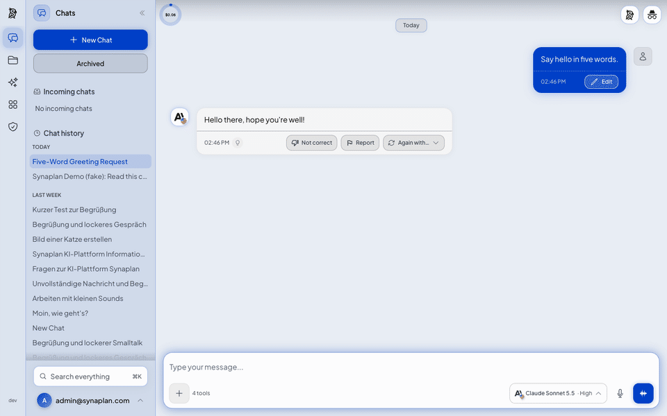
</p>

<p align="center"><sub>Chat, the cost of every answer, your files, generated media and connected apps – in about 30 seconds.</sub></p>

---

## Why Synaplan

- **Own your channels.** One assistant answers on your website, in WhatsApp, by email, in Outlook and inside Nextcloud and ownCloud – with the same knowledge and the same rules everywhere.
- **Own your models.** Hundreds of models from OpenAI, Anthropic, Google, Mistral, sovereign EU providers or locally via Ollama. Mix them per task: sensitive work stays local, everything else gets the best model for the job.
- **Own your costs.** Every answer shows its model and price. A planner splits bigger requests into steps and spends the expensive model only where it matters.
- **Own the decisions.** Actions like sending mail or creating tickets wait for your approval, and every step is logged.
- **Own the stack.** On-prem, EU cloud or fully air-gapped. No training on your data, no forced telemetry, no feature paywall: self-hosted Synaplan is the same software as our cloud, under Apache-2.0.

**Running in production at** Megaherz Yoga · SANI Pflegedienst · National Secure Cloud · PlateArt

---

## Quickstart

**You need:** Docker with Compose v2 and 8 GB of RAM.

```bash
git clone https://github.com/metadist/synaplan.git
cd synaplan
make up
```

Open **<http://localhost:5173>**, log in as `admin@synaplan.com` / `admin123` and say hello. Your first message starts the **Synaplan Demo – no API key needed** (40 messages a day for 14 days, [how it works](https://docs.synaplan.com/demo)). When you're ready, add [your own key](https://docs.synaplan.com/own-ai-keys) (free: [Groq](https://console.groq.com)) or run [local models with Ollama](https://docs.synaplan.com/modules/local-ai).

The first start downloads everything and takes 5–15 minutes. After that, Synaplan starts in seconds.

> [!IMPORTANT]
> These logins are for trying Synaplan on your own machine. On a server, use the [installer](#install-it-your-way) – it creates its own admin password.

---

## Install it your way

| Where | How | Guide |
| --- | --- | --- |
| **Your machine** | `make up` – the quickstart above | [Quickstart](#quickstart) |
| **Published image, no git** | One `compose.yaml`, then `docker compose up -d` | [Published image](docs/PLATFORM_REFERENCE.md#published-image-no-git-checkout) |
| **Docker GUI** | Portainer, Dockge, Synology: paste the compose file as a stack | [Docker GUI](docs/PLATFORM_REFERENCE.md#published-image-no-git-checkout) |
| **Closed network** | No route to the internet, HTTPS on your LAN address | [Closed network](docs/PLATFORM_REFERENCE.md#closed-network) |
| **Linux server** | The installer pins a release, generates secrets and runs a smoke test | [On a server](docs/PLATFORM_REFERENCE.md#on-a-server) |
| **Kubernetes** | Helm charts for clusters | [synaplan-charts](https://github.com/metadist/synaplan-charts) |
| **One click** | [RepoCloud](https://repocloud.io/details/Synaplan/) · [Elestio](https://elest.io/open-source/synaplan) | – |

A Linux server in one line:

```bash
curl -fsSL https://raw.githubusercontent.com/metadist/synaplan/main/install.sh | \
  bash -s -- --mode server --domain https://ai.example.com
```

**Public sector & sovereign cloud (EU/CH):** [synaplan.eu](https://www.synaplan.eu/) covers openDesk, Nextcloud and OpenCloud deployments, on-premises or in an EU cloud.

---

## How it compares

People usually arrive comparing Synaplan with a chat window or an app builder. This is what each project is for. It is not a scoreboard.

| | Synaplan | Open WebUI | LibreChat | Dify |
| --- | --- | --- | --- | --- |
| What it is | A team platform: chat, your files as knowledge, a site widget, and the same assistant on WhatsApp and email | A chat interface for local and cloud models | A chat app for many providers | A builder for AI apps and workflows |
| First run | Several containers, about 4 GB | One container | A Compose stack | A Compose stack, and a hosted cloud |
| Cost of an answer | Shown on the answer | Not on the answer | Not on the answer | In the builder's usage logs, not on the chat answer |
| Same assistant on your site, WhatsApp and email | Yes | No | No | Site widget yes. WhatsApp and email are not built in |

If you only want a chat window, Open WebUI or LibreChat gets you there faster.

---

## Take the tour

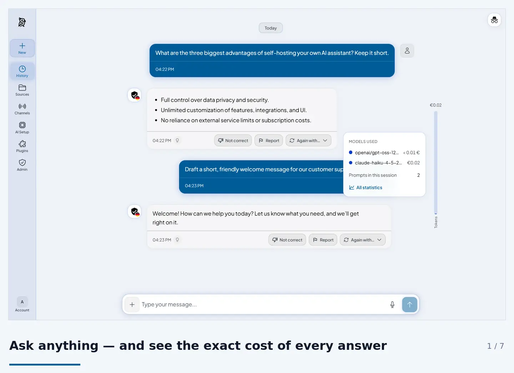

<p align="center"><a href="https://www.youtube.com/watch?v=WjO9mE43uec">▶ Watch the full demo on YouTube</a> &nbsp;·&nbsp; Click any screenshot to see it full size.</p>

<table>
  <tr>
    <td width="25%" align="center">
      <a href="docs/images/tour/chat.webp">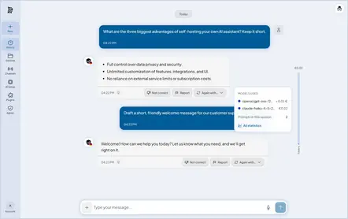</a><br>
      <sub><b>Chat</b><br>Every answer shows what it cost</sub>
    </td>
    <td width="25%" align="center">
      <a href="docs/images/tour/provider-setup.webp">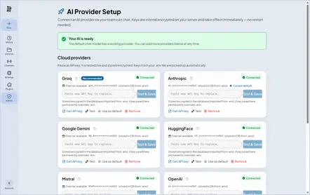</a><br>
      <sub><b>Provider setup</b><br>One key, tested and encrypted</sub>
    </td>
    <td width="25%" align="center">
      <a href="docs/images/tour/model-selection.webp">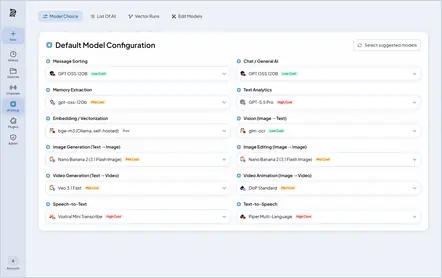</a><br>
      <sub><b>Model choice</b><br>A different model per task</sub>
    </td>
    <td width="25%" align="center">
      <a href="docs/images/tour/rag-search.webp">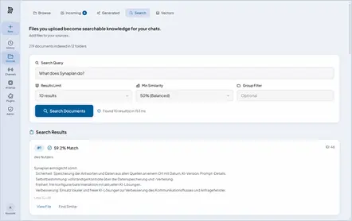</a><br>
      <sub><b>Document search</b><br>Answers from your own files</sub>
    </td>
  </tr>
  <tr>
    <td width="25%" align="center">
      <a href="docs/images/tour/media-generation.webp">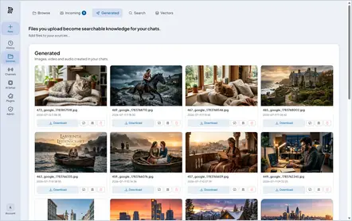</a><br>
      <sub><b>Media generation</b><br>Images, video and audio in chat</sub>
    </td>
    <td width="25%" align="center">
      <a href="docs/images/tour/chat-widget.webp">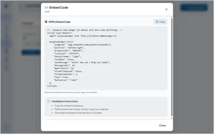</a><br>
      <sub><b>Chat widget</b><br>One snippet, any website</sub>
    </td>
    <td width="25%" align="center">
      <a href="docs/images/tour/system-prompts.webp">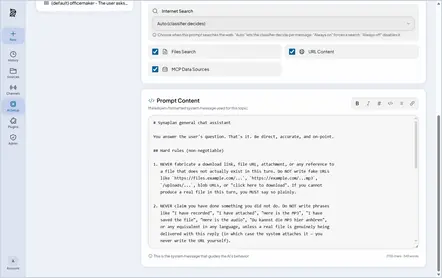</a><br>
      <sub><b>AI instructions</b><br>Your own system prompts</sub>
    </td>
    <td width="25%" align="center">
      <a href="docs/images/tour/file-manager.webp">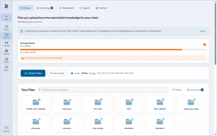</a><br>
      <sub><b>Files</b><br>Uploads become knowledge</sub>
    </td>
  </tr>
  <tr>
    <td width="25%" align="center">
      <a href="docs/images/tour/plugins.webp">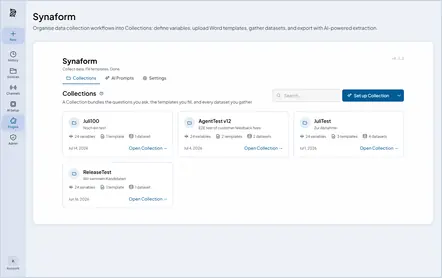</a><br>
      <sub><b>Plugins</b><br>Extend without forking</sub>
    </td>
    <td width="25%" align="center">
      <a href="docs/images/tour/admin-panel.webp">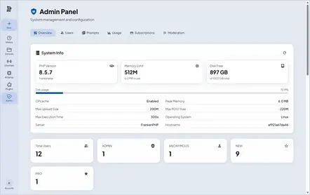</a><br>
      <sub><b>Admin</b><br>Users, usage and health</sub>
    </td>
    <td width="25%" align="center">
      <a href="docs/images/tour/branding.webp">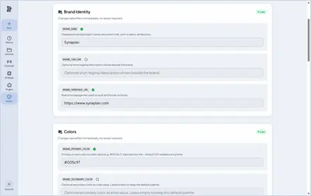</a><br>
      <sub><b>Branding</b><br>White-label the whole app</sub>
    </td>
    <td width="25%"></td>
  </tr>
</table>

<!-- Regenerate these assets after a UI change with scripts/build-readme-tour.sh -->

---

## One AI, everywhere you work

The same assistant, the same knowledge, the same model policy – on every channel your team and your customers already use.

| Surface | What it does | Get it |
| --- | --- | --- |
| **Web app** | Full chat and admin UI, light and dark, five languages | This repo |
| **Mobile apps** | Chat, documents and voice on iPhone and Android – on web.synaplan.com or your own server | [App Store](https://apps.apple.com/app/id6784278288?ct=github-readme) · [Google Play](https://play.google.com/store/apps/details?id=com.synaplan.app&referrer=utm_source%3Dgithub-readme) |
| **Outlook add-in** | Find and process mail inside Outlook (Web, new & classic, Mac) without sending it anywhere | [Synamail](https://github.com/metadist/Synamail) |
| **Chat widget** | Your assistant on any website with one snippet, human takeover included | [Widget guide](https://docs.synaplan.com/widget) |
| **WhatsApp & email** | The AI answers on the channel the question came in on | [WhatsApp](docs/WHATSAPP.md) · [Email](docs/EMAIL.md) |
| **Nextcloud, ownCloud & OpenCloud** | Use your assistants inside your file cloud, with its files as knowledge – your file store stays in charge | [Nextcloud](https://web.synaplan.com/apps/nextcloud) · [ownCloud](https://web.synaplan.com/apps/owncloud) · [OpenCloud](https://github.com/metadist/synaplan-opencloud) |
| **Synaplan Desktop** | Pair a computer and run skills on it (no installer yet – build from source) | [synaplan-desktop](https://github.com/metadist/synaplan-desktop) |
| **MCP & Claude Code** | Your knowledge and memories as MCP tools, plus an Anthropic-compatible endpoint | [MCP guide](https://docs.synaplan.com/mcp) |

**Connects to** Microsoft 365 · Dropbox · Nextcloud / ownCloud / WebDAV · CalDAV · IMAP · Jira & Confluence · your own MCP servers – [how to connect](docs/CONNECTIONS.md)

---

## Under the hood

- **Stack:** Symfony (PHP) backend, Vue frontend, MariaDB VECTOR or Qdrant for document search, Redis, Docker.
- **Lean core:** app, database and Redis. Local AI, office files, web search, voice and more are building blocks you switch on when you need them.
- **Open by design:** OpenAPI REST API, MCP server and client, an Anthropic-compatible `/v1/messages` endpoint and a plugin system – extend Synaplan without forking it.

Full feature list, every AI provider, all building blocks and developer commands: **[Platform reference](docs/PLATFORM_REFERENCE.md)**.

---

## Troubleshooting

| Problem | What to do |
| --- | --- |
| "Port already in use" on start | A port Synaplan needs is taken – see [Port conflicts](docs/INSTALLATION.md#port-conflicts) |
| Containers stop right after start | Give Docker at least 8 GB of RAM, then check `docker compose logs -f backend` |
| Chat gives no answers | Use the Synaplan Demo, paste one provider key, or add the `local-ai` profile – see the [quickstart](#quickstart) |
| First start seems stuck | The first start downloads all images and takes 5–15 minutes. `docker compose logs -f startup-notes` shows where it is |
| Anything else | Ask in [Discord](https://discord.com/invite/kQB3eDjWfF) or open a [GitHub issue](https://github.com/metadist/synaplan/issues) |

---

## Learn more

- **[docs.synaplan.com](https://docs.synaplan.com/)** – guides for users and admins
- **[docs/README.md](docs/README.md)** – the technical manual, in five learning tracks
- **[Platform reference](docs/PLATFORM_REFERENCE.md)** – install variants, features, providers and building blocks
- Changing the code? Start with [adding an AI provider](docs/PROVIDERS.md) or [following a tool call](docs/ARCHITECTURE.md#tool-path).

---

## Help shape what's next

We build Synaplan in the open. Tell us what you'd use it for, vote on ideas or show what you built in [Discussions](https://github.com/metadist/synaplan/discussions) – we read everything.

- 💬 **[Discord](https://discord.com/invite/kQB3eDjWfF)** – the fastest place for self-hosting and configuration questions
- 🐛 **[Issues](https://github.com/metadist/synaplan/issues)** – bugs and feature requests
- 🙌 **[Contributing](CONTRIBUTING.md)** – how to get your first pull request merged ([AGENTS.md](AGENTS.md) is the guide for coding agents)
- 🔒 **[Security policy](SECURITY.md)** – report a vulnerability privately

---

## License

[Apache-2.0](LICENSE) · Built in Düsseldorf by [metadist](https://www.synaplan.com) · Member of the Open Source Business Alliance

<p align="center">
  <a href="https://osb-alliance.de/" target="_blank" rel="noopener noreferrer"></a>
</p>

<p align="center"><b>If Synaplan helps you own your flow, a ⭐ helps the next team find it.</b></p>

<p align="center">
  <a href="https://star-history.com/#metadist/synaplan&Date">
    <picture>
      <source media="(prefers-color-scheme: dark)" srcset="https://api.star-history.com/svg?repos=metadist/synaplan&type=Date&theme=dark" />
      <source media="(prefers-color-scheme: light)" srcset="https://api.star-history.com/svg?repos=metadist/synaplan&type=Date" />
      
    </picture>
  </a>
</p>
