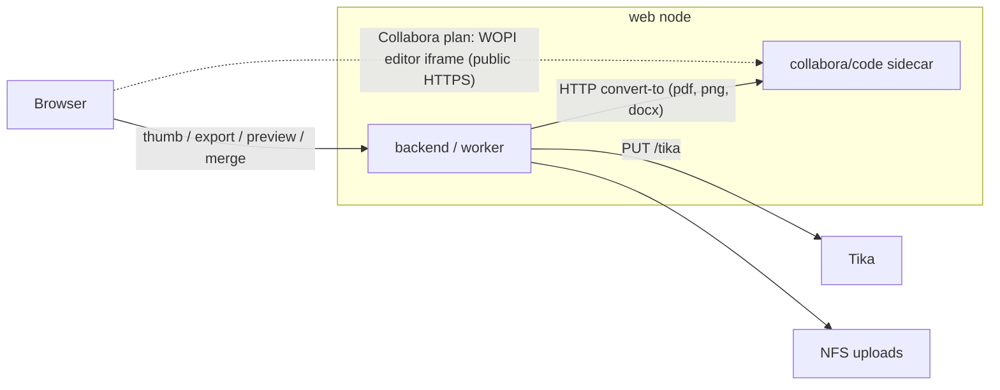

# Office Documents — Master Plan (v3)

Status: planned (see `STATUS.md`)
Date: 2026-09-02
Supersedes: `office-plan_v2.md` is kept as the detailed design for Phase B
(structured editing). This master plan re-sequences the work so users see
improvements early and adds the missing infrastructure decision (LibreOffice).

## Scope — the Synaplan side

There are two sides to office documents. **This plan is side 1**: the user is
in Synaplan and wants to **create, analyse, convert, merge and edit** Word,
Excel, PowerPoint and PDF files. Side 2 — the user is in the **Collabora
editor** and wants Synaplan there (chat, image generation, tasks on the
text, cells and slide elements in front of them) — is a separate epic with
its own plan: `../20260902-collabora-integration/`. The Collabora sidecar
introduced here (Decision 1) is shared by both.

## Two delivery surfaces (must both work)

This work has **two first-class customers**. Shipping the PHP client in
`synaplan` and "mentioning" the platform later is not enough. Every
engine-backed step must be designed so both surfaces stay correct.

| Surface | Repo | Who | What "done" means |
| ------- | ---- | --- | ----------------- |
| **Open source** | `synaplan` (public) | Anyone who clones, Umbrel, AWS Marketplace, Elestio, or `deploy/compose.yaml` | Core stack boots without Collabora. New office features stay **off** until the operator opts in. Docs tell them how. Default `docker compose up -d` does not grow RAM or pull `collabora/code`. |
| **Our hosted demo / prod** | `synaplan-platform` (private) | `web.synaplan.com` on web1/2/3 | The same image, with the engine **on**. Visitors of our demo see thumbnails, PDF export, preview and (later) the editor. Operators update `CLUSTER-DOC.md` and sizing in the same change. |

The PHP contract is one URL. The wiring is not:

- The app talks only to `OFFICE_CONVERT_URL` over HTTP (same pattern as
  `TIKA_BASE_URL` / `SYNAPLAN_TTS_URL`). It never execs `soffice`, never
  bind-mounts host LibreOffice, never assumes a compose service name.
- **OSS default is empty** (`isEnabled() === false`) → today's behaviour.
- **Platform default is set** (`http://collabora:9980` on backend, worker
  and worker-bulk) so our demo actually shows the product.

Do **not** copy the topology of the other companions. They look similar
and they are not:

| Companion today | OSS | Our platform | Why Collabora is different |
| --------------- | --- | ------------ | -------------------------- |
| Tika | In-stack `tika` service | **Shared** Coolify on the tools box (`tika.synaplan.com`) | Extraction is cheap and stateless. Collabora is RAM-heavy and later serves the WOPI editor; it is **one sidecar per web node**, like Centrifugo, not a second shared Tika. |
| Piper TTS | Compose profile `tts`, URL often `host.docker.internal` | **Shared** on the GPU box (`SYNAPLAN_TTS_URL`) | Speech can live on one machine. Convert-to + WOPI want the engine next to the node that holds the request. |
| Centrifugo | In-stack, no published port | **Per web node**, no published port, Caddy reverse-proxy | **This is the analog.** Same compose file, `restart: unless-stopped`, log cap, no public convert-to port. |
| Qdrant | In-stack | Per-node via `docker-host:host-gateway` (separate compose) | Unrelated; do not put Collabora there. |

OSS compose files that must learn the **optional** `office` profile (A0),
not only the dev file:

- `docker-compose.yml` (local dev)
- `docker-compose-minimal.yml` (already has `tts`)
- `deploy/compose.yaml` — this is the portable **self-host production**
  contract everyone else actually runs. Today it has in-stack Tika and a
  `local-ai` profile; it has **no** `tts` / `office` profile. A0 must add
  `office` here or self-hosters never get the engine.
- Umbrel / AWS Marketplace / Elestio **stay off** by default (Pi-class
  and small cloud images cannot spare ~2 GB). Document the opt-in.

Platform rules (private repo, separate PR, same A0):

- Add `collabora` to the existing compose (no profile). Pin tag **and**
  digest. `mem_limit`, `num_prespawn_children=2`, healthcheck on
  `/hosting/capabilities`, **no published port**.
- Set `OFFICE_CONVERT_URL` on `backend`, `worker` and `worker-bulk`
  (`worker-bulk` drains `async_index`, which will generate thumbnails).
- Record the service in `CLUSTER-DOC.md` §2 (per-node containers), not §5
  (shared Tika/TTS). Note the unused host `apt` LibreOffice packages.
- Recalculate RAM in `docs/PHP-RUNTIME-SIZING.md`: each web node already
  shares the box with native Galera, a Qdrant node, Centrifugo and two
  workers. +~2 GB for CODE is a real budget line, not a comment.
- Rolling update (`updatewebN.sh`) is `compose up` without `down`; a new
  service starts on the next roll. Roll one node at a time, same as today.
- Convert writes next to the source file on the NFS `up/` volume so every
  node can see the artefact.
- **Out of this epic unless we reopen it:** the Swiss box (`ch1`,
  `synaplan-swiss`) is a separate compose, not `synaplan-platform`.

Public-repo hygiene (already a ground rule, restated): no node IPs,
credentials, or private hostnames of our cluster in `synaplan` or
`synaplan-docs`. Those live in `synaplan-platform`.

Phase T is **OSS-only** (PHP providers + gateway). The first dual-repo
step is A0: one PR in `synaplan`, one in `synaplan-platform`, one in
`synaplan-docs`. Our demo must not ship A1–A4 "in the image" while the
platform compose still has no sidecar — visitors would see the same
empty tiles they see today.

## Goal

Make Synaplan a good place to **work with** Office documents, not just to
emit them:

1. Every Word / Excel / PowerPoint / PDF file in Synaplan gets a real
   thumbnail, an inline preview, and a one-click PDF export.
2. `officemaker` can deliver PDFs and produces properly styled DOCX.
3. Uploaded files are **analysable**: legacy formats (`.doc`, `.xls`,
   `.ppt`, `.rtf`, `.odt`, Apple iWork) become readable, and spreadsheets /
   decks reach the AI as structured text (sheet-by-sheet, slide-by-slide),
   not one flat blob.
4. Several documents can be **merged**: first as one combined PDF, later
   as a real merged DOCX/XLSX/PPTX on the structured model.
5. Step-by-step AI editing on a structured document model (Phase B,
   `office-plan_v2.md`).

## What exists today (investigated 2026-09-02)

- `officemaker` is a **prompt topic**, not a handler. The model returns
  `{"BFILEPATH":"x.docx","BFILETEXT":"<markdown|csv>"}`;
  `backend/src/Service/File/DocumentGeneratorService.php` renders DOCX
  (PhpWord via HTML), XLSX (PhpSpreadsheet), PPTX
  (`Service/File/Presentation/PptxRenderer`). `ChatHandler::storeGeneratedFile()`
  and `StreamController::storeGeneratedFileInStream()` persist the `File`
  row (near-duplicate code) and replace the reply with
  `__FILE_GENERATED__:<name>`.
- **PDF output is explicitly unsupported** (`MessageClassifier` and the
  officemaker prompt both exclude it).
- Ingestion is Tika only (`Service/File/TikaClient.php`); low-quality PDFs
  fall back to `PdfRasterizer` (Imagick / `pdftoppm`, both in the base image)
  plus vision.
- Thumbnails exist end to end **for videos only**: `ThumbnailService` →
  `File.thumbPath` → `GET /api/v1/files/{id}/thumb` → `thumb_url` →
  `frontend/src/components/files/FilePreview.vue`. Office files render as an
  icon or a `text_preview` snippet.
- Open issues: #1396 (DOCX has no visual formatting), #1499 (clean previews
  across file types). Closed formative issues: #1397/#1404 (PPTX design),
  #1382 (images in DOCX), #1406 (envelope leak), #1190 (regenerate from
  `BFILETEXT`).
- **LibreOffice is installed on the dev host and on web1/2/3 (Ubuntu apt,
  24.2.7) but nothing in any repository references it.** The backend runs in
  Docker (`ghcr.io/metadist/synaplan`, Debian bookworm base) and cannot
  execute host binaries. Every external service in this stack is reached over
  HTTP via an env URL (`TIKA_BASE_URL`, `QDRANT_URL`, `SYNAPLAN_TTS_URL`);
  host services use `extra_hosts: docker-host:host-gateway`.

## Decision 1 — one office engine, reached over HTTP

**Run Collabora CODE (`collabora/code`) as a sidecar container, one per web
node, and call its conversion REST API from PHP the same way we call Tika.**

- `POST http://collabora:9980/cool/convert-to/<format>` with multipart field
  `data` converts any office input to `pdf`, `png` (first page/slide/sheet
  only), `docx`/`xlsx`/`pptx`, `odt`/`ods`/`odp`, `csv`, `html`, `txt`.
  `GET /hosting/capabilities` reports `convert-to.available`.
- The same container serves the WOPI editor for the Collabora integration
  plan — one engine, one deployment path, and it is exactly what
  Nextcloud/OpenCloud run.
- It isolates crashes on malformed documents and manages concurrency itself
  (forkit + per-document kits). A bare `soffice --headless` inside the PHP
  container would need one profile directory per concurrent call and a crash
  takes the FrankenPHP worker with it.

Rejected alternatives, for the record:

| Option | Why not |
| ------ | ------- |
| Bind-mount the host `/usr/bin/soffice` + `/usr/lib/libreoffice` into the container | Ubuntu 24.04 host vs Debian bookworm container: glibc/ICU/library coupling breaks on every host upgrade; undocumented anywhere; not reproducible in dev |
| Bake LibreOffice into `synaplan-base-php` (whisper.cpp pattern) | +~500 MB per image on two architectures, per-process profile locking, crash coupling, still no editor |
| Host-side `unoserver` behind `docker-host:host-gateway` | Works, but a second deployment mechanism (pip on the host) with its own upgrade path; only worth it if we never want the editor |
| Gotenberg sidecar | Good conversion-only API (LibreOffice + Chromium); no editor, so the Collabora integration plan would need Collabora anyway |

Consequence for the hosts: the apt `libreoffice-*` packages on web1/2/3 are
**not used** by the containers. Remove them or keep them for admin one-offs;
do not build anything on them.

**Public docs:** `synaplan-docs` must say this in operator language before
the features land (step A0-docs). New page `docs/office-documents.md`,
cross-linked from Quickstart, FAQ, Architecture, Using Synaplan, Production
and Desktop tools. Distinguish the server sidecar from Desktop's local
LibreOffice (Agent Skills). See `01_phase_a_engine_and_ux.md` § A0.

Sizing: CODE idles at ~0.5–1 GB RAM; set `--o:num_prespawn_children=2` and a
compose `mem_limit`. Conversion needs **no published port** (backend →
`collabora:9980` on the compose network). A public HTTPS hostname is required
only for the editor (Collabora integration plan, Epic 0).



## Decision 2 — UX first, model second

`office-plan_v2.md` builds the document model, persistence, tools, provider
tool-calling and the loop before a user sees anything (Sprints 0–4). We ship
the engine-backed UX wins first (Phase A, each step one PR, each shippable
alone), then Phase B with a narrowed first slice (xlsx only).

## Decision 3 — tool calling first

Tool calling in the chat providers and the OpenAI-compatible gateway is the
one building block three consumers wait for: Collabora 26.04's built-in AI
Assistant (Collabora plan Epic 1), OpenAI-SDK clients of `/v1/chat/completions`,
and Phase B's `ChatToolLoop`. It is pulled in front of Phase A as **Phase T**
and built once, additively (no provider signature change).

Capability is a **dual, consistent gate**: the provider implements
`ToolCallingChatProviderInterface` **and** the catalog row has `tool_use`.
The catalog is wrong today (flagship OpenAI/Groq/Anthropic/Gemini chat rows
are unflagged). Phase T fixes the flags, ships a migration for existing
installs, and locks the matrix with a consistency test.

`/v1/chat/completions` is a **hybrid loop**, not pass-through only: client
tools are relayed (Collabora/SDK execute them); Synaplan **injects and
runs** the user's MCP catalog and `web_search` on every dual-gated model.
That is a deliberate policy difference from `/v1/messages` (whose MCP
default is off and which waits for Anthropic's `web_search_*` declaration).

## Phases

| Phase | Content | Detail |
| ----- | ------- | ------ |
| **T (first)** | Tool calling: consistent `tool_use` flags, additive provider contract, Chat Completions providers, `/v1/chat/completions` pass-through **plus** server-side MCP/web search, then OpenAI Responses, Anthropic/Google | `03_phase_t_tool_calling_gateway.md` |
| A | Engine + UX quick wins: converter client, sidecar, thumbnails, PDF export, inline preview, officemaker PDF, DOCX styling, analysable ingestion, combine as PDF | `01_phase_a_engine_and_ux.md` |
| B | Structured editing (document model + tool loop) and true document merge, re-sequenced | `02_phase_b_structured_editing.md` + `office-plan_v2.md` |
| — | Collabora editor, Synaplan inside Collabora, partner platforms | `../20260902-collabora-integration/` (separate plan; depends on A0 here) |

## Ground rules (every step)

- Feature branch per step, Conventional Commits, never on `main`, no AI
  attribution.
- Full gate before every commit — filtered runs are not the gate:

  ```bash
  make lint && make -C backend phpstan && make test && docker compose exec -T frontend npm run check:types
  ```

- New endpoint ⇒ complete OpenAPI annotations ⇒ `make -C frontend
  generate-schemas` ⇒ `vue-tsc`. Never hand-write TS interfaces for API
  responses.
- New UI text ⇒ all five locales (`en`, `de`, `es`, `fr`, `tr`);
  `localeParity.spec.ts` gates it.
- Colors only via `style.css` tokens; verify light, dark, and V2.
- Any change to `MessageClassifier` / `MessageSorter` / prompts ⇒ re-record
  `tests/Characterization/` snapshots and review every changed line.
- New paths ⇒ classify in `.github/mobile-impact-policy.json`
  (`backend/**` backend-only, `frontend/src/**` ota-candidate,
  `docker-compose*.yml` / `_docker/**` / `docs/**` no-app-impact).
- The engine is **optional on OSS, on by default on our platform**. Every
  feature degrades to today's behavior when `OFFICE_CONVERT_URL` is empty.
  Self-hosters without the sidecar lose nothing they have today. Our
  `web.synaplan.com` demo must actually run the sidecar (see "Two delivery
  surfaces").
- This repository is public: no node IPs, credentials, or hostnames of the
  production cluster in code or docs here (they live in `synaplan-platform`).
