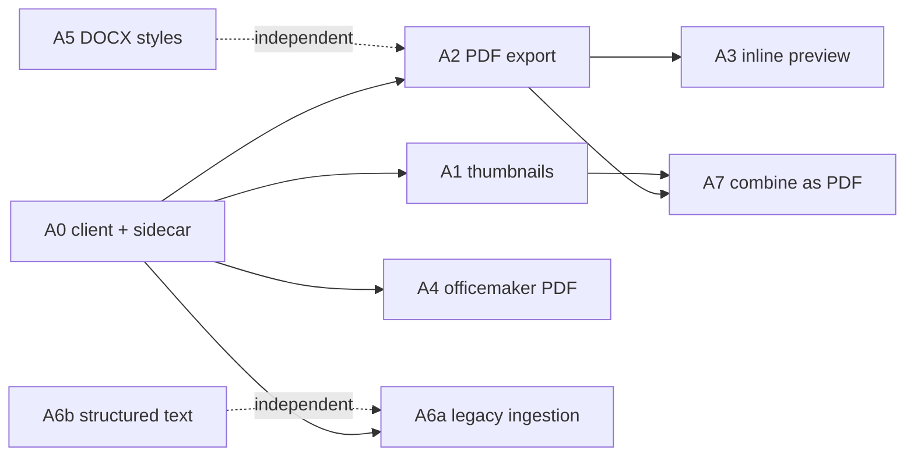

# Phase A — Office engine and UX quick wins

Status: planned
Date: 2026-09-02
Depends on: `00_master_plan.md` (Decision 1: Collabora CODE sidecar over HTTP)

Eight small steps. **Each step is one branch, one PR, shippable alone.** Do
not start the next step until the previous PR is green and merged. Every
step lists the files it touches, what it must NOT touch, an acceptance check
a human can run, and the gate.

Engine-optional rule: every feature must behave exactly as today when
`OFFICE_CONVERT_URL` is empty. Check `OfficeConverterClient::isEnabled()`
before doing anything engine-related.

---

## A0 — Converter client and sidecar (no UI)

Branch: `feat/office-converter-client`

### Backend

- New `backend/src/Service/File/Office/OfficeConverterClient.php`, modelled
  on `Service/File/TikaClient.php` (`final`, constructor DI, structured
  logging, one-time health probe):
  - `isEnabled(): bool` — URL non-empty and not `disabled`.
  - `capabilities(): array` — `GET {url}/hosting/capabilities`, cached per
    process; returns `[]` on failure.
  - `convert(string $absoluteInputPath, string $targetFormat, array $options = []): ?string`
    — `POST {url}/cool/convert-to/{format}` as multipart (`data` = file
    stream, optional `lang`); writes the response body to a temp file in the
    same directory as the input (NFS-visible, so worker and backend see it);
    returns the absolute temp path or `null` on any failure (never throws to
    callers; log with `endpoint`, `format`, `elapsed_ms`, `http_code`).
  - Supported target formats as a `public const` list: `pdf`, `png`,
    `docx`, `xlsx`, `pptx`, `odt`, `ods`, `odp`, `csv`, `html`, `txt`.
  - Timeout from `OFFICE_CONVERT_TIMEOUT_MS` (default 60000), one retry on
    transport error, none on HTTP 4xx.
- Env + DI: `OFFICE_CONVERT_URL` (default empty), `OFFICE_CONVERT_TIMEOUT_MS`
  in `backend/.env.example`, `backend/config/services.yaml` (bind
  `$officeConvertUrl`, `$officeConvertTimeoutMs`), and `docker-compose.yml`
  backend + worker environment (`OFFICE_CONVERT_URL: http://collabora:9980`).
- Feature exposure: add `officeConvertEnabled` to the runtime `features`
  array in `ConfigController` (next to `whisperEnabled`, ~line 465) and an
  entry in `getFeaturesStatus()` under "Processing Services" that pings
  `/hosting/capabilities`. Update the OpenAPI property list so the generated
  Zod schema gets the new boolean.
- Tests: `backend/tests/Unit/Service/File/Office/OfficeConverterClientTest.php`
  with Symfony `MockHttpClient` — success, HTTP 500, timeout, disabled URL,
  unsupported format.

### Compose — two delivery surfaces (see `00_master_plan.md`)

Same image, same PHP client, **two wirings**. Do not copy Tika (shared on
the tools box) or TTS (shared on the GPU box). Copy **Centrifugo**: one
sidecar next to the app, no published convert-to port.

#### OSS (`synaplan`) — optional, default off

- `docker-compose.yml` **and** `docker-compose-minimal.yml`: service
  `collabora`, image `collabora/code` pinned by tag **and digest**,
  `profiles: [office]`, `mem_limit: 2g`, environment
  `extra_params=--o:ssl.enable=false --o:ssl.termination=false --o:num_prespawn_children=2`,
  no `ports`, healthcheck `curl -f http://localhost:9980/hosting/capabilities`.
  Do **not** set `aliasgroup1` yet (only the editor needs it).
- `deploy/compose.yaml` (the portable self-host production contract
  everyone else actually runs): same service, same `office` profile.
  Today it has in-stack Tika and `local-ai` only — without this, A1–A7
  never light up for self-hosters. Official RAM floor is 8 GB; default-on
  CODE would break it. Follow the `local-ai` profile pattern (case
  statement in `x-app-command` can set `OFFICE_CONVERT_URL` when `office`
  is in `COMPOSE_PROFILES`).
- Umbrel / AWS Marketplace / Elestio: **do not** start Collabora by
  default (Pi-class / small images). Document the opt-in in A0-docs.
- If convert-to answers 403, the compose subnet is outside CODE's default
  `net.post_allow.host` regex list; add
  `--o:net.post_allow.host[0]=<compose subnet regex>` to `extra_params` and
  note it in `docs/DEVELOPMENT.md`.
- Default `docker compose up -d` (without the profile) must stay unchanged;
  the app must boot with the converter disabled.

#### Our hosted demo (`synaplan-platform`, separate PR in that repo)

- Same `collabora` service, **no profile**, `restart: unless-stopped`, log
  cap like Centrifugo, `mem_limit`. This is our `web.synaplan.com` demo:
  the engine is **on**.
- `OFFICE_CONVERT_URL: http://collabora:9980` on `backend`, `worker` **and**
  `worker-bulk` (`worker-bulk` drains `async_index`, which will generate
  thumbnails in A1). Do not rely on `extends` alone — set the key
  explicitly so a future split cannot drop it.
- Record the container in `CLUSTER-DOC.md` **§2** (per-node list next to
  Centrifugo), not §5 (shared Tika/TTS). Note that host `apt`
  `libreoffice-*` is unused by the containers.
- Update `docs/PHP-RUNTIME-SIZING.md`: +~2 GB RAM per web node on a box
  that already runs Galera + Qdrant + two workers + Centrifugo.
- Rolling update is `updatewebN.sh` (`compose up`, no `down`). A new
  service starts on the next one-node-at-a-time roll. Convert artefacts
  go next to the source on NFS `up/`.
- **Not in this PR:** Swiss `ch1` / `synaplan-swiss` (separate compose).

### Docs (this repo)

- `docs/DEVELOPMENT.md`: "Office conversion (optional)" — how to start the
  `office` profile, what it enables, the 403 note.
- `_devextras/SYSADMIN-help.md`: the prod service and the env var.
- `.github/mobile-impact-policy.json`: verify `backend/src/Service/File/Office/**`
  falls under the existing `backend/**` rule; add nothing unless the test
  fails.

### Docs (`synaplan-docs`, same step — separate PR)

Public docs at [docs.synaplan.com](https://docs.synaplan.com) must say, before
the new capabilities ship, that they need a **LibreOffice engine**. Follow
the TTS companion-service pattern (`docs/tts.md`).

New page `docs/office-documents.md` (sidebar: **Office documents**),
registered in `index.php` `$docsMap` + `$sections` (Install & self-host,
next to `tts` / after `quickstart`) and `sitemap.php`. Outline:

- **What it is.** Synaplan's office engine is **Collabora Online
  (`collabora/code`)**, a LibreOffice-based sidecar reached over HTTP
  (`OFFICE_CONVERT_URL`). It is optional. Without it, chat, Tika RAG and
  today's PhpOffice officemaker (DOCX/XLSX/PPTX) keep working; the
  capabilities below stay off.
- **What requires LibreOffice / Collabora** (table): thumbnails for
  Word/Excel/PowerPoint/PDF; Download as PDF and inline preview;
  officemaker PDF output; conversion of legacy/Apple formats
  (`.doc`/`.xls`/`.ppt`/`.rtf`/`.odt`/iWork) before analysis; combine
  several files into one PDF; later "Open in editor" (WOPI).
- **How to enable (dev):**
  `docker compose --profile office up -d` — pulls `collabora/code`,
  sets `OFFICE_CONVERT_URL=http://collabora:9980` on backend + worker.
  ~1–2 GB RAM (`mem_limit`).
- **How to enable (self-host / `deploy/compose.yaml`):**
  `COMPOSE_PROFILES=office` (or `--profile office`). Same sidecar, no
  published convert-to port. Official 8 GB floor stays valid because the
  profile is off by default.
- **How we enable it on our demo (`synaplan-platform`):** always-on sidecar
  **per web node** (Centrifugo analog, not shared Tika/TTS),
  `OFFICE_CONVERT_URL` on backend + both workers. Sizing: idle ~0.5–1 GB,
  `mem_limit` 2g, `--o:num_prespawn_children=2`. That change lives in the
  private platform PR, not in this public repo.
- **Host `apt install libreoffice` is not enough.** The PHP app runs in
  Docker and cannot execute host binaries. The Ubuntu packages on web
  nodes are unused by the containers. Do not document bind-mounting
  `/usr/bin/soffice` into the backend image.
- **Not the same as Desktop LibreOffice.** [Check this computer](desktop-tools)
  looks for LibreOffice on the *user's PC* so Agent Skills can export
  slides/PDFs locally. Server-side office features need the Collabora
  sidecar on the Synaplan host. Say this on both pages so operators
  don't confuse the two.

Cross-links in the same PR (short paragraphs, not a second essay):

- `docs/intro.md` — add the page to "Install & self-host" and mention
  the optional office engine next to TTS.
- `docs/quickstart.md` — new pitfall: "Office documents need LibreOffice
  (Collabora sidecar)", same tone as the TTS pitfall; bump the "four
  things" lead-in to include it.
- `docs/using-synaplan.md` — under Files & RAG: preview / PDF export /
  combine require the engine; link the new page.
- `docs/architecture.md` — add `collabora` to the service map (profile
  `office`, optional).
- `docs/faq.md` — "Do I need LibreOffice?" / "Why don't my Word files
  get a thumbnail?" — engine optional, feature list, `OFFICE_CONVERT_URL`.
- `docs/production.md` — Requirements: optional Collabora sidecar + RAM.
- `docs/hosting.md` — mention Collabora next to Tika on the tools/web
  node, not as a host apt package.
- `docs/desktop-tools.md` — one sentence: server office features are a
  different LibreOffice (the Collabora sidecar).

Do **not** put production node IPs or private compose hostnames in this
public repo.

### Acceptance

- `docker compose --profile office up -d`, then
  `curl -s http://localhost:8000/api/v1/config/features` (admin) shows the
  converter as available.
- `docker compose exec -T backend php bin/console debug:container OfficeConverterClient`
  resolves; a throwaway `php -r` call converts a `.docx` from `var/uploads`
  to PDF (do not commit the script).

### Gate

`make -C backend lint && make -C backend phpstan && make -C backend test`
(frontend untouched except the regenerated schema: run
`make -C frontend generate-schemas` and `vue-tsc` too).

---

## A1 — Thumbnails for office documents and PDFs

Branch: `feat/office-thumbnails` — the office/PDF half of #1499.

### Backend

- New `backend/src/Service/File/Office/DocumentThumbnailGenerator.php`
  (`final readonly`):
  - Office formats (`doc docx xls xlsx ppt pptx odt ods odp rtf`): engine
    `convert(..., 'png')` (first page/slide/sheet), then Imagick resize to
    the poster size used for videos, write `{basename}_thumb.jpg` next to the
    source via `ThumbnailService::getThumbnailPath()` conventions (reuse, do
    not duplicate the naming), `FileHelper::setFilePermissions()`.
  - PDF: `PdfRasterizer::pdfToPng()` page 1 only (cap = 1) — works without
    the engine.
  - Returns the relative thumb path or `null`. Never throws.
- New Messenger message `App\Message\GenerateDocumentThumbnailMessage(int $fileId)`
  routed to `async_index` in `config/packages/messenger.yaml`, handler sets
  `File::setThumbPath()` and flushes. Idempotent: skip if `thumbPath` already
  set and the file exists (`FileHelper::fileExistsNfs`).
- Dispatch points (dispatch only, never convert inline in the HTTP request):
  - after a successful upload in `FileUploadService` for document/PDF types,
  - after officemaker persists a generated file (`ChatHandler::storeGeneratedFile`,
    `StreamController::storeGeneratedFileInStream`, `DocumentGenerationRunner`
    if it stores separately),
  - when a missing binary is regenerated (`FileController::regenerateMissingBinary`)
    — optional.
- Delete the thumb when the file is deleted (follow how video thumbs are
  removed in `FileStorageService` / `ThumbnailService::deleteThumbnail`).
- `FileListService` already emits `thumb_url` when `thumbPath` is set — no
  change needed; verify with a test.

### Frontend

- `frontend/src/components/files/FilePreview.vue`: for `kind` in
  `document` / `pdf`, render the poster `` when `file.thumb_url` is set
  (same `mediaSrc(rawThumbUrl)` path as the video poster, `object-cover`,
  `loading="lazy"`); keep the snippet / icon fallbacks when it is not.
- `frontend/src/components/ChatMessage.vue` file badges: no thumbnail yet
  (keep the badge compact); revisit in A3.
- Tests: extend `frontend/tests/unit/services/filePreview.spec.ts` /
  `FilePreview.spec.ts` for the poster branch.

### Acceptance

Upload a `.docx`, `.xlsx`, `.pptx`, `.pdf` in Files; after the worker runs
(seconds) the tiles show page-1 posters in light, dark and V2. With the
engine disabled, office tiles still show icon/snippet; PDFs still get a
poster (rasterizer path).

### Gate

Full gate (backend + frontend).

---

## A2 — "Download as PDF"

Branch: `feat/office-pdf-export`

### Backend

- `FileController`: `GET /api/v1/files/{id}/export` with query `format`
  (enum, initially only `pdf`) and optional `inline=1`. Reuse the exact auth
  pattern of `downloadFile()` (`#[CurrentUser]` or media token,
  `isFileAccessibleByUser`). Complete OpenAPI (`parameters`, 200 `File
  content`, 400 unsupported format, 404, 503 when the engine is disabled).
  Keep the method under 50 lines: delegate to a new
  `Service/File/Office/DocumentExportService::exportToPdf(File $file): ?string`.
- `DocumentExportService`: source is the on-disk binary (or the
  `regenerateMissingBinary` path if missing); if the source already is a PDF
  return it; else engine `convert(..., 'pdf')`, move the result to
  `{basename}.export.pdf` next to the source, and return it. Cache rule: reuse
  the cached PDF when its mtime is newer than the source's; delete it with
  the file.
- Guest variant next to the existing guest download route (widget sessions).
- Response: `BinaryFileResponse`, `Content-Disposition` attachment (or inline
  when `inline=1`), filename `<original name>.pdf`, same security headers as
  `downloadFile()`.

### Frontend

- `frontend/src/services/filesService.ts`: `exportFile(id, format, filename)`
  + guest twin, via `httpClient` like `downloadFile()`; URL builder
  `exportUrl(id, format, inline)` for A3.
- `ChatMessage.vue` (badge block ~line 405–420) and `FilesGrid.vue` /
  `FilesView.vue` actions: replace the single click-to-download with a small
  menu (existing dropdown pattern in the codebase; tokens only) — items:
  **Download**, **Download as PDF** (only for office kinds and only when
  `configStore.features.officeConvertEnabled`), **Preview** (A3, hidden until
  then). Errors via `useNotification().error(t('files.exportFailed'))`.
- i18n keys (all five locales): `files.download`, `files.downloadPdf`,
  `files.exportFailed`, `files.preview`. Placeholders identical to English.
- `make -C frontend generate-schemas` after the OpenAPI change, then
  `vue-tsc`.

### Acceptance

A generated `.docx` in chat: menu → "Download as PDF" downloads
`<name>.pdf` that opens and matches the document. Second click is served
from cache (log shows no engine call). With the engine disabled the menu
item is hidden and the API answers 503 with a clear message.

### Gate

Full gate.

---

## A3 — Inline preview

Branch: `feat/office-inline-preview`

### Frontend only (uses A2)

- New `frontend/src/components/files/DocumentPreviewModal.vue`, loaded with
  `defineAsyncComponent`. Props: `file`. Body: `<iframe>` pointing at
  `exportUrl(id, 'pdf', true)` for office kinds, or the download URL
  (`inline`) for PDFs, wrapped with `useMediaSrc()` so the `<iframe>` can
  authenticate without headers. Header: filename, Download, Download as PDF,
  close. Uses the app's modal shell / `surface-card` tokens; verify light,
  dark, V2.
- Wire "Preview" from the A2 menu (chat badges, Files tiles) and from a click
  on the A1 poster.
- Capability guard: iOS/Android WebViews do not render PDFs inside iframes
  reliably. Detect the native shell the way the app already does for media
  tokens (`useMediaSrc` / platform helpers) and fall back to
  `Download as PDF` there. Mark the seam with `MOBILE-APP SEAM` if a new
  platform check is introduced.
- Tests: component test with stubs (no network), covering office vs PDF vs
  engine-disabled (menu item hidden).

### Acceptance

Preview opens a multi-page DOCX/PPTX/XLSX as PDF inside Synaplan; keyboard
close (Esc) works; nothing is downloaded until the user asks.

### Gate

Frontend gate (`make -C frontend lint && make -C frontend test` +
`vue-tsc`).

---

## A4 — officemaker can deliver PDF

Branch: `feat/officemaker-pdf`

### Backend

- Extract the duplicated persistence into
  `Service/File/GeneratedDocumentStore::store(...)` used by
  `ChatHandler::storeGeneratedFile()`, `StreamController::storeGeneratedFileInStream()`
  and `DocumentGenerationRunner`. Pure refactor first (same behavior, tests
  green), commit separately inside the PR.
- Envelope extension: when the user asked for a PDF, the model still returns
  a `.docx` / `.xlsx` / `.pptx` `BFILEPATH` (the editable source) plus
  `"BEXPORT":"pdf"`. `FileGenerationEnvelope::extract()` learns the optional
  key (ignored if unknown). `GeneratedDocumentStore` writes the source file
  as today, then — only if the engine is enabled — converts it and attaches
  the PDF as a second `File` (`source=generated`, `originKind=document`,
  `fileText` = same source text so #1190 regeneration and search keep
  working). Both files are attached to the message; the reply marker names
  the PDF.
- `PromptCatalog::officeMakerPrompt()`: describe `BEXPORT` and when to use
  it; keep the "no PDF" rule when the engine is disabled (pass a flag into
  the prompt builder, do not fork the topic).
- `MessageClassifier`: lift the "PDF requests must not route to officemaker"
  exclusion **only when the engine is enabled**. Re-record
  `tests/Characterization/` snapshots and review every changed line.
- Tests: envelope with/without `BEXPORT`, store with engine on/off,
  classifier both modes.

### Frontend

- Nothing new; the PDF appears as a normal file badge with the A2/A3 menu.
- `frontend/src/utils/fileGenerationEnvelope.ts` must still hide the
  envelope mid-stream with the extra key (add a spec case).

### Acceptance

"Erstelle mir ein PDF mit ..." produces a `.pdf` badge (and the `.docx`
source); "füge ein Kapitel hinzu" edits the source and re-exports. Engine
off: today's behavior, PDF requests answered as before.

### Gate

Full gate + snapshot review.

---

## A5 — DOCX default styling (#1396, no engine)

Branch: `fix/docx-default-styles`

- `DocumentGeneratorService::writeDocx()`: define a default style set once
  (`Service/File/Office/DocxStyleSheet.php` or a private method): body font
  and size, Heading 1–3 sizes/spacing/color via `addTitleStyle` (independent
  of `{{TOC}}`), paragraph spacing, list indentation, table style with
  borders and header row shading, page margins, header/footer with page
  number. Keep the HTML→PhpWord path; only register styles before
  `Html::addHtml()`.
- Use A2 (PDF export) to eyeball the result; add a unit test asserting the
  styles are registered and a heading ends up with the style name.
- Keep the `PptxTheme` look in mind so DOCX and PPTX feel like one product.

Gate: backend gate.

---

## A6 — Analysable ingestion: legacy formats and structured text

Branch: `feat/office-ingestion-analysis`

Two halves; ship as two commits in one PR or two PRs if the second grows.

### A6a — Legacy and Apple formats (engine)

- `FileProcessor::extractText()`: for `doc xls ppt rtf odt ods odp pages
  numbers key` (and when Tika returns empty/low-quality text for
  `docx/xlsx/pptx`), convert via the engine to the OOXML sibling (or PDF)
  first, then run the existing Tika / rasterizer path on the converted file.
  Keep the converted file as a temp artifact only.
- Extend `docs/RAG.md` supported-format table and the supported-formats
  endpoint (#676) if it enumerates extensions.

### A6b — Structured text for spreadsheets and decks (no engine)

Tika flattens a workbook or a deck into one blob, which is why "analyse this
Excel" answers are vague. Without waiting for Phase B importers:

- New `Service/File/Office/StructuredTextExtractor.php`:
  - `xlsx/xls/ods/csv`: PhpSpreadsheet reader (data only, no styles) →
    per-sheet Markdown tables with the sheet name as heading, A1 cell
    coordinates in a header row, formulas shown next to values when present,
    capped per sheet (`OFFICE_TEXT_MAX_ROWS`, default 500) with a "N more
    rows" note.
  - `pptx`: reuse the existing PPTX reading in `Presentation/*` or
    PhpPresentation reader → `## Slide N — <title>` sections with body text
    and speaker notes.
  - `docx`: Tika already preserves paragraphs; keep Tika.
- `FileProcessor` prefers the structured extractor for those types and
  falls back to Tika; the result lands in `BFILETEXT` like today, so RAG
  chunking, digests, previews and `text_preview` benefit automatically.
- The `analyzefile` prompt (`PromptCatalog`) gets one sentence telling the
  model that spreadsheet context is sheet-by-sheet with A1 coordinates, so
  answers can cite `Sheet1!B12`.
- Tests: fixtures with two sheets + formulas, a five-slide deck with notes;
  snapshot the produced Markdown.

### Optional nightly

Convert every fixture produced by `DocumentGeneratorServiceTest` to PDF
through the engine to detect invalid OOXML early (not on PR CI).

Gate: backend gate; re-record routing snapshots if the `analyzefile` prompt
text changes.

---

## A7 — Combine documents as one PDF

Branch: `feat/office-combine-pdf` — the first, honest "merge" feature.
True DOCX+DOCX → DOCX merging needs the Phase B structured model; combining
as PDF is achievable now with the engine plus `pdfunite` (poppler-utils,
already in the base image).

### Backend

- `Service/File/Office/DocumentCombineService::combineToPdf(array $files, User $user): File`
  — export each input to PDF (A2's `DocumentExportService`, so office and
  PDF inputs mix), `pdfunite` them in the given order into a new generated
  `File` (`source=generated`, `originKind=document`, `fileText` = a short
  Markdown manifest "Combined from: …" so search and #1190 regeneration have
  something), dispatch the A1 thumbnail.
- `POST /api/v1/files/combine` with `{ fileIds: int[], filename?: string }`
  (OpenAPI → Zod), owner check on every id, cap the count and total size
  (`OFFICE_COMBINE_MAX_FILES`, default 20), 503 when the engine is disabled
  and an office input is present (PDF-only combines work without it).
- Runs in the request for small sets; above a size threshold dispatch to
  `async_index` and return 202 with the pending `File` (reuse the media-job
  progress pattern if it fits, otherwise poll the file status).
- Officemaker/multitask: a `combine` intent is **not** added to the
  classifier in this step — keep it a UI action; the chat path comes with
  Phase B's `DocumentEdit` capability.

### Frontend

- Files view: multi-select → "Combine as PDF" action (order = selection
  order, drag to reorder in a small confirm dialog via `useDialog()`), result
  appears as a new tile with a toast (`useNotification()`).
- Chat: when a message has two or more document/PDF badges, the A2 menu
  gains "Combine as PDF" for the set.
- i18n (5 locales): `files.combinePdf`, `files.combineOrderHint`,
  `files.combineTooMany`, `files.combined`.

### Acceptance

Select a `.docx`, a `.pptx` and a `.pdf` → one PDF in the chosen order,
with a thumbnail, downloadable and previewable (A3). Engine off: PDF-only
sets still combine; mixed sets show a clear message.

Gate: full gate.

---

## Order and dependencies

A5 and A6b need no engine and can be done at any time, even before A0.
