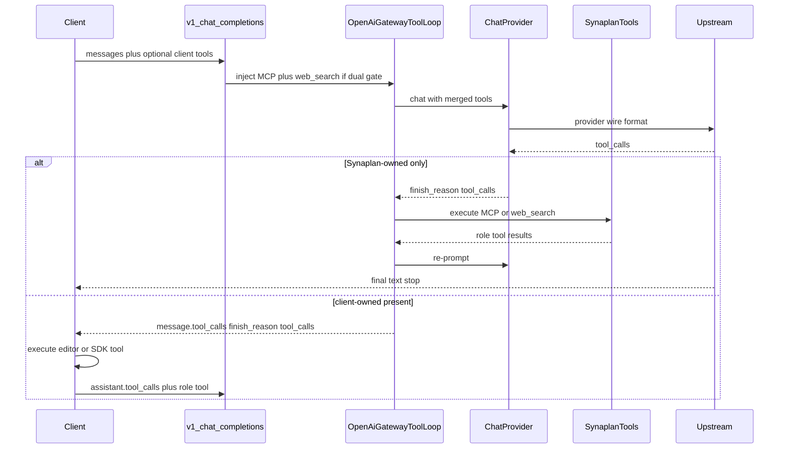

# Phase T — Tool calling in the chat providers and the OpenAI-compatible gateway

Status: planned, **highest priority — runs before Phase A**
Date: 2026-09-02
Revised: 2026-09-02 (dual capability gate + server-side MCP/web search on `/v1/chat/completions`)
Delivery: **OSS-only** (`synaplan` PHP). No compose / `synaplan-platform`
change. The dual-surface rule in `00_master_plan.md` starts at A0.
This file is the plan of record for the Cursor session plan
*Phase T tool calling*. Do not keep a second copy outside this directory.
Consumers: Collabora 26.04 AI Assistant (`../20260902-collabora-integration/02_epic_1_ai_assistant_provider.md`
Step 1.1), any OpenAI SDK client of `/v1/chat/completions` (Cursor, Continue,
LangChain), and later Phase B's `ChatToolLoop` (`office-plan_v2.md` Sprint 3).

## Where we stand (investigated 2026-09-02)

- `POST /v1/chat/completions` (`Controller/OpenAICompatibleController.php`)
  reads only `model`, `temperature`, `max_tokens`, `stream`; `tools`,
  `tool_choice`, assistant `tool_calls` and `role: tool` messages are
  ignored; the answer is always text with `finish_reason: "stop"`.
  `docs/OPENAI_COMPATIBLE_API.md` says so explicitly.
- `AI/Interface/ChatProviderInterface.php`: `chat()` returns
  `{content, usage, response_id?}`; `chatStream()` callback receives a string
  or `{type: content|reasoning|finish, ...}`. No tool shape anywhere.
- Providers: Groq, OpenAICompatible, Mistral, xAI, TrustedTokens talk
  **Chat Completions** (openai-php); OpenAI talks the **Responses API**;
  Anthropic and Google use their native HTTP APIs; Ollama, Triton,
  HuggingFace, Test. Only HuggingFace forwards `tools` from options — and
  still drops `tool_calls` from the answer.
- The Anthropic-shaped gateway (`AI/Messages/*`) already maps tools both
  ways for OpenAI Chat Completions and Gemini
  (`Translator/OpenAiMessagesTranslator.php`, `GeminiMessagesTranslator.php`)
  and runs a server-side loop (`Tools/GatewayToolLoop.php`) that executes
  Synaplan-owned MCP + `web_search` and **relays** client-owned tools.
  Reuse the mapping tables and the catalog/loop **semantics**. Do not route
  the OpenAI gateway through the Anthropic request body.
- Model capability: `Model::hasFeature()` on `BJSON.features`; the string
  `tool_use` exists but is set **inconsistently**. HuggingFace, TrustedTokens
  and some Mistral rows have it; **OpenAI / Groq / Anthropic / Gemini
  flagship chat rows do not** (e.g. GPT-5.4 is `['reasoning', 'vision']`
  only). That is a catalog bug and must be fixed in this phase.
- API-key scope for `/v1/*` is `desktop:messages`; unchanged.

## Decision — dual, consistent capability gate

Tool calling is allowed only when **both** are true:

1. **Provider gate:** the resolved chat provider implements
   `ToolCallingChatProviderInterface` and
   `supportsToolCalling($providerModelId)` returns true.
2. **Catalog flag:** the resolved `Model` has `hasFeature('tool_use')`.

The two must describe the same reality. Rules:

- `supportsToolCalling($model)` is `true` **iff** that model is flagged
  `tool_use` in the catalog (providers do not hard-code a private allow-list
  that drifts from `BJSON.features`).
- Every chat-tag model whose upstream API documents function calling
  **must** carry `tool_use`. Image / TTS / embedding / video rows must not.
- `/v1/models` advertises `synaplan:tool_use` only when both gates pass.
- A client `tools` / `tool_choice` (other than `none`) on a model that
  fails either gate → `400` `tools_not_supported`, never a silent text
  answer.
- A CI/unit test (`ModelCatalogToolUseConsistencyTest`) freezes the matrix:
  listed capable chat families must include `tool_use`; non-chat tags must
  not. Adding a capable chat model without the flag fails the suite.

**Existing installs:** `ModelSeeder` only updates rows whose fingerprint
still matches. Operator-edited `BJSON` is PRESERVE'd. Ship a Galera-safe
migration that **adds** `tool_use` to `BJSON.features` for the known
`service` + `providerId` keys **without overwriting** the rest of `BJSON`
(same `JSON_SET` / array-append pattern as
`backend/migrations/Version20260513120000.php`). Never remove an
operator-added feature.

**"Flagship"** in this plan means those `tool_use` chat models — the
product's capable chat rows (OpenAI GPT, Anthropic Claude, Gemini, Groq
Llama/Qwen/GPT-OSS, Mistral, xAI Grok, and the already-flagged HuggingFace /
TrustedTokens agentic rows). No second feature string.

## Decision — `/v1/chat/completions` offers Synaplan tools

Pass-through of **client** tools stays: Synaplan never executes a tool the
client owns (Collabora editor tools, Cursor/Continue tools). Those come back
as `finish_reason: "tool_calls"` for the client to run.

On top of that, for every request whose resolved model passes the dual
gate, the gateway **injects and executes** Synaplan-owned tools:

| Tool | When it is injected | How it is run |
| ---- | ------------------- | ------------- |
| User MCP catalog (read-only, `includeMutating: false`) | `MCP_CLIENT_ENABLED` is on **and** the user has at least one connected MCP server | `McpClient` — same dispatch as `GatewayToolCatalog` |
| `web_search` (`WebSearchTool`) | Brave (or the configured search provider) is available **and** `MESSAGES_GATEWAY.WEB_SEARCH_MODE` is not `off` | `WebSearchTool` |

This is a **policy difference** from `POST /v1/messages`:

- The Anthropic gateway injects MCP only when
  `MESSAGES_GATEWAY.MCP_TOOLS_ENABLED` is on (default **off**), and skips
  MCP when the client already sent `tools` unless
  `MCP_TOOLS_WITH_CLIENT_TOOLS` is on. Web search is injected only when the
  client declared Anthropic's `web_search_*` server tool (or mode is
  `synaplan`).
- OpenAI SDK clients and Collabora **never** send that Anthropic server-tool
  declaration, and Collabora **always** sends its own `tools[]`. If we
  reused those defaults, `/v1/chat/completions` would offer nothing.
- Therefore this endpoint **does not** require `MESSAGES_GATEWAY.ENABLED`
  or `MCP_TOOLS_ENABLED`. It respects the real availability switches
  (`MCP_CLIENT_ENABLED`, search provider, `WEB_SEARCH_MODE=off`) and
  **injects alongside client tools**. Name collision: if the client already
  declared the same function name, skip the Synaplan declaration (client
  owns that name).

Server-owned calls are executed inside Synaplan; intermediate MCP / search
rounds are **not** streamed to the client (same suppress rule as
`GatewayToolLoop`). The client sees either the final text
(`finish_reason: "stop"`) or the **client-owned** `tool_calls`.

## Design in one paragraph

The provider contract is extended **additively** through `$options` and new
chunk types — no signature change, so the 12 existing providers keep
compiling. The gateway is a **hybrid loop**: forward client tools, inject
Synaplan MCP + `web_search` on dual-gated models, execute only what Synaplan
owns, relay the rest. Mapping helpers are extracted from the Messages
translators; loop **semantics** are copied from `GatewayToolLoop` into an
OpenAI-shaped `OpenAiGatewayToolLoop` (`finish_reason === 'tool_calls'`,
`role: tool` messages).

## Steps (one branch and PR each, in this order)

### T1 — Contract, consistent `tool_use` flags, test provider

Branch: `feat/chat-provider-tool-contract`

- `AI/Interface/ChatProviderInterface.php` docblock: document the additive
  contract.
  - Options: `tools` (OpenAI function declarations
    `[{type:'function', function:{name, description?, parameters?}}]`),
    `tool_choice` (`'auto'|'none'|'required'|{type:'function',function:{name}}`),
    `parallel_tool_calls` (bool).
  - Input messages may contain assistant `tool_calls` and `role: 'tool'`
    (`tool_call_id`, `content`) entries, and array `content`.
  - `chat()` return gains `tool_calls?: list<{id, type:'function',
    function:{name, arguments: string}}>` and `finish_reason?: string`.
  - Stream chunk types gain `['type'=>'tool_call_delta','index'=>int,
    'id'=>?string,'name'=>?string,'arguments'=>string]`; the `finish` chunk
    may carry `finish_reason: 'tool_calls'`.
- New marker `AI/Interface/ToolCallingChatProviderInterface extends
  ChatProviderInterface` with `supportsToolCalling(string $model): bool`.
  Implementations look up the catalog row and return
  `$model->hasFeature('tool_use')`. Providers opt in during T2 / T5 / T6.
- New `AI/Tool/ToolCallAccumulator` (final): folds `tool_call_delta` chunks
  by `index` into complete `tool_calls`, guarantees `id` (generate
  `call_<random>` when upstream omits it — Gemini does), validates that
  `arguments` is a JSON object string (repair `''` → `'{}'`).
- New `AI/Tool/OpenAiToolShapes` (final, static): validation of incoming
  `tools`/`tool_choice`, normalization of `tool_choice` variants, and the
  mapping helpers the providers share (`toChatCompletionsTools`,
  `toResponsesTools`, `toAnthropicTools`, `toGeminiDeclarations`) —
  extracted from the two Messages translators **without changing their
  behavior** (translators call the shared helpers; their tests stay green).
- `AI/Service/StreamChunk::visibleText()` must keep returning `''` for the
  new chunk type (add a test).
- `Model/ModelCatalog.php`: add `tool_use` to every chat-tag row whose
  upstream documents function calling. Confirmed missing today: OpenAI GPT
  chat family, Groq chat rows, Anthropic Claude chat rows, Gemini chat
  rows, xAI Grok chat rows, remaining Mistral chat rows. Do **not** flag
  `pic2text` / `text2pic` / `vectorize` / TTS / video slots even when they
  share a provider id with a chat row.
- Galera-safe Doctrine migration: for each `service`+`providerId` in that
  list, `JSON_SET` / array-append `tool_use` onto `BJSON.$.features` if
  absent. Idempotent; do not rewrite operator-owned toggles
  (`BSELECTABLE`, `BACTIVE`, `BISDEFAULT`).
- New `tests/Unit/Model/ModelCatalogToolUseConsistencyTest.php`: the
  capable-family matrix vs catalog features. This is the lock that keeps
  the two gates consistent when someone adds a model later.
- `AI/Provider/TestProvider.php`: implement the marker; honor `tool_use` on
  the test-model row (add the feature to `ModelSeeder::TEST_MODELS` / test
  catalog json). When `tools` are present and the last user message starts
  with `TOOLTEST:<name>:<json>` return a matching `tool_call` (stream:
  `tool_call_delta` chunks split in two, then `finish tool_calls`); when
  the history ends with a `role: tool` message answer
  `Tool result received: <content>`. Extra: `TOOLTEST:web_search:...` and
  `TOOLTEST:mcp:...` so T4 can drive the loop without a live upstream.
- Tests: `ToolCallAccumulatorTest`, `OpenAiToolShapesTest` (incl. the
  extracted translator mappings), `StreamChunkTest`, `TestProvider` tool
  behavior, `ChatProviderContractTest` extended with "tools option is
  ignored gracefully by non-tool providers".

### T2 — Chat Completions providers

Branch: `feat/tools-chat-completions-providers`

- New trait `AI/Provider/Concerns/ChatCompletionsToolSupport` used by
  Groq, OpenAICompatible, Mistral, xAI, TrustedTokens, HuggingFace:
  - request: add `tools`, `tool_choice`, `parallel_tool_calls` when present;
    pass assistant `tool_calls` and `role: tool` messages through unchanged;
  - non-stream: read `choices[0].message.tool_calls` and `finish_reason`;
  - stream: turn `choices[0].delta.tool_calls[*]` into `tool_call_delta`
    chunks and the final `finish_reason` into the `finish` chunk.
- Each provider implements `ToolCallingChatProviderInterface`;
  `supportsToolCalling()` returns the catalog `tool_use` flag for that
  model (HuggingFace included — no special case once flags are consistent).
- Tests per provider with recorded upstream JSON (non-stream + SSE) under
  `tests/Fixtures/ai/tools/<provider>/`.

### T3 — Gateway: `/v1/chat/completions` speaks tools (pass-through)

Branch: `feat/openai-gateway-tools`

Wire format first, so Groq / OpenAI-compatible / TestProvider can serve
Collabora editor tools immediately. Server-side injection lands in T4 on
this same surface.

- `OpenAICompatibleController::chatCompletions()`: parse and validate
  `tools`, `tool_choice`, `parallel_tool_calls` (400 `invalid_request_error`
  on malformed input); keep `messages` intact including `tool_calls`,
  `role: tool`, array content. Dual gate: if tools are present and either
  the provider is not a `ToolCallingChatProviderInterface` **or** the model
  lacks `tool_use` → 400 `tools_not_supported` naming the model. Move the
  growing logic into `Service/Api/OpenAiChatCompletionRequest` (parsing)
  and `Service/Api/OpenAiChatCompletionResponder` (shaping) so the
  controller stays thin.
- Non-stream response: `message.tool_calls` when present, `content: null`
  if the model returned no text, `finish_reason: "tool_calls"`.
- Stream: first chunk `delta.role`; text `delta.content`; tool calls as
  OpenAI does — first chunk per index carries `index`, `id`, `type`,
  `function.name`, `function.arguments` (partial), later chunks carry
  `index` + `function.arguments`; final chunk `finish_reason: "tool_calls"`;
  honor `stream_options.include_usage` with a trailing usage chunk;
  `[DONE]`.
- Metering unchanged (`recordUsage('API_CHAT', …)`), `response_text` for the
  session summary = text content plus a one-line `[tool_call name(...)]`
  note per call so digests stay meaningful.
- Upstream 4xx about tools → mapped to 400 `tools_not_supported`, never a
  500.
- `GET /v1/models`: add `capabilities: ["synaplan:tool_use"]` only when
  both gates pass (additive field; OpenAI clients ignore unknown keys).
- OpenAPI annotations; `docs/OPENAI_COMPATIBLE_API.md`: replace "not yet
  supported" with the supported subset and a curl example of a two-round
  client-tool exchange. T4 adds the server-tool section.
- Tests: `OpenAICompatibleControllerToolsTest` driving the `TestProvider`
  through non-stream and stream, two-round exchange, malformed tools,
  unsupported provider, model missing `tool_use`; SSE golden files in
  `tests/Fixtures/openai-compatible/tools/`.

### T4 — Server-side MCP + web search on `/v1/chat/completions`

Branch: `feat/openai-gateway-server-tools`

This is no longer out of scope. It is the step that makes flagship models
on this endpoint actually **offer** Synaplan tools.

- New `AI/OpenAI/OpenAiGatewayToolLoop` (final): OpenAI-shaped copy of
  `GatewayToolLoop` semantics.
  - Inject catalog tools (converted with `OpenAiToolShapes`) at the front
    of `tools[]`.
  - On `finish_reason === 'tool_calls'`, partition calls into
    Synaplan-owned (dispatch table) vs client-owned.
  - Owned only → execute (MCP via `McpClient`, `web_search` via
    `WebSearchTool`), append `{role:'tool', tool_call_id, content}`,
    re-prompt. Bound by `MESSAGES_GATEWAY.MCP_MAX_ITERATIONS` (default 8),
    16 tools/turn, 240s wall clock, 12k-char result trim — same constants
    as the Anthropic loop.
  - Any client-owned call → stop the loop and return those `tool_calls`
    to the client (mixed turns prefer returning client-owned and still
    executing owned ones first if that stays simple; if mixed is messy,
    execute owned, then return leftover client-owned — document the
    chosen rule in the class docblock and lock it with a test).
  - Streaming: suppress intermediate server rounds; emit only the final
    assistant text or the client-owned `tool_calls` SSE.
- Reuse `GatewayToolCatalog` / `McpToolCatalogAdapter` / `WebSearchTool`
  for the snapshot. Add a small adapter that answers "OpenAI completions
  policy" (inject MCP even when the client sent tools; inject `web_search`
  without an Anthropic server-tool declaration). Do **not** change the
  Anthropic gateway's defaults.
- Injection conditions (all must hold): dual capability gate; for MCP,
  `MCP_CLIENT_ENABLED` + at least one user server; for web search,
  `WebSearchTool::isAvailable()` and `WEB_SEARCH_MODE !== off`.
- Name collision: skip a Synaplan declaration whose function name is
  already in the client's `tools[]`.
- `tool_choice: none` → do not inject, do not loop.
- Metering: each loop iteration records usage; session summary notes
  `[web_search:…]` / `[mcp:server/tool]` so digests stay meaningful.
- Docs: `docs/OPENAI_COMPATIBLE_API.md` section "Server tools (MCP and
  web search)" with a curl that sends **no** client tools and still gets
  a search-backed answer when Brave is configured. Cross-link
  `docs/ANTHROPIC_COMPATIBLE_API.md` and spell out the policy difference.
- Tests: loop with TestProvider (`TOOLTEST:web_search`, `TOOLTEST:mcp`);
  client-owned relay; name collision; `tool_choice: none`; MCP disabled;
  search unavailable; stream suppression of an intermediate server round.
  Fake `McpClient` / `WebSearchTool` — no live network.

### T5 — OpenAI Responses API provider

Branch: `feat/tools-openai-responses`

- `OpenAIProvider::buildResponsesRequest()`: `tools` →
  `[{type:'function', name, description, parameters, strict:false}]`,
  `tool_choice` mapping; history: assistant `tool_calls` → `function_call`
  input items (`call_id`, `name`, `arguments`), `role: tool` →
  `function_call_output` items (`call_id`, `output`).
- Non-stream: `output[*].type === 'function_call'` → `tool_calls`;
  `finish_reason: 'tool_calls'` when any present.
- Stream: `response.output_item.added` (function_call) → first
  `tool_call_delta` with `id`/`name`; `response.function_call_arguments.delta`
  → argument deltas; `response.output_item.done` closes; `response.completed`
  → `finish`.
- Keep `previous_response_id` behavior intact; tests with recorded Responses
  payloads.
- `supportsToolCalling()` = catalog `tool_use` for that model.

### T6 — Anthropic and Google providers

Branch: `feat/tools-anthropic-google-providers`

- `AnthropicProvider`: `tools` via `OpenAiToolShapes::toAnthropicTools`
  (`input_schema`), `tool_choice` → `{type: auto|any|tool}`; history:
  assistant `tool_calls` → `tool_use` content blocks, `role: tool` → user
  `tool_result` blocks; response `tool_use` blocks → `tool_calls`; stream
  `content_block_start` (tool_use) + `input_json_delta` → `tool_call_delta`;
  `stop_reason: tool_use` → `finish tool_calls`. Update the class comment
  that says tools are not implemented.
- `GoogleProvider`: `tools: [{functionDeclarations}]`, `toolConfig`
  mapping of `tool_choice`; history: `functionCall` / `functionResponse`
  parts; response `functionCall` parts → `tool_calls` (generate ids);
  stream: whole-arguments delta per part.
- Ollama: implement the marker only for models flagged `tool_use` (add the
  flag only when Ollama metadata / our catalog says the pulled model
  supports tools); otherwise false. Optional, last.

### T7 — Wrap-up

- Admin model list shows the tool badge from `hasFeature('tool_use')`
  (the flag is now a real gate, so the badge is truthful).
- Record in both `STATUS.md` files that `ToolCallingChatProviderInterface`
  and `OpenAiGatewayToolLoop` exist so Phase B / Collabora Epic 1.1 build
  on them instead of re-adding them.

## Out of scope here (explicitly)

- Internal chat (`ChatHandler`) using tools — that is Phase B's
  `ChatToolLoop`.
- Structured outputs / `response_format: json_schema` — separate, small,
  can follow T3 if a client needs it.
- Changing Anthropic `/v1/messages` defaults (`MCP_TOOLS_ENABLED` stays
  off until an admin enables the Messages gateway tools).
- Mutating MCP tools on this endpoint (`includeMutating: false`).

## Gate

Backend only: `make -C backend lint && make -C backend phpstan && make -C backend test`
per PR; the frontend is untouched except when T3 changes OpenAPI
annotations that the SPA consumes (it does not consume `/v1/*`, verify with
`make -C frontend generate-schemas` producing no diff).
