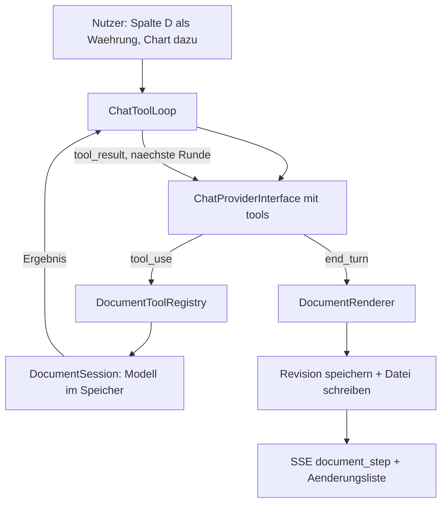

t# AI Dokument-Editing (Excel, Word, PowerPoint)

## Warum heute nichts Feines geht

Der `officemaker`-Pfad ist ein Einweg-Trichter: Das Modell liefert `{"BFILEPATH":…,"BFILETEXT":…}` (Markdown bzw. CSV), [backend/src/Service/File/DocumentGeneratorService.php](backend/src/Service/File/DocumentGeneratorService.php) rendert daraus **jedes Mal eine komplett neue Datei**. Konkrete Folgen:

- Excel kennt keine Typen: alles landet als `TYPE_STRING`, ein einziges Sheet, keine Formeln, keine Charts (`writeXlsx`, Zeilen 517–548).
- Ein Edit bedeutet: gesamter Dateitext zurück in den Prompt (auf 10.000 Zeichen gekürzt, [ChatHandler.php](backend/src/Service/Message/Handler/ChatHandler.php) Zeilen 1460–1482), Modell schreibt alles neu. Formatierung, die nicht in Markdown ausdrückbar ist, existiert nicht und geht daher bei jedem Turn verloren.
- Hochgeladene Dateien kommen nur als flacher Tika-Text an ([TikaClient.php](backend/src/Service/File/TikaClient.php)) — keine Zellen, keine Folien.

## Zwei tragende Entscheidungen

**1. Das Dokumentmodell ist die Wahrheit, nicht die Binärdatei.**
Binär-Round-Trip mit PhpSpreadsheet verliert Charts, sobald Reader oder Writer `setIncludeCharts(true)` fehlt, und auch dann Styles; PhpWord und PhpPresentation lesen DOCX/PPTX nur rudimentär. Wir halten stattdessen ein versioniertes, strukturiertes Modell (Sheets/Zellen/Formeln/Styles, Word-Blöcke, Folien) und rendern die Datei daraus deterministisch. Werkzeuge patchen das Modell, nie die ZIP-Datei. Damit sind beliebig viele Edit-Turns verlustfrei.

**2. Der Tool-Loop wird nachgebaut, nicht umgebogen.**
[GatewayToolLoop.php](backend/src/AI/Messages/Tools/GatewayToolLoop.php) hat das Muster fertig (Iterations- und Wall-Clock-Bounds, Server/Client-Partition, Fehler als `tool_result` statt Abbruch, Zeilen 142–238). Er hängt aber an `MessagesTranslatorInterface` und am Anthropic-Wire-Format. Der Web-Chat läuft über `ChatProviderInterface`, das gar kein Tool-Calling kennt. Wir bauen einen zweiten, schlanken Loop auf `ChatProviderInterface` und übernehmen Bounds und Fehlerverhalten 1:1.




## Sprint 0 — Dokumentmodell und Rendering, ohne KI

Neues Verzeichnis `backend/src/Service/Document/`. Reine Datenklassen plus Renderer, alles `final readonly`, strict types, testbar ohne Modell.

- `Model/SpreadsheetModel`, `SheetModel`, `CellModel` (Wert, Typ, Formel, Zahlenformat), `StyleModel`, `ChartModel`
- `Model/WordModel` mit Blocktypen (Heading, Paragraph, Table, Image, TOC, PageBreak) und Style-Referenzen
- `Model/DeckModel` — greift die bestehenden Strukturen aus [backend/src/Service/File/Presentation/](backend/src/Service/File/Presentation/) auf (`SlideDeck`, `SlideContent`, `PptxTheme`) statt sie zu duplizieren
- `Render/DocumentRenderer` als Dispatcher plus `XlsxRenderer`, `DocxRenderer`, `PptxRenderer`-Adapter auf den vorhandenen [PptxRenderer.php](backend/src/Service/File/Presentation/PptxRenderer.php)
- `Serializer/DocumentModelSerializer`: Modell zu/von JSON, mit `schemaVersion` für spätere Migration

Der bestehende `DocumentGeneratorService` bleibt unangetastet und weiter der Default-Pfad. Neue Composer-Pakete sind nicht nötig — `phpoffice/phpspreadsheet ^5.8`, `phpword ^1.4`, `phppresentation` sind gepinnt.

Gate: `XlsxRenderer` erzeugt Formeln, Zahlenformate, zwei Sheets und ein Bar-Chart; die Datei öffnet sich und `IOFactory::load()` liest die Werte zurück.

## Sprint 1 — Persistenz und Versionshistorie

`BFILETEXT` ist belegt: Volltextsuche ([FileRepository.php](backend/src/Repository/FileRepository.php) Zeile 65), Digests ([MessageDigestService.php](backend/src/Service/Digest/MessageDigestService.php) Zeile 380), Summaries, MCP-Ressourcen, `text_preview`. Dort darf kein JSON hinein, sonst verschlechtern wir Suche und RAG. Also eigene Tabelle.

Doctrine-Migration nach [docs/MIGRATIONS.md](docs/MIGRATIONS.md), Galera-tauglich: nur rohes `addSql` mit `CREATE TABLE IF NOT EXISTS`, kein Zugriff auf `Schema $schema`.

- Tabelle `BDOCUMENT_REVISIONS`: `BID`, `BFILEID`, `BUSERID`, `BVERSION`, `BSCHEMAVERSION`, `BMODEL` (LONGTEXT, JSON), `BSUMMARY`, `BCREATED`
- Entity `App\Entity\DocumentRevision` plus `DocumentRevisionRepository`
- `DocumentRevisionService`: `latestFor(File)`, `append(File, model, summary)`, `restore(File, version)`, Kappung auf `KEEP_REVISIONS`
- `BFILETEXT` bekommt weiter eine **Text-Projektion** des Modells (`DocumentTextProjector`), damit Suche, Digest und Summary unverändert funktionieren

Wichtig: Mehrere Fremdschlüssel im Schema haben kein `ON DELETE CASCADE` (siehe AGENTS.md). Beim Löschen einer Datei müssen Revisionen zuerst weg — in `FileController`/Service und in der Migration berücksichtigen.

## Sprint 2 — Werkzeuge auf dem Modell

`backend/src/Service/Document/Tool/`. Vertrag angelehnt an [WebSearchTool.php](backend/src/AI/Messages/Tools/WebSearchTool.php), diesmal aber als echtes Interface, weil es viele Tools werden:

```php
interface DocumentToolInterface
{
    public function name(): string;
    public function declaration(): array;              // JSON-Schema
    public function appliesTo(): array;                // ['xlsx'] etc.
    public function execute(DocumentSession $s, array $input): DocumentToolResult;
}
```

`DocumentToolResult` trägt `ok`, `message` (für das Modell), `userLabel` (i18n-Key plus Parameter für die UI) und `isError`. Tools werfen nie — Fehler kommen als Ergebnis zurück, genau wie im Gateway-Loop.

Werkzeugsatz:

- Excel: `read_range`, `set_cells`, `set_formula`, `set_number_format`, `set_cell_style`, `add_column`, `add_row`, `add_sheet`, `sort_range`, `add_chart`, `set_conditional_format`
- Word: `read_outline`, `insert_block`, `replace_block`, `delete_block`, `set_block_style`, `set_table_cell`, `insert_toc`, `insert_image`
- PowerPoint: `read_deck`, `add_slide`, `set_slide_content`, `move_slide`, `delete_slide`, `set_theme`, `insert_image`

`read_*` ist Pflicht, nicht Kür: nur so sieht das Modell den Ist-Zustand und muss ihn nicht im Prompt mitgeschleppt bekommen. Genau das ersetzt die heutige 10.000-Zeichen-Volltext-Injektion.

`DocumentSession` hält das Modell während eines Turns im Speicher, protokolliert die angewandten Operationen und schreibt erst am Turn-Ende Datei plus Revision — ein fehlgeschlagener Turn hinterlässt kein halb kaputtes Dokument.

Gate: jedes Tool hat einen Unit-Test, inklusive Fehlerfälle (Bereich außerhalb, unbekanntes Sheet, ungültige Formel).

## Sprint 3 — Tool-Calling in den Providern

`ChatProviderInterface` bleibt unverändert (viele Implementierungen, auch `TestProvider` und `OpenAICompatibleProvider`). Stattdessen ein zusätzliches, optionales Interface:

```php
interface ToolCallingChatProviderInterface
{
    public function chatWithTools(array $messages, array $tools, array $options = []): array;
    public function chatStreamWithTools(array $messages, array $tools, callable $cb, array $options = []): array;
}
```

Rückgabe normalisiert auf eine interne Form (`content`, `toolCalls[]`, `stopReason`, `usage`), damit der Loop providerunabhängig bleibt. Als Mapping-Vorlage dienen die vorhandenen Translator: [OpenAiMessagesTranslator.php](backend/src/AI/Messages/Translator/OpenAiMessagesTranslator.php) Zeilen 177–223 und `GeminiMessagesTranslator`.

Pro Provider:

- `GroqProvider` — Chat Completions über `openai-php/client`, einfachster Fall: `tools`/`tool_choice` in `$requestOptions` (Zeilen 159–167), `delta.tool_calls` im Stream (Zeilen 261–276). Damit anfangen.
- `OpenAIProvider` — nutzt die **Responses API**, nicht Chat Completions. `tools` in `buildResponsesRequest()` (Zeilen 344–370), Parsing des `output`-Arrays statt nur `outputText`, im Stream `response.function_call_arguments.delta` und `response.output_item.done`.
- `AnthropicProvider` — direktes HTTP, `tools` in den Request-Body (Zeilen 188–192, 316–321), `tool_use`-Blöcke und `input_json_delta` in `parseSSEStream()` (Zeilen 891–915). Der Klassenkommentar (Zeilen 22–25) sagt heute explizit „nicht implementiert" — mit anpassen.
- `GoogleProvider` — `functionDeclarations` im Payload (Zeilen 197–205), `functionCall`-Parts im Stream (Zeilen 378–388).

Modellfähigkeit über das bestehende `features`-Muster: `'tools'` in `json.features` im [ModelCatalog.php](backend/src/Model/ModelCatalog.php), geprüft mit `Model::hasFeature('tools')` — analog zum Vision-Check in [ChatHandler.php](backend/src/Service/Message/Handler/ChatHandler.php) Zeilen 969–970. Kann ein Modell keine Tools, fällt der Turn sauber auf den heutigen `officemaker`-Pfad zurück. Das ist die Sicherheitsleine für Ollama und selbstgehostete Endpunkte.

## Sprint 4 — Der Chat-Tool-Loop

`backend/src/AI/Tool/ChatToolLoop.php`, Bounds und Fehlerverhalten von `GatewayToolLoop` übernommen:

- Iterationsgrenze aus BCONFIG (Default 8), Wall-Clock 240 Sekunden, maximal 24 Operationen pro Turn
- Tool wirft nie den Loop ab: Fehler geht als `tool_result` zurück, das Modell korrigiert sich
- Loop-Ende bei `end_turn`, bei erschöpften Bounds oder wenn keine bekannten Tools mehr kommen
- Jede Runde meldet Fortschritt über den vorhandenen Status-Callback

Einstieg in [ChatHandler.php](backend/src/Service/Message/Handler/ChatHandler.php): bei `topic === 'officemaker'`, gesetztem Flag und tool-fähigem Modell statt `aiFacade->chatStream()` in den Loop. Alle anderen Topics bleiben unberührt. Der Prompt bekommt eine eigene Variante `officeMakerPrompt` für den Tool-Modus (Werkzeuge nutzen, keine JSON-Envelopes) — als **neues** Topic `officemaker` bleibt bestehen, der Prompttext wird flaggenabhängig gewählt, damit die Routing-Snapshots nicht driften.

Achtung Snapshots: sobald `MessageClassifier`, `MessageSorter` oder Planner-Prompt berührt werden, driften `routing_classification.json`, `planner_system_prompt.txt` und `utterance_plans.json`. Neu aufnehmen und **jede** Zeile im Diff prüfen.

## Sprint 5 — Sichtbarkeit für den Nutzer

Ohne UI ist der Loop eine Blackbox. Copilot punktet vor allem damit, dass man sieht, was passiert.

Backend, neues SSE-Event neben dem bestehenden `generating_file`:

- `document_step` mit `{ index, total?, labelKey, labelParams }` — pro ausgeführtem Tool
- `complete` trägt zusätzlich `documentChanges: [{ labelKey, labelParams }]` und `version`

Frontend:

- [ChatMessage.vue](frontend/src/components/ChatMessage.vue) Zeilen 302–326: der `generating_file`-Block bekommt eine kompakte Schrittliste unter der Unterzeile, mit `txt-tertiary` und `surface-chip` aus [style.css](frontend/src/style.css) — keine Tailwind-Farben, in Light, Dark und V2 geprüft
- Änderungszusammenfassung als Block unter den Datei-Badges: „Spalte D als Währung formatiert, Balkendiagramm auf Blatt 1 eingefügt"
- Versionshistorie: Aufklapper an der Datei mit „Version wiederherstellen", über `useDialog()` bestätigt, Rückmeldung über `useNotification()` — nie `confirm()`
- `frontend/src/types/chatStream.ts` erweitern (Stream-Events sind handtypisiert, nicht aus OpenAPI generiert)

Zwei neue Endpunkte, mit vollständigen OpenAPI-Annotationen, danach `make -C frontend generate-schemas` und `vue-tsc`:

- `GET /api/v1/files/{id}/revisions`
- `POST /api/v1/files/{id}/revisions/{version}/restore`

i18n in **allen fünf** Locales (`en`, `de`, `es`, `fr`, `tr`), Platzhalternamen identisch zu Englisch — `localeParity.spec.ts` gated Vollparität. Neue Namensräume: `processing.documentStep`*, `message.documentChanges`*, `files.revisions*`. Copy für Laien: „Spalte hinzugefügt", nicht „add_column ausgeführt".

## Sprint 6 — Hochgeladene Dateien bearbeiten

Erst hier, weil es der unsicherste Teil ist.

- `Import/SpreadsheetImporter` über `IOFactory::load()` mit `LOAD_WITH_CHARTS` — bei xlsx tragfähig
- `Import/WordImporter` und `DeckImporter` als ausdrücklich verlustbehafteter Best-Effort-Import
- `ImportFidelityReport`: was nicht übernommen wurde. Der Nutzer bekommt das **vor** dem ersten Edit zu sehen, statt es später zu merken.
- [MessageClassifier.php](backend/src/Service/Message/MessageClassifier.php) Zeilen 210–222: heute geht jedes analysierbare Non-Image-Attachment nach `analyzefile`. Für „ändere diese Datei" auf einem xlsx muss stattdessen `officemaker` greifen — Guard und Charakterisierungs-Snapshot zusammen anpassen.

## Sprint 7 — Rollout

BCONFIG-Flags über einen Seeder nach dem Muster von [FileContextConfigSeeder.php](backend/src/Seed/FileContextConfigSeeder.php) (`BConfigSeeder::insertIfMissing`), alles **standardmäßig aus**:

- `DOCUMENT_TOOLS.ENABLED` = 0
- `DOCUMENT_TOOLS.MAX_ITERATIONS` = 8
- `DOCUMENT_TOOLS.MAX_OPS_PER_TURN` = 24
- `DOCUMENT_TOOLS.KEEP_REVISIONS` = 10
- `DOCUMENT_TOOLS.ALLOW_UPLOAD_EDIT` = 0

Bootstrap-Fallstrick aus AGENTS.md: BCONFIG-Defaults greifen nur bei Neuinstallationen. Für bestehende Installationen braucht ein Default-Wechsel eine Migration mit explizitem UPDATE. Und: ein Flag, das aus ist, macht neue Logik zum No-op — vor „fertig" prüfen, dass der Pfad wirklich erreicht wird.

Weiter:

- Admin-Umschalter über das bestehende Config-Gruppen-Muster in `SystemConfigService`
- Neue Pfade in [.github/mobile-impact-policy.json](.github/mobile-impact-policy.json) einordnen: `backend/**` ist backend-only, `frontend/**` ist ota-candidate. Unbekannte Pfade fallen auf store-required und machen CI rot. `tests/mobile-impact.test.mjs` mit erweitern.
- Dokumentation in `docs/`

## Risiken

- **Kosten und Latenz.** Acht Runden mit Werkzeugen sind teurer als ein Aufruf. Bounds sind niedrig gesetzt; `read_`* liefert Bereiche, keine kompletten Blätter.
- **Modelle ohne Tools.** Ollama und OpenAI-kompatible Endpunkte fallen auf den heutigen Pfad zurück. Deshalb bleibt `officemaker` alt vollständig funktionsfähig und wird nicht ersetzt.
- **PhpPresentation** ist auf `dev-master as 1.3.0` gepinnt — beim Rendern über die vorhandenen Klassen bleiben, keine neuen Reader-Pfade.
- **Zwei Wahrheiten.** Solange das Flag aus ist, existieren alter und neuer Pfad parallel. Revisionen entstehen nur im neuen Pfad; die Datei-UI muss den Fall „keine Historie" beherrschen.

## Qualitätsgate

Vor jedem Commit vollständig, nicht gefiltert:

```bash
make lint && make -C backend phpstan && make test && docker compose exec -T frontend npm run check:types
```

`--filter` und `phpstan analyse <pfad>` sind **nicht** das Gate — Characterization- und Integrationstests liegen außerhalb der üblichen Namensräume. Snapshots nach Routing-Änderungen neu aufnehmen und Zeile für Zeile prüfen. Arbeit läuft auf einem Feature-Branch mit Conventional Commits, niemals direkt auf `main`.