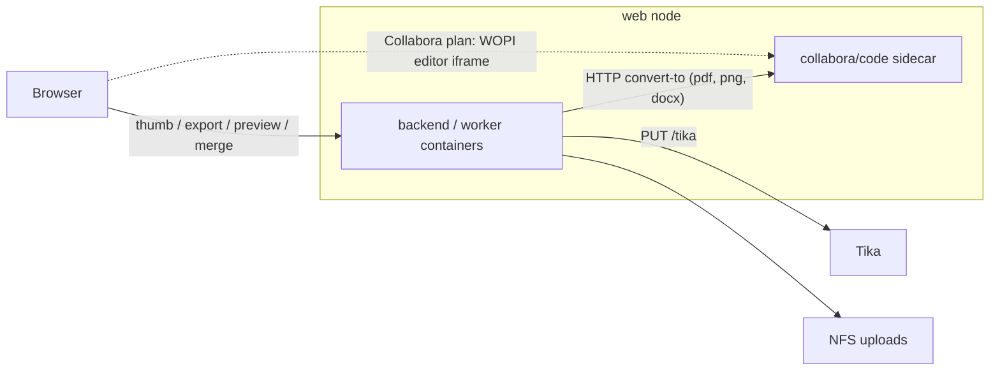

# Office documents: engine, UX quick wins, then editing

Status: planned (see `STATUS.md`)
Date: 2026-09-02
This is the persisted English v3 write-up of the Cursor session plan
*Office docs UX and LibreOffice*. The executable step lists are
`00_master_plan.md`, `03_phase_t_tool_calling_gateway.md`,
`01_phase_a_engine_and_ux.md`, and `02_phase_b_structured_editing.md`.
`office-plan_v2.md` remains the detailed design for Phase B.

The Collabora-editor side (WOPI, AI Assistant, extension, MCP, partners)
is **not** Phase C here. It is a separate plan:
`../20260902-collabora-integration/`.

## What I found

- `officemaker` is a chat topic, not a handler: the model returns
  `{"BFILEPATH","BFILETEXT"}`,
  `backend/src/Service/File/DocumentGeneratorService.php` renders
  DOCX/XLSX/PPTX with PhpOffice, `ChatHandler` / `StreamController` store
  the `File` row (two near-identical store paths). PDF output is explicitly
  excluded in `MessageClassifier` and the prompt. Open issues: #1396 (DOCX
  has no styling), #1499 (previews/thumbnails).
- Ingestion is Tika only (`TikaClient.php`); PDF fallback rasterizes via
  Imagick/`pdftoppm` (`PdfRasterizer.php`). Video thumbnails already exist
  end to end: `ThumbnailService` → `File.thumbPath` →
  `GET /api/v1/files/{id}/thumb` → `thumb_url` → `FilePreview.vue`. Office
  files today render as an icon or a text snippet.
- LibreOffice 24.2 (Ubuntu apt) is on the dev host and on web1–3, but
  **nothing in any repo references it**. The backend runs in Docker
  (`ghcr.io/metadist/synaplan`, Debian bookworm) and cannot execute host
  binaries. All external services already follow one pattern: HTTP URL in
  env (`TIKA_BASE_URL`, `QDRANT_URL`, `SYNAPLAN_TTS_URL`), host reachable
  via `extra_hosts` (`docker-host:host-gateway`).
- `office-plan_v2.md` is a sound long-term design (document model as truth
  + tool loop), but it is 8 sprints deep before a user sees anything, and
  it does not use LibreOffice at all.

## Decision 1 — how LibreOffice reaches Synaplan

Do **not** bind-mount the host `soffice` into the container (glibc/library
coupling Ubuntu vs Debian, undocumented, breaks on every host upgrade).
Do **not** bake LibreOffice into `synaplan-base-php` (+~500 MB per image;
bare `soffice --headless` needs one profile dir per concurrent call and
crashes take the PHP worker with them).

**Run Collabora CODE (`collabora/code`) as a sidecar container**, one per
web node, and talk to it over HTTP exactly like Tika:

- `POST http://collabora:9980/cool/convert-to/<format>` (multipart
  `data=@file`) converts any office format to `pdf`, `png` (first page
  only), `docx`/`xlsx`/`pptx`, `odt`, `csv`, `html`, `txt`.
  `GET /hosting/capabilities` reports `convert-to.available`.
- Same container later serves the WOPI editor (Collabora integration plan)
  — one engine, no second deployment path. It isolates crashes on
  malformed documents and manages concurrency (forkit/kits) itself.
- Gotenberg would be the simpler alternative if we never wanted the
  editor; the Collabora choice keeps the editor on the same box.
- The apt LibreOffice on web1–3 is not needed by the containers and can
  be removed (or kept for admin one-offs). Do not maintain a second path
  via host-side `unoserver`.

Sizing: CODE idles at roughly 0.5–1 GB RAM; set
`--o:num_prespawn_children=2` and a memory limit in compose. Dev: compose
profile `office`. Prod: service in `synaplan-platform` on the compose
network, **no published port** for conversion (a public HTTPS hostname is
only needed for the editor).

**Public docs:** `synaplan-docs` must state that the new office
capabilities need this LibreOffice engine (step A0-docs). Host
`apt install libreoffice` is not enough. Desktop's local LibreOffice
(Agent Skills doctor) is a different install. See
`01_phase_a_engine_and_ux.md` § A0.

## Decision 2 — UX first, model second

`office-plan_v2.md` builds the document model, persistence, tools,
provider tool-calling and the loop before a user sees anything
(Sprints 0–4). We ship the engine-backed UX wins first (Phase A, each
step one PR, each shippable alone), then Phase B with a narrowed first
slice (xlsx only).

## Decision 3 — tool calling first

Tool calling is pulled in front of Phase A as **Phase T**
(`03_phase_t_tool_calling_gateway.md`). It is the shared building block
for Collabora's AI Assistant, OpenAI-SDK clients of
`/v1/chat/completions`, and Phase B's `ChatToolLoop`.

- Dual, consistent gate: `ToolCallingChatProviderInterface` **and**
  catalog `tool_use` (flags fixed + migration + consistency test).
- Hybrid loop on `/v1/chat/completions`: relay client tools; inject and
  execute MCP + `web_search` on dual-gated models.

## Phase T — tool calling (first)

Detail: `03_phase_t_tool_calling_gateway.md`. One PR each: T1 contract +
flags, T2 Chat Completions providers, T3 gateway pass-through, T4
server-side MCP + web search, T5 OpenAI Responses, T6 Anthropic/Google,
T7 wrap-up.

## Phase A — engine + UX quick wins

Detail: `01_phase_a_engine_and_ux.md`. Each step independently shippable.
The engine is optional (`OFFICE_CONVERT_URL` empty = today's behaviour).

- **A0** Converter client + `collabora/code` sidecar. **Two wirings:**
  OSS profile `office` (dev, minimal, `deploy/compose.yaml`; Umbrel/AWS
  stay off); our `synaplan-platform` demo turns it **on** per web node
  (Centrifugo analog). See `00_master_plan.md` "Two delivery surfaces".
- **A0-docs** Public `synaplan-docs` page `office-documents.md` +
  cross-links (Quickstart, FAQ, Architecture, Using Synaplan, Production,
  Hosting, Desktop tools).
- **A1** Thumbnails for office documents and PDFs (office half of #1499).
- **A2** Download as PDF (`GET /api/v1/files/{id}/export?format=pdf`).
- **A3** Inline preview modal (PDF iframe).
- **A4** Officemaker delivers PDF; unify generated-file store; lift
  classifier PDF exclusion; re-record routing snapshots.
- **A5** DOCX default styling (#1396, no engine).
- **A6** Analysable ingestion: legacy/Apple via engine + structured
  sheet/slide text.
- **A7** Combine documents as one PDF.

## Phase B — structured editing (v2, re-sequenced)

Detail: `02_phase_b_structured_editing.md` + `office-plan_v2.md`.

Keep the two decisions from v2 (document model as truth; a separate
`ChatToolLoop` on `ChatProviderInterface` mirroring `GatewayToolLoop`
bounds). Refinements:

- Ship **xlsx only first**, then docx, then pptx.
- Every revision render passes through the engine for a PDF preview
  (A2/A3) — cheaper than a bespoke diff UI.
- A document edited in Collabora makes the stored model stale. Revisions
  need a `source` (`model` | `binary`); decide before the migration.
- B7 is true format-preserving merge on the model.

## Collabora editor (not this directory)

WOPI host, "Open in editor", built-in AI Assistant provider, Synaplan
extension, Collabora MCP, partner platforms: see
`../20260902-collabora-integration/`. That plan depends on A0 here and
on Phase T for `/v1/chat/completions` tool calling.

## Ground rules

- Feature branches + Conventional Commits; never on `main`; no AI
  attribution.
- Full gate before each commit:
  `make lint && make -C backend phpstan && make test && docker compose exec -T frontend npm run check:types`.
- New endpoints: complete OpenAPI, regenerate Zod schemas. New UI text:
  all five locales. Colors via tokens, verified in light/dark/V2.
- No secrets or production node IPs in this public repo.
