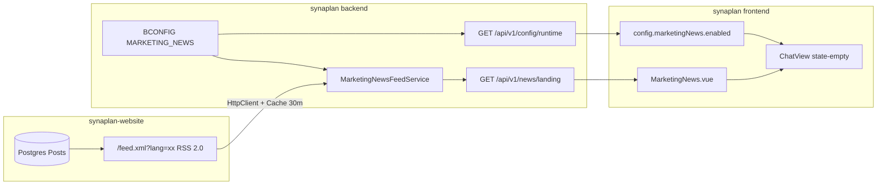

# Anonymous Landing Marketing News — Planning

**Date:** 2026-06-24  
**Status:** Implemented (master switch OFF by default; all gates green)  
**Scope:** Guest/anonymous chat landing in `synaplan/` (backend BCONFIG + public API + Vue cards), RSS feed in `synaplan-website/`  
**Out of scope:** Authenticated users starting a new chat, widget embed surface, partner-specific blog CMS

---

## 1. Goal

When an anonymous visitor opens the Synaplan chat (e.g. on `web.synaplan.com` or a partner-hosted instance), show a polished **marketing news** section below the welcome text with the latest posts from synaplan.com (or the admin’s own feed). The section:

- Is controlled by a **single admin master switch** per installation — **off by default** on every fresh OSS deploy
- Uses **configurable RSS feed URLs** per language (DE, EN, default for ES/TR) when enabled
- **Disappears** as soon as the user sends a message or the AI responds (same empty-state gate as today)
- Looks good on **mobile** (stacked cards) and **desktop** (2×2 grid, up to 4 cards)

---

## 2. Admin master switch (OSS requirement)

Every self-hosted / open-source installation must be able to **fully enable or disable** this feature without code changes, redeploys, or SQL.

| Requirement | How |
|-------------|-----|
| **Who can toggle** | `ROLE_ADMIN` only — via **Admin → System Config** (same panel as multitask routing, Qdrant thresholds) |
| **What they toggle** | One boolean: `MARKETING_NEWS.ENABLED` in BCONFIG (`'0'` / `'1'`) |
| **Default on fresh install** | **`'0'` (OFF)** — seeded by `MarketingNewsConfigSeeder`; partners see no marketing block until they opt in |
| **Takes effect** | Immediately — `source: database` in `SystemConfigService`; no container restart |
| **When OFF (hard off)** | No cards in UI · frontend skips `/api/v1/news/landing` · backend returns `{ items: [] }` · **no outbound HTTP** to any feed URL · runtime config exposes `marketingNews.enabled: false` |
| **When ON** | Cards appear for anonymous users only · backend fetches configured feed URL(s) · admin may keep synaplan.com defaults or point to their own WordPress/RSS source |
| **Not env-gated** | No `.env` flag that could force synaplan.com content on unwilling hosts — admin UI is the only control surface |

This mirrors the existing pattern for `MULTITASK_ROUTING_ENABLED`: database-backed, admin-schema field, `PUT /api/v1/admin/config/values`, global `ownerId=0` row.

**Admin UI field (proposed copy):**

> **Show marketing news on guest landing** — When enabled, anonymous visitors see a news card grid on the empty chat screen. When disabled, the landing page shows only the welcome text. Feed URLs below are ignored while disabled.

Feed URL fields remain visible in admin (so operators can preconfigure before enabling) but have **no runtime effect** until the master switch is ON.

---

## 3. Data flow

---

## 4. synaplan-website — RSS feed

| Item | Detail |
|------|--------|
| Route | `src/app/feed.xml/route.ts` |
| URL | `https://www.synaplan.com/feed.xml` (EN), `?lang=de` (DE) |
| Format | RSS 2.0 with WordPress-compatible namespaces (`content:`, `dc:`, `media:`) |
| Query | `status: PUBLISHED`, `locale`, `orderBy publishedAt desc`, `take: 12` |
| Matcher | Excluded from i18n proxy via `.*\..*` in `src/proxy.ts` |

---

## 5. synaplan backend — config + API

### BCONFIG group `MARKETING_NEWS` (global, `ownerId=0`)

| Setting | Purpose | Default (seed) | Admin UI type |
|---------|---------|----------------|---------------|
| `ENABLED` | **Master switch** — must be `'1'` for any news to show or fetch | `'0'` | boolean |
| `FEED_URL_EN` | English feed (used only when enabled) | `https://www.synaplan.com/feed.xml` | url |
| `FEED_URL_DE` | German feed (used only when enabled) | `https://www.synaplan.com/feed.xml?lang=de` | url |
| `FEED_URL_DEFAULT` | ES/TR fallback (used only when enabled) | `https://www.synaplan.com/feed.xml` | url |

`MarketingNewsConfig::isEnabled()` is checked **first** in every code path (`resolveFeedUrl`, `getLandingItems`, runtime config). If false, downstream layers never run.

### Admin UI

New tab **Guest landing** → section **Marketing news** in `SystemConfigService::buildSchema()`:

| Schema key | Maps to BCONFIG |
|------------|-----------------|
| `MARKETING_NEWS_ENABLED` | `MARKETING_NEWS.ENABLED` |
| `MARKETING_NEWS_FEED_URL_EN` | `MARKETING_NEWS.FEED_URL_EN` |
| `MARKETING_NEWS_FEED_URL_DE` | `MARKETING_NEWS.FEED_URL_DE` |
| `MARKETING_NEWS_FEED_URL_DEFAULT` | `MARKETING_NEWS.FEED_URL_DEFAULT` |

All fields: `'source' => 'database'`, `'sensitive' => false`. Writes via existing `PUT /api/v1/admin/config/values` — **admin-only**, no new endpoints.

### Public endpoints

| Route | Auth | Returns |
|-------|------|---------|
| `GET /api/v1/config/runtime` | Public | `marketingNews: { enabled }` — frontend reads this before any news fetch |
| `GET /api/v1/news/landing?lang=xx` | Public | `{ items: [...] }` — **always `{ items: [] }` when master switch OFF**; no feed HTTP when disabled |

### Services

- `MarketingNewsConfig` — flag + locale → feed URL resolver
- `MarketingNewsFeedService` — HttpClient fetch, SimpleXML parse, Symfony cache (30 min TTL)
- `MarketingNewsConfigSeeder` — registered in `SeedAllCommand`

---

## 6. synaplan frontend — Vue cards

| File | Role |
|------|------|
| `components/MarketingNews.vue` | Responsive card grid; **only mounts when** `config.marketingNews.enabled === true` |
| `services/api/newsApi.ts` | Typed client + Zod schema |
| `stores/config.ts` + `httpClient.ts` | `marketingNews.enabled` from runtime config |
| `views/ChatView.vue` | Render inside `state-empty`, gated `!auth && config.marketingNews.enabled` |
| `i18n/{de,en,es,tr}.json` | Section heading, read-more link |

**Frontend gating (defence in depth):**

1. `ChatView` — `v-if="!authStore.isAuthenticated && configStore.marketingNews.enabled"` — component not mounted when OFF
2. `MarketingNews.vue` — re-checks `enabled` before calling `newsApi`; renders nothing if fetch returns empty
3. No hardcoded synaplan.com URLs in frontend — all content comes from backend when admin has enabled + configured feeds

**Hide on chat start:** component lives in `v-else-if="messages.length === 0"` — no extra state.

---

## 7. Tests + gates

- Backend: `RssFeedParserTest` (fixture XML), `NewsControllerTest` (public, **master switch OFF → empty items, no HttpClient call**), `MarketingNewsConfigTest` (enabled/disabled resolution)
- Frontend: `MarketingNews.spec.ts` (renders cards when enabled; **no fetch / no DOM when disabled**)
- Gates: `make lint && make -C backend phpstan && make test` (synaplan); website lint/build

---

## 8. Implementation checklist

- [x] `synaplan-website`: `feed.xml/route.ts` (ESLint + tsc green)
- [x] `synaplan`: BCONFIG seeder (`ENABLED='0'`) + admin schema (master boolean first) + `MarketingNewsConfig`
- [x] `synaplan`: feed service short-circuits when disabled + `NewsController` + runtime `marketingNews.enabled` + `security.yaml`
- [x] `synaplan`: OpenAPI → `generate-schemas` (`marketingNews` in generated Zod)
- [x] `synaplan`: `MarketingNews.vue` + ChatView integration + i18n (de/en/es/tr)
- [x] Tests green: backend 2193 OK, frontend 736 OK, phpstan OK, both lint gates OK
- [x] E2E smoke: feed fetch+parse+controller verified against a live WordPress RSS feed; flag reset OFF
