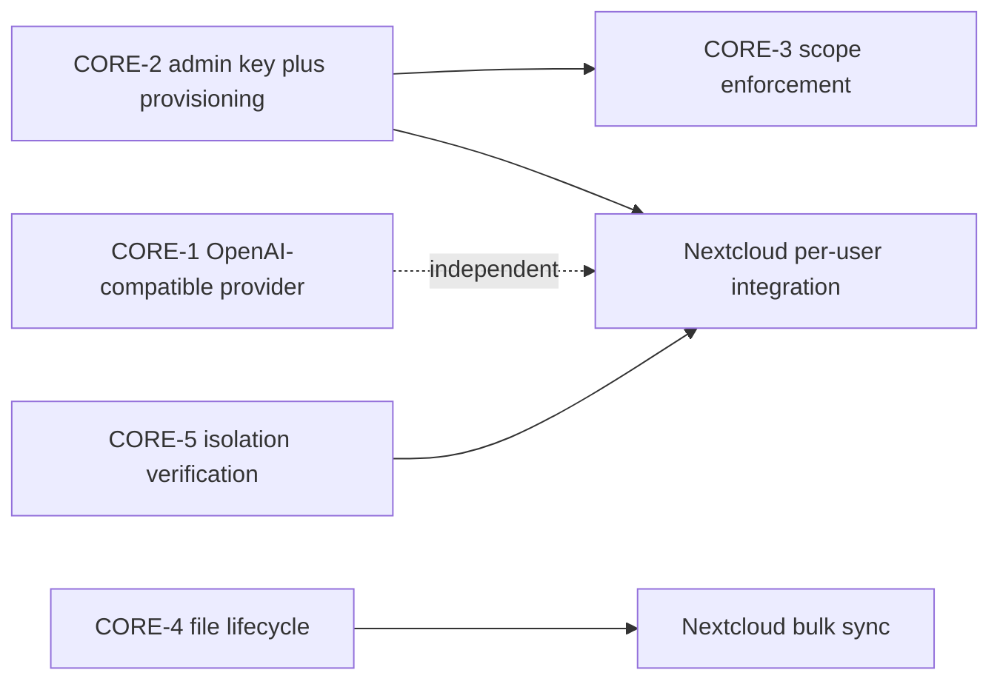

# Hosting-Partner Requirements — Synaplan Core Work Items

**Date:** 2026-07-09
**Status:** Planned — not started
**Origin:** Q&A exchange with a hosting company that wants to run the Synaplan
Nextcloud app (`synaplan-nextcloud` repo) for its customers. This document
extracts every requirement that must be solved in **Synaplan core** (this
repo). The Nextcloud-side plan lives in
`synaplan-nextcloud/.local/20260709-hosting-partner-extension-plan.md` and
references the items below by their IDs (`CORE-1` … `CORE-5`).

**Scope:** `backend/src` (providers, API keys, admin API, file/embedding
lifecycle) + admin frontend surfaces. **Out of scope:** everything inside the
Nextcloud app itself (per-user key storage in NC, sync workers, NC admin UI).

---

## Summary table

| ID | Item | Status today | Effort | Priority |
|----|------|--------------|--------|----------|
| CORE-1 | Generic "OpenAI Compatible" provider in BMODELS (custom URL + auth) | Missing | L | **P1** |
| CORE-2 | Admin API key (service account) + programmatic user provisioning | Missing | M | **P1** |
| CORE-3 | API-key scope enforcement (per-user keys exist, scopes are decorative) | Partial | M | **P2** |
| CORE-4 | Knowledge-file lifecycle: overwrite, delete-after-embed, "stale" state | Partial | M | **P1** |
| CORE-5 | Per-user knowledge isolation — verification + contract documentation | Implemented | S | **P2** |

`S` ≤ half a day, `M` ≈ 1–2 days, `L` ≈ 3+ days.

---

## CORE-1 — "OpenAI Compatible" as a first-class service in BMODELS (P1)

**Request (verbatim intent).** "I want to ADD my OpenAI compatible backbone
URL with auth to Synaplan as a CHOICE in BMODELS. I need any URL as 'OpenAI
Compatible' as the service, then the details to connect, and Synaplan able to
use it — including file uploads, multi-modal results, etc." (Target: LocalAI,
vLLM, LiteLLM, and similar self-hosted gateways.)

**Today.** Upstream providers are hardcoded classes in
`backend/src/AI/Provider/` with env-var credentials
(`OPENAI_API_KEY`, `OLLAMA_BASE_URL`, …). OpenAI-*shaped* upstreams exist only
with fixed URLs (Groq, Mistral, HF router). The only custom-URL providers are
Ollama and Triton, both via install-wide env vars. There is no way for an
admin to register an arbitrary OpenAI-compatible endpoint at runtime.

**Target design.**

1. **New service value** `OpenAICompatible` in the `BSERVICE` vocabulary
   (entity `backend/src/Entity/Model.php`, catalog
   `backend/src/Model/ModelCatalog.php`). Models of this service are NOT
   seeded from the static catalog — they are admin-created rows.
2. **Endpoint registry.** An endpoint = `{name, base_url, api_key, extra
   headers?}`. Store per-install in `BCONFIG` (encrypted API key), following
   the existing `HiggsfieldCredentialResolver` pattern
   (`backend/src/AI/Credential/`). A BMODELS row of service
   `OpenAICompatible` references its endpoint by name in `BJSON`
   (e.g. `{"endpoint": "localai-gpu1"}`); `BPROVID` stays the upstream model
   id passed in the request body.
3. **New provider class** `OpenAICompatibleProvider` in
   `backend/src/AI/Provider/`, registered in `config/services.yaml` with the
   full capability tag set. Implementation reuses the OpenAI client with an
   overridden base URL. Capability support (all standard OpenAI API shapes):
   - `chat` incl. SSE streaming (`/v1/chat/completions`)
   - `vectorize` (`/v1/embeddings`)
   - `pic2text` / vision — image parts in chat messages (multi-modal input)
   - file uploads (`/v1/files`) where the endpoint supports it
   - `text2pic` (`/v1/images/generations`) where supported
   - `sound2text` (`/v1/audio/transcriptions`) where supported
   Per-endpoint capability toggles live in the endpoint config, since not
   every gateway implements every route; `ProviderRegistry`
   (`backend/src/AI/Service/ProviderRegistry.php`) must respect both the
   endpoint toggle and the `BMODELS.BTAG` capability as today.
4. **`isAvailable()`** = at least one endpoint configured (DB-backed, not
   env-backed — this is the first provider whose availability is not an env
   var; `ProviderRegistry` health checks must handle that).
5. **Admin UI/API.** Extend `AdminModelsService` /
   `AdminModelsController` (`/api/v1/admin/models`) with endpoint CRUD
   (`/api/v1/admin/openai-endpoints` or similar) + a "test connection" action
   (list `/v1/models` on the upstream). Frontend: admin models view gets an
   "OpenAI Compatible endpoints" section; adding a model of this service
   requires picking an endpoint.
6. **Model discovery (nice-to-have).** "Import models" button that calls the
   upstream `/v1/models` and offers rows to create in BMODELS.

**Acceptance.**
- Admin can register `https://localai.example.com/v1` + key, add a chat model
  and an embedding model on it, set them as user defaults, and chat +
  vectorize work end to end (streaming included).
- A vision-capable model on the endpoint answers image questions.
- Removing the endpoint cleanly deactivates its BMODELS rows (no orphaned
  defaults — `ModelConfigService` fallback must survive).

---

## CORE-2 — Admin API key + programmatic user provisioning (P1)

**Request.** "A Synaplan configuration option to set the ADMIN api key; the
Nextcloud admin says: with this admin key, I allow my Nextcloud users to
create an account in my Synaplan installation and steer their account."

**Today.** `BAPIKEYS` (`backend/src/Entity/ApiKey.php`) keys always
authenticate as their owning user; there is no service-account/admin-key
concept. Admin powers require `ROLE_ADMIN` session/OIDC. The admin API
(`backend/src/Controller/AdminController.php`) can list/patch/delete users
but **cannot create** them; users only appear via self-registration, OAuth,
or OIDC JIT provisioning (`OidcUserService`).

**Target design.**

1. **Admin-scoped API keys.** An API key owned by an admin user with scope
   `admin:*` (or finer: `admin:users`, `admin:apikeys`) is accepted by the
   `^/api/v1/admin` firewall paths. `ApiKeyAuthenticator` grants the owner's
   roles; enforcement of the scope is CORE-3. Non-admin owners can never hold
   `admin:*` scopes (validated at key creation in `ApiKeyController`).
2. **`POST /api/v1/admin/users`** — create a user: email, display name,
   optional password (else invite/passwordless), plan level, and an
   `external_id` / `source` pair (e.g. `source=nextcloud`,
   `external_id=<NC instance id>:<NC uid>`) for idempotent lookup.
   Re-posting the same external identity returns the existing user (upsert
   semantics) so integrations can call it safely.
3. **`POST /api/v1/admin/users/{id}/apikeys`** — issue (and rotate/revoke) a
   per-user API key *on behalf of* a user. Returns the secret once. This is
   the handover the Nextcloud app needs: admin key in, per-user key out.
4. **`GET /api/v1/admin/users/{id}/usage`** — per-user usage/stats for the
   cross-link panel ("which NC user used what in Synaplan"): message counts,
   file counts, vector storage size, model usage. Reuse the existing admin
   stats queries where possible.
5. New users created this way go through
   `ModelConfigService::initializeNewUserDefaults()` exactly like
   registration does.

**Acceptance.**
- With only an `sk_` admin key (no browser session), a script can: create a
  user, mint that user's API key, upload a file as that user (using the
  minted key), and read the user's usage.
- The same create call twice returns the same user id.
- A non-admin key hitting `/api/v1/admin/*` gets 403.

---

## CORE-3 — API-key scope enforcement (P2)

**Today.** `BAPIKEYS.BSCOPES` is stored and `ApiKey::hasScope()` exists, but
no controller checks it — any key grants full authenticated access as its
owner. That is acceptable for self-owned keys but becomes a real risk once
admin keys (CORE-2) exist and once hosting partners distribute keys to
end-user devices.

**Target design.**

1. Define the scope vocabulary: `*` (full), `chat`, `files`, `rag`,
   `webhooks:*` (existing default), `admin:users`, `admin:apikeys`,
   `admin:models`, `admin:stats`.
2. Enforce centrally — a request listener / attribute on route groups (not
   per-controller if-blocks): map route prefixes to required scopes,
   check via `hasScope()` after `ApiKeyAuthenticator` resolves the key.
3. Backward compatibility: existing keys with the legacy `webhooks:*` default
   are migrated to `*` (they factually had full access; silently narrowing
   them would break integrations). New keys default to a sensible narrow set;
   the key-creation UI/API lets the user pick scopes.
4. `admin:*` scopes creatable only by admin owners (see CORE-2).

**Acceptance.**
- A key scoped `chat` cannot list files or touch `/api/v1/admin/*`.
- Existing production keys keep working unchanged after migration.

---

## CORE-4 — Knowledge-file lifecycle: overwrite, delete-after-embed, stale (P1)

**Request.** "We need to OVERRIDE files that exist already, be able to delete
the file from the Knowledge Base once it is embedded, and if the file changed
meanwhile, a 'stale' indication. I would like that to be planned."
Plus, from the bulk-ingest discussion: "what about files that change? A sync
mechanism is needed" — the core side must give integrators the primitives.

**Today.** `BFILES` has `BVECTORSTATE`; per-file re-vectorize exists
(`POST /api/v1/files/{id}/re-vectorize`, `FileUploadService::reVectorize()`
deletes old vectors first); delete removes vectors
(`VectorStorageFacade::deleteByFile()`). But: re-upload of the same document
creates a *new* row (no overwrite), there is no source-checksum/etag
tracking, and no `stale` state.

**Target design.**

1. **Source identity on upload.** Extend the upload API
   (`FileController` / `FileUploadService`) with optional
   `source_id` (stable external id, e.g. NC file id), `source_etag` /
   `source_mtime`, alongside the existing `source=nextcloud|opencloud`.
   Stored on `BFILES` (new columns via Doctrine migration — Galera rules
   apply: raw idempotent `addSql()`, no `Schema` API).
2. **Overwrite semantics.** Upload with `overwrite=1` + matching
   `(user, source, source_id)` (fallback: `(user, group_key,
   original_name)`) replaces the existing row's content, re-extracts,
   re-vectorizes (reusing `reVectorize()`), and keeps the file id stable.
   No version chain in v1 — replacement only.
3. **Stale state.** New `BVECTORSTATE` value `stale`.
   - Set explicitly: `POST /api/v1/files/{id}/mark-stale` (integrator
     detected a source change) — or implicitly when a new `source_etag` is
     reported that differs from the stored one.
   - Cheap bulk check: `POST /api/v1/files/check-stale` with
     `[{source_id, source_etag}, …]` returns which files are stale/missing —
     this is what a sync client polls instead of re-uploading everything.
   - Surfaced in the file manager UI (badge) and filterable
     (`GET /api/v1/files?vector_state=stale`).
   - Stale files remain searchable (old vectors stay) until re-vectorized —
     stale ≠ excluded; document this clearly.
4. **Delete-after-embed.** Optional `retain_source=0` flag: after successful
   vectorization the binary payload is discarded, keeping the `BFILES` row,
   extracted text, and vectors. Deleting the KB entry entirely already works
   (`DELETE /api/v1/files/{id}`); verify Qdrant + BRAG cleanup in both
   storage backends and cover with a test.
5. **Bulk ingest friendliness.** Confirm rate-limit configuration
   (`RateLimitConfigSeeder`) has a lane for high-volume trusted uploads
   (admin-key or scope-based multiplier), so a few-hundred-GB initial sync
   doesn't fight end-user limits. Vectorization remains the GPU cost center —
   expose queue depth / per-user vectorize counts in CORE-2's usage endpoint
   so operators can see the load.

**Acceptance.**
- Re-uploading a changed NC file with the same `source_id` updates in place;
  RAG answers reflect the new content; file id unchanged.
- `check-stale` with 1000 entries answers in one round trip.
- A file marked stale shows the badge and is re-vectorizable one click / one
  API call later.

---

## CORE-5 — Per-user knowledge isolation: verify + document the contract (P2)

**Request.** "The knowledge base must be PER USER, not install-wide."

**Today.** This is already the architecture: `BFILES.BUSERID`,
`BRAG.BUID`, Qdrant `user_documents` filtered by `userId` payload
(`QdrantClientDirect`), group keys (`BGROUPKEY`) scoped within a user. The
install-wide *appearance* the partner saw comes from the Nextcloud app using
one shared API key — i.e. one Synaplan user — which is fixed by CORE-2 + the
Nextcloud-side plan, not by core changes.

**Work items.**
1. Add/extend an integration test proving user A's RAG search can never
   return user B's chunks in both vector backends (MariaDB `BRAG` and
   Qdrant), including the `rag_group_key` path on the stream endpoint.
2. Document the isolation contract in `docs/` (one page: what is user-scoped,
   what is global, what an integrator must NOT do — e.g. sharing one API key
   across human users) so partners can be pointed at it.

---

## Suggested sequencing

CORE-2 and CORE-4 unblock the Nextcloud work and should go first; CORE-1 is
independent and can proceed in parallel; CORE-3 hardens what CORE-2
introduces and should land in the same release.
