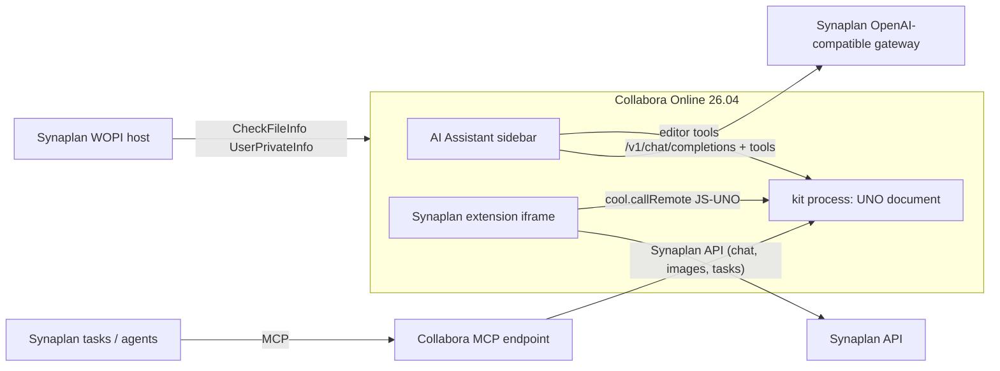

# Collabora Integration — Master Plan

Status: planned (see `STATUS.md`)
Date: 2026-09-02
Sibling plan: `../20260902-office-docs/` covers the **Synaplan side** (create,
analyse, convert, merge and edit office files inside Synaplan). This plan
covers the **Collabora side**: a user sitting in the Collabora Online editor
(Writer, Calc, Impress) uses Synaplan — chat, image generation, tasks,
knowledge — on the text, cells and slide elements in front of them.

## Goal

Synaplan becomes the AI behind the Collabora editor, in three places:

1. **Our own Collabora** — the `collabora/code` sidecar from the office-docs
   plan, opening Synaplan files via a Synaplan WOPI host.
2. **Partner-hosted Collabora** — Nextcloud, OpenCloud, ownCloud, where the
   platform already runs Collabora and Synaplan is installed as an app.
3. **Any Collabora** — a standard Synaplan extension that a Collabora
   operator can drop into their installation.

## What Collabora Online offers today (investigated 2026-09-02)

Collabora Online **26.04** (CODE released July 2026) changed the picture; the
integration surfaces, from most to least standard:

| Surface | What it is | Access to document | Status |
| ------- | ---------- | ------------------ | ------ |
| **Built-in AI Assistant** | Sidebar in Writer/Calc/Impress that talks to any **OpenAI-compatible** `/v1/chat/completions` endpoint (`/v1/models` for the model list) and lets the model call **editor-provided tools** (rephrase, formulas, slides, images, summarise). Configured in `coolwsd.xml <ai>` (`enabled`, `api_url`, `api_key`, `model`, `allow_user_settings`), per document via WOPI `CheckFileInfo.UserPrivateInfo` (`AIProviderURL`, `AIProviderAPIKey`, `AIProviderModel`), or per user in File > Options. Off by default. | Full, via Collabora's own tools; the model must support function calling | Shipped in 26.04; young (see upstream issue #15997 on tool loops) |
| **MCP endpoint** | Collabora exposes Model Context Protocol so an external AI client can drive editor functions **without an open editor session** | Full, server side | Shipped in 26.04, details to verify |
| **iframe-hosted extensions** | A directory `browser/dist/extensions/<reverse-dns-id>/` with `manifest.json` (0.1), an HTML entry and an icon; appears as an "Extensions" notebookbar tab / menu and opens as a sidebar iframe. `cool.js` gives `cool.callRemote(fn, ...args)` — runs a JS function **inside the kit process with the full UNO API** (text, cells, shapes) — and `cool.document.on*` hooks (selection change, modification, comments). | Full | Behind `experimental_features` in `coolwsd.xml`; manifest 0.1, "API not frozen" |
| **postMessage API** (integrator page ↔ editor iframe) | `Insert_Button`/`Button_Clicked` (classic toolbar only, not the notebookbar), `Send_UNO_Command` (`.uno:InsertText`, `.uno:ExecuteSearch`, …), `Action_InsertGraphic` (host must be in `lok_allow`), `CallPythonScript` (needs pyuno packages on the server) | Partial: insert yes, **read selection no** without Python | Stable for years |
| WOPI host | `CheckFileInfo` / `GetFile` / `PutFile` — the file storage side | File bytes only | Stable |

Synaplan already has the two things the first surface needs:
`OpenAICompatibleController` at `/v1/chat/completions` + `/v1/models`
(API-key auth, `ApiKeyScope`), and an MCP connector layer
(`AI/Messages/Mcp/*`, plan `20260821-mcp-oauth-connectors`). What it lacks:
the OpenAI endpoint **drops `tools`** (it forwards only model, temperature,
max_tokens, stream) and `ChatProviderInterface` has no tool calling — the
same gap `office-plan_v2.md` Sprint 3 closes.

## Decisions

1. **Ride the built-in AI Assistant first.** Synaplan as the provider behind
   Collabora's own sidebar is the standard, zero-install path that also works
   in Nextcloud/OpenCloud. It needs no Collabora plugin — only a
   tool-calling-transparent `/v1/chat/completions`. Everything Synaplan adds
   (memories, RAG knowledge, file context, rate limits, plugins) rides along
   because the request enters through our gateway.
2. **The Synaplan WOPI host lives in this plan.** "Open in editor" is the
   bridge between the two sides and the test bed for every epic here; it is
   built once (Epic 0) and the office-docs plan only links to it.
3. **Own extension = Epic 2, not Epic 1.** The iframe extension framework is
   experimental (0.1). Build it as the richer experience (Synaplan chat UI,
   image generation into the document, tasks) once the AI Assistant path is
   in production, and keep the postMessage path as the fallback for
   installations without the experimental flag.
4. **Never patch Collabora.** Everything is configuration (`coolwsd.xml`,
   WOPI), a drop-in extension directory, or Synaplan-side code. Partner
   platforms get the same Synaplan endpoint, provisioned through the apps we
   already ship (`synaplan-nextcloud`, `synaplan-opencloud`).

## Epics

| Epic | Content | Detail |
| ---- | ------- | ------ |
| 0 | Synaplan WOPI host + "Open in editor" (bridge and test bed) | `01_epic_0_wopi_host.md` |
| 1 | Synaplan as the provider of Collabora's built-in AI Assistant (tool-calling gateway, provisioning via WOPI / `coolwsd.xml`) | `02_epic_1_ai_assistant_provider.md` |
| 2 | Synaplan extension for Collabora (iframe-hosted, `cool.callRemote`), postMessage fallback | `03_epic_2_synaplan_extension.md` |
| 3 | Collabora MCP endpoint driven by Synaplan tasks / agents | `04_epic_3_mcp_and_tasks.md` |
| 4 | Partner platforms: Nextcloud, OpenCloud, ownCloud provisioning | `05_epic_4_partner_platforms.md` |

Dependencies on the office-docs plan: A0 (the `collabora/code` sidecar and
`OFFICE_CONVERT_URL`) for Epic 0; Phase B2 (`ToolCallingChatProviderInterface`
per provider) is **shared** with Epic 1 — build it once, in whichever plan
gets there first, and record it in both `STATUS.md` files.

## Ground rules

Same as `../20260902-office-docs/00_master_plan.md`, plus:

- Pin the Collabora version we test against (image tag + digest) and record
  the postMessage IDs, `UserPrivateInfo` keys and `cool.js` calls we depend
  on in `STATUS.md`; re-verify on every Collabora bump.
- Everything Collabora-facing is **default off** and additive: no behavior
  change for installations without Collabora.
- The OpenAI-compatible gateway is a public API surface: API-key scopes,
  rate limits and metering apply unchanged; never bypass them for the
  editor.
- No production hostnames, node details or keys in this public repository.
