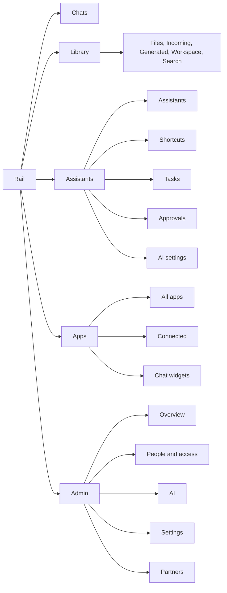

# UX overhaul — navigation, every sub page, guided tours

**Status:** 2026-10-09 — opened. Replaces the open steps NV10–NV23 of
[`../20260914-navigation-consolidation/00_master_plan.md`](../20260914-navigation-consolidation/00_master_plan.md).
**Binding contracts:** [`../20260907_ux_user_flows.md`](../20260907_ux_user_flows.md)
(U1–U12, §6 sprint-file contract) and AGENTS.md "Perfect UX & Stability".
**Class:** every step is `ota-candidate` unless marked `backend-only`.
**Shell:** colours, the rail and the second sidebar stay. Only the tree and
the pages inside it change.

| File | Content |
| ---- | ------- |
| `00_master_plan.md` (this) | Why, the new tree, old → new map, glossary, steps, gates |
| [`01_sprint_foundation.md`](./01_sprint_foundation.md) | UX01–UX02: EmptyState, PageHeader help, wording guard, driver.js tours |
| [`02_sprint_tree_and_apps.md`](./02_sprint_tree_and_apps.md) | UX03–UX07: rail tree, Apps directory, every integration as an app, widgets conversations |
| [`03_sprint_assistants_ai.md`](./03_sprint_assistants_ai.md) | UX08–UX09: Assistants, Shortcuts, Tasks, Approvals, AI settings |
| [`04_sprint_library_account.md`](./04_sprint_library_account.md) | UX10–UX11: Library tabs, account pages |
| [`05_sprint_admin.md`](./05_sprint_admin.md) | UX12: Admin overview, AI, settings search |
| [`06_sprint_tours_closeout.md`](./06_sprint_tours_closeout.md) | UX13–UX14: tour content, getting-started checklist, journeys, docs |

---

## 0. Why

The lead developer opened `/ai/providers`, `/ai/assistants`,
`/channels/approvals`, `/channels/platform-links` and `/channels/agents` and
could not say what any of them were for. The 2026-10-09 inventory found:

- **One menu, seven products.** "Channels" mixes messengers, the website
  widget, an IMAP automation, the desktop app, the coding gateway, partner
  platforms and the API. "Assistants" mixes models, keys, personas, snippets
  and routing.
- **Four things are called "prompt"** (saved prompts, instructions / task
  prompts, assistant instructions, planner / sorter prompt), **three are called
  "connection"** (connected apps, MCP, linked platforms) and **three are
  e-mail** (`smart+keyword@`, IMAP handler, mailbox connection).
- **Dead ends.** WhatsApp lists two hard-coded mock numbers
  (`frontend/src/mocks/config.ts`). Saved tasks cannot be created on the
  Saved tasks page. Linked platforms, Incoming and Generated have empty states
  without an action. `/statistics` is titled "Welcome to synaplan!".
  `/channels/platform-links` and `/channels/approvals` have no route guard.
- **Duplicates.** Live support is a subset of widget chats. Instructions vanish
  from the menu when Assistants is on but are still needed. The Higgsfield key
  and the Anthropic BYO key live away from the features that need them.
- **Walls of text.** Coding clients carries ~850 words, ~520 of them admin
  gateway settings on a user page. Admin has three "system" pages.
- **Dead help.** `HelpTour.vue` / `helpContent.ts` sit behind
  `FEATURE_HELP=false` and both route `helpId`s match no content.

## 1. Principles

1. **One concept, one home, one word** — in all five locales.
2. **Every page answers "what is this" in its first sentence**, and every empty
   state is one sentence plus one primary action (U5).
3. **Things from outside are Apps.** One directory, one card per app, one
   detail template (pattern: ChatGPT / Claude connectors directory).
4. **Users configure, admins operate.** Instance knobs leave user pages.
5. **Redirect, never 404**, for ≥ 2 releases, query preserved.
6. **Flag off ⇒ absent** (U11), including the route.
7. **Explain on demand.** A guided tour per area, started once
   automatically, restartable from the `?` in every page header.

## 2. The new tree

Rail: **Chats · Library · Assistants · Apps · Admin**. The second sidebar
lists at most ~6 entries per section.



## 3. Old → new (every page)

| Today | After | Step |
| ----- | ----- | ---- |
| `/ai/assistants` | **Assistants**, intro sentence, filter chips explained and hidden when empty | UX08 |
| `/prompts` | **Shortcuts** ("type / in the chat"), example + empty state | UX08 |
| `/channels/tasks` | **Tasks** at `/tasks`, **New task** button on the page | UX03, UX08 |
| `/channels/approvals` | **Approvals** at `/approvals`, route guard | UX03, UX08 |
| `/ai/models`, `/ai/instructions`, `/ai/task-prompts` | **AI settings** tabs *Default models* and *Topics* (always visible) | UX09 |
| `/ai/routing` | Admin › AI › Chat behaviour (routing) | UX09 |
| `/ai/providers` | Dissolved: Higgsfield app, Anthropic key inside the Claude Code app | UX05, UX06 |
| `/channels` (Inbound) | Apps: WhatsApp, Telegram, *Email to Synaplan*; mocks removed | UX04 |
| `/channels/email` | App *Mailbox automation* | UX04 |
| `/channels/connections` | Apps: Microsoft 365, Dropbox, WebDAV folder, Calendar, Custom tools | UX05 |
| `/channels/mcp` | App *Tool servers (MCP)* | UX05 |
| `/channels/platform-links` | Apps: Nextcloud, ownCloud, Outlook, with clear steps; guard | UX06 |
| `/channels/agents` | App *Claude Code & coding tools* (3 steps); gateway settings → Admin › AI | UX06, UX09 |
| `/channels/desktop` | App *Synaplan Desktop* | UX06 |
| `/channels/api`, `/channels/api/docs` | App *API & developers* | UX06 |
| `/plugins/:name` | Cards in category *Extensions* | UX06 |
| `/channels/widgets*` | **Chat widgets** under Apps, tab *Conversations* | UX07 |
| `/channels/widgets/live-support` | Redirect → widgets *Conversations* tab, waiting filter | UX07 |
| `/files/*` | Real in-page tabs, rendered empty-state actions | UX10 |
| `/files/vectors` | Admin › AI › Knowledge search | UX10 |
| `/statistics` | Title "My usage", one header | UX11 |
| `/memories`, `/feedbacks` | Empty-state actions, correct settings link | UX11 |
| `/admin` + `/admin/features` | **Overview** with status cards and "needs attention" | UX12 |
| `/admin/setup` | **AI** with routing, gateway and vector storage sections | UX12 |
| `/admin/config` | **Settings** with search across all fields | UX12 |
| `/admin/partners` | Visible only when the server is publicly reachable | UX12 |
| "Operate" | **Admin** | UX03 |

## 4. Glossary (one word per concept)

| Concept | en | de | es | fr | tr |
| ------- | -- | -- | -- | -- | -- |
| AI persona | Assistant | Assistent | Asistente | Assistant | Asistan |
| `/` snippet | Shortcut | Schnellbefehl | Atajo | Raccourci | Kısayol |
| Topic system prompt | Topic | Thema | Tema | Sujet | Konu |
| Saved task | Task | Aufgabe | Tarea | Tâche | Görev |
| Approval request | Approval | Freigabe | Aprobación | Approbation | Onay |
| Anything connected from outside | App | App | App | App | Uygulama |
| Admin area | Admin | Admin | Administración | Administration | Yönetim |

Banned in primary copy (enforced by the wording guard): *Inbound*, *handler*,
*BYO*, *coding clients*, *platform instances*, *chunk*, *Operate*.

## 5. Steps

| Step | PR title | Class |
| ---- | -------- | ----- |
| UX00 | `docs(planning): UX overhaul master plan` | docs |
| UX01 | `feat(ui): EmptyState, PageHeader help button and wording guard` | ota-candidate |
| UX02 | `feat(help): guided tours with driver.js and per-user tour state` | backend-only + ota-candidate |
| UX03 | `feat(nav): Chats, Library, Assistants, Apps, Admin` | ota-candidate |
| UX04 | `feat(apps): Apps directory and detail template; messengers and e-mail` | ota-candidate |
| UX05 | `feat(apps): Microsoft 365, Dropbox, WebDAV, calendar, custom tools, MCP, Higgsfield` | ota-candidate |
| UX06 | `feat(apps): Nextcloud, ownCloud, Outlook, Claude Code, Desktop, API, plugins` | ota-candidate |
| UX07 | `feat(widgets): Conversations tab replaces Live support` | ota-candidate |
| UX08 | `feat(assistants): explained gallery, Shortcuts, Tasks with New task, Approvals` | ota-candidate |
| UX09 | `feat(ai): AI settings with Default models and Topics; routing to Admin` | ota-candidate |
| UX10 | `feat(library): in-page tabs and empty-state actions` | ota-candidate |
| UX11 | `fix(account): usage title, memories and feedback empty states` | ota-candidate |
| UX12 | `feat(admin): Overview, AI sections, settings search` | ota-candidate |
| UX13 | `feat(help): tour content per area and getting-started checklist` | ota-candidate |
| UX14 | `test(ux): journeys, redirect matrix, docs` | ota-candidate |

## 6. Journeys (U10)

| Id | Journey |
| -- | ------- |
| J-UX-1 | **Fresh install.** Clone, sign in; the checklist leads to a file, an assistant and an app; each rail section explains itself on the first visit. |
| J-UX-2 | **Connect Telegram.** Apps › Telegram, paste the token, `/start`, status "Connected", disconnect in one click. |
| J-UX-3 | **Take over a visitor.** Badge on Chat widgets › Conversations, take over, hand back to the AI. |
| J-UX-4 | **Create a task directly.** Tasks › New task, schedule, run now, find the result. |
| J-UX-5 | **Admin.** Overview names the problem, one click opens the right AI section, settings search finds a field. |

## 7. Gates (every step)

```bash
make ci-local
make test-e2e
make -C frontend test-e2e-layout          # nav / layout changes
node scripts/mobile-impact.mjs --base main --head HEAD
make -C frontend generate-schemas         # after OpenAPI changes, then vue-tsc
```

Light, dark, V2, 320 px and five locales in the same PR. New dependency
`driver.js` (MIT, ~7 KB) approved 2026-10-09. No schema migration.

## 8. Rollback

Frontend refactors with redirects; revert the PR. The `toursSeen` profile
field (UX02) is additive and ignored by an older frontend.
