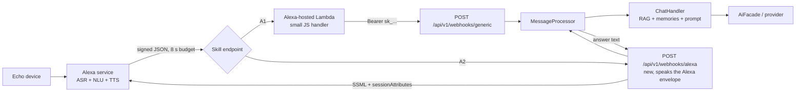

# Alexa Voice Agent for Synaplan — Research & Plan

> **Status:** Research only. No code changed, no schema changed, no dependency added.
> Everything below is either (a) a verified fact about Amazon's platform as of
> 2026-07-31, or (b) a proposal that still needs a team decision.
>
> **Question investigated:** Can a Synaplan user create their own Alexa agent —
> go to the Amazon developer site, register their own chat widget / RAG corpus /
> email access, and talk to their Synaplan account by voice? If yes, how does the
> user connect their Synaplan account to their Amazon developer account, and what
> does it take to write the Alexa side?
>
> **Repo surfaces reviewed:** `backend/src/Controller/{WebhookController,McpController,WidgetPublicController,StreamController}.php`,
> `backend/src/Mcp/McpServerFactory.php`, `backend/src/Security/*`,
> `backend/config/packages/security.yaml`, `backend/config/services.yaml`,
> `backend/.env.example`, `backend/src/Service/Message/MessageProcessor.php`,
> `backend/src/Service/TtsTextSanitizer.php`, and the existing planning docs in
> `voice-conversations/`, `mcp-and-api-enhancements/`, `n8n-integration-research.md`.

---

## TL;DR

**Yes, it is possible today — and the cheapest version needs zero Synaplan code.**
But "possible" splits into four very different paths, and only the first two are
realistic self-serve product features right now.

| Path | What it is | Who can do it | Synaplan work needed | Verdict |
|------|-----------|---------------|----------------------|---------|
| **A1 — Bring-your-own skill, glue in Amazon** | User creates a *custom skill* in their own Amazon developer account, hosts the tiny handler as an **Alexa-hosted skill** (free), which calls `POST /api/v1/webhooks/generic` with the user's `sk_…` API key | Any user with a free Amazon developer account + an Echo registered to it | **None.** Works with what is already shipped | ✅ **Do this first** — publish a recipe + template |
| **A2 — Skill endpoint points straight at Synaplan** | Same user-owned skill, but the skill's HTTPS endpoint *is* Synaplan (`/api/v1/webhooks/alexa`). No AWS account, no Lambda, no JS for the user | Any user; a self-hoster or synaplan.com tenant | New controller + Alexa request-signature verifier + account pairing + per-session chat threading | ✅ **The productized version** — this is the "Connect Alexa" button |
| **B — One public Synaplan skill in the Alexa Skills Store** | Synaplan publishes a certified skill everyone enables | Everyone, no developer account | OAuth 2.0 authorization server + certification | ⚠️ **Policy-hostile** — see §6 |
| **C — Alexa+ MCP add-on** | Register Synaplan's existing `POST /mcp` server as an **Alexa+ add-on** so Alexa+ calls Synaplan tools natively | Nobody yet — gated preview, onboarded via an Alexa Solutions Architect | OAuth 2.1 conformance + <500 ms tools + store listing | 🔭 **Strategically the future, blocked today** |

Three findings drive that ranking:

1. **Amazon now runs two parallel developer platforms.** The classic **Alexa Skills
   Kit** (custom skills, invocation names, your own HTTPS endpoint) is still fully
   documented and supported — its pages were updated in July 2026. Alongside it,
   **Alexa+ for Builders** launched an **MCP toolkit** (announced 2026-07-23) where
   Alexa+ acts as an MCP *client* against your MCP server. Synaplan already ships
   exactly such a server, which is a genuine head start — but the toolkit is
   preview-only and onboarding runs through an Amazon Solutions Architect plus a
   private CodeArtifact registry, so no user can self-serve it.
2. **Nothing about "one skill per user" requires Amazon's approval.** A skill left
   in the **Development** stage works indefinitely on every Echo registered to the
   developer's own Amazon account, with no certification and no store listing.
   That is precisely the "my own Alexa agent" shape the question asks about, and it
   sidesteps the certification policies that would otherwise kill this product.
3. **Account linking is the one real architectural gap.** Alexa's built-in linking
   mechanism is OAuth 2.0 authorization-code, and **Synaplan is not an OAuth
   provider** — it is an OAuth *client* (Google/GitHub/Apple/Keycloak login) and an
   OAuth *resource server* (for MCP, pointing at an external Keycloak). For
   user-owned skills we do not need OAuth at all: a **device-code pairing** flow
   keyed on Alexa's stable `userId` is simpler, safer, and works for self-hosters
   with no identity provider. OAuth only becomes mandatory for paths B and C.

---

## 0. Direct answers to the four questions

**"Is that possible?"** Yes. A user can register a custom skill in their own Amazon
developer account, point it at their Synaplan instance, and talk to their own RAG
corpus, prompts and (with a read tool) their email. It works on any Echo registered
to that Amazon account, with no Amazon review, for free, indefinitely.

**"If so, how?"** Classic Alexa Skills Kit custom skill, kept in the **Development**
stage. Either the skill's Alexa-hosted Lambda calls Synaplan's existing
`POST /api/v1/webhooks/generic` (works today, no Synaplan change — §3 of the
appendix), or Synaplan grows an endpoint that speaks Alexa's JSON envelope directly
so no Lambda is needed at all (§4.3). The *Alexa+ MCP add-on* route — the one that
would put Synaplan into Alexa+ natively — exists but is a gated preview and its
certification policy currently rejects "relay to a third-party LLM" experiences
(§6).

**"How could a Synaplan user connect their account to their Amazon developer
account?"** Not with Alexa's built-in account linking, because that is OAuth 2.0 and
Synaplan is not an OAuth authorization server (§3.2). Use a **device-code pairing**
instead: Alexa reads out a short code, the user types it into Synaplan while logged
in, and Synaplan binds Alexa's stable `context.System.user.userId` (plus the skill's
`applicationId`) to the account (§3.3, option 1). OAuth only becomes mandatory if we
ever publish a skill or ship an Alexa+ add-on — that is the separate
"Synaplan as authorization server" initiative (§3.3, option 2).

**"What is needed to write Alexa agents?"** A free Amazon developer account, an
invocation name, an interaction model with an `AMAZON.SearchQuery` slot elicited
through a dialog (the console refuses a bare `{query}` utterance), an HTTPS endpoint
on port 443 with a trusted certificate, mandatory request-signature and timestamp
verification, an answer inside ~8 seconds, and SSML for the spoken reply. Full
detail in §1.1 and the appendix.

---

## 1. The two Amazon platforms in 2026

### 1.1 Classic Alexa Skills Kit (ASK) — still the only self-serve route

A *custom skill* is: an invocation name, an interaction model (intents + slots),
and an endpoint. Amazon calls your endpoint with a signed JSON request; you answer
with JSON containing speech. Two hosting choices:

- **Alexa-hosted skill** — Amazon provisions the Lambda, an S3 bucket and a code
  editor inside the developer console. No AWS account needed by the user. Chosen
  in the "Hosting services" step when creating the skill.
- **Your own web service** — any language, any host, with hard requirements:
  reachable on **port 443**, TLS with a certificate from an Amazon-trusted CA and
  the service's domain in the certificate's **Subject Alternative Names**, and
  *mandatory* request verification (§4.3). A self-signed certificate is allowed for
  testing only, never for a published skill.

Everything a Synaplan-style assistant needs is available in this model. The
constraints that shape the design are all documented and non-negotiable:

| Constraint | Detail | Design consequence |
|-----------|--------|--------------------|
| **8-second response budget** | A skill has ~8 s to return a full response. **Progressive responses do not extend it** — the 5 allowed interim SSML clips must also fit inside the same window | A full RAG + LLM turn must be tuned to fit, or degraded (§4.4) |
| **Free-form text capture** | `AMAZON.SearchQuery` is the only built-in "say anything" slot, and the console **rejects** an utterance that is just `{Query}` — it demands a carrier phrase ("ask …", "find out …") | Open-ended chat requires **dialog slot elicitation**: launch the skill, Alexa asks a question, the next whole utterance lands in the slot with no carrier phrase |
| **Signature verification** | `SignatureCertChainUrl` + `Signature-256` headers; URL must be `https`, host `s3.amazonaws.com`, path prefix `/echo.api/` (case-sensitive), port 443 if present; chain must be valid, unexpired, contain SAN `echo-api.amazon.com`, and chain to a trusted root; body hashed with SHA-256; `timestamp` within **150 s** | A reusable `AlexaRequestVerifier` service with fixture-based unit tests |
| **Audio playback** | SSML `<audio src>` needs MP3 **MPEG version 2**, **48 kbps**, sample rate 16000/22050/24000 Hz, ≤240 s total per response (≤90 s in a reprompt), on an HTTPS host with a trusted (non-self-signed) certificate and **no authentication** | Synaplan/Piper TTS output must be transcoded and served unauthenticated to use our own voice instead of Alexa's |
| **Locales** | `ar-SA, de-DE, en-AU, en-CA, en-GB, en-IN, en-US, es-ES, es-MX, es-US, fr-CA, fr-FR, hi-IN, it-IT, ja-JP, nl-NL, pt-BR` | German, English and Spanish map cleanly to Synaplan's UI locales; **Turkish does not exist on Alexa at all** |
| **Distribution** | *Development* stage = the developer's own devices, indefinitely, no certification. *Beta test* = up to **500 testers**, max **90 days**, not extendable (a new test can be created). *Live* = certification required. The **Private Skill Distribution REST API is gone**; the Business Skill API is gone too (Alexa Smart Properties is the managed-fleet route) | There is **no** supported "share my private skill with three colleagues forever" mode. Per-user skills or beta tests only |

### 1.2 Alexa+ for Builders — the MCP toolkit

Announced 2026-07-23. Alexa+ is the LLM-based assistant layered on classic Alexa
(most Echo devices 4th gen and newer; 1st–2nd gen Echo/Show, Echo Spot 1st gen,
Amazon Tap and FireOS 5 devices stay on classic Alexa). For developers it changes
the integration model completely: instead of an interaction model, you register an
**add-on** that points at **your MCP server**, and Alexa+ does NLU, response
generation and UI rendering itself.

Concretely, from the builder docs:

- Alexa+ is the MCP **client**; it speaks **Streamable HTTP** and supports MCP spec
  **2025-11-25** (the standalone HTTP+SSE transport is rejected).
- You scaffold with `alexa-ai new mcp --name … --mcp-server-url https://… --category …`,
  fill an `addon.json` store listing (descriptions, example phrases, privacy policy
  URL, terms URL, six icon sizes, a 600x900 carousel image), then `alexa-ai deploy`
  → development stage → `alexa-ai submit` for certification.
- Tool metadata is snapshotted **at deploy time**: changing tools on the MCP server
  requires a redeploy.
- Setup requires an AWS account "that you provided to the Alexa Solutions
  Architect", an IAM role assumption into Amazon's account `372468808636`, and npm
  auth against a private CodeArtifact registry for `@alexa-ai/*`.

This is a partner-onboarding funnel, not a self-serve one. Its authentication and
policy requirements are analysed against Synaplan's actual implementation in §6.

### 1.3 Which platform for which goal

- **"Let each user build their own voice agent" → classic ASK, Development stage.**
  Self-serve, free, no Amazon review, works today.
- **"Put Synaplan on every Echo in the world" → Alexa+ add-on**, eventually, and
  only if the framing survives policy §10 (§6.3).

---

## 2. What the user has to do on Amazon's side

For paths A1/A2, the user's checklist is short and entirely self-service:

1. **Create a free Amazon developer account** (an existing Amazon account works).
2. **Register the Echo to that same account** — a development-stage skill is only
   visible to devices signed in with the developer account's credentials. (An
   Amazon Family member or a beta test is the only way to add other people.)
3. **Create a skill**: *Custom* model + *Provision your own* (A2) or *Alexa-hosted*
   (A1) backend.
4. **Set the invocation name** — avoid single person-names (§8, Alexa+ routing risk).
5. **Paste the interaction model JSON** (appendix: `reference-skill-blueprint.md`).
6. **Set the endpoint**: the Alexa-hosted Lambda (A1) or `https://<their-synaplan>/api/v1/webhooks/alexa` (A2).
7. **Link the account** — Alexa reads out a pairing code once, the user enters it in
   Synaplan (§3.3, option 1).
8. **Enable testing** on the *Development* stage and say "Alexa, open …".

Nothing here requires an AWS account in the A2 variant, and nothing requires
certification, a privacy policy, or store assets as long as the skill stays in
Development.

---

## 3. Connecting a Synaplan account to an Amazon developer account

This is the crux of the question, so it gets the most detail.

### 3.1 What Alexa offers natively: OAuth 2.0 account linking

- Grant types: **authorization code** (recommended, PKCE supported) or implicit
  (discouraged — expiry forces re-linking).
- You configure, per skill: *Authorization URI*, *Access Token URI*, *Client ID*,
  *Client Secret*, *Client Authentication Scheme* (`HTTP_BASIC` or
  `REQUEST_BODY_CREDENTIALS`), scopes, domains.
- Alexa's redirect URIs are fixed per developer **Vendor ID** and must be
  pre-registered on the authorization server:
  `https://pitangui.amazon.com/api/skill/link/{vendorId}` (NA),
  `https://layla.amazon.com/api/skill/link/{vendorId}` (EU),
  `https://alexa.amazon.co.jp/api/skill/link/{vendorId}` (FE).
- The token endpoint must answer **within 4.5 seconds** and must be HTTPS.
- After linking, every request carries the token at
  `context.System.user.accessToken`; if it is missing the skill should answer with a
  `LinkAccount` card.

The blocker: this presumes **the skill owner controls an OAuth authorization
server**. For a user-owned skill on a shared synaplan.com, they do not.

### 3.2 What Synaplan has today

| Capability | Status | Files |
|-----------|--------|-------|
| API keys `sk_…` (`X-API-Key`, `Authorization: Bearer`, `?api_key=`) | ✅ shipped, one key unlocks `/api`, `/v1`, `/mcp` | `Entity/ApiKey.php`, `Security/ApiKeyAuthenticator.php`, `config/packages/security.yaml` |
| Cookie/Bearer HMAC session tokens | ✅ shipped | `Security/CookieTokenAuthenticator.php`, `Service/TokenService.php` |
| OAuth **client** (Google, GitHub, Apple, Keycloak) | ✅ shipped | `Controller/{Google,GitHub,Apple,Keycloak}AuthController.php` |
| OAuth **resource server** for MCP (RFC 9728 PRM + `WWW-Authenticate`) | ✅ shipped, points at an *external* Keycloak | `Controller/McpController.php`, `Security/McpAuthenticationEntryPoint.php` |
| OAuth **authorization server** (third parties get `client_id`/`client_secret`, users approve a consent screen) | ❌ **does not exist** | — |
| OIDC configured by default | ❌ `OIDC_DISCOVERY_URL` is empty in `.env.example`; Keycloak is opt-in | `config/services.yaml`, `.env.example` |

So: Alexa's happy path needs a component Synaplan does not have, and most
self-hosters have no identity provider to borrow either.

### 3.3 Three linking designs

#### Option 1 — Device-code pairing (recommended for v1)

No OAuth. Alexa already gives the skill a **stable, opaque, per-skill user id** at
`context.System.user.userId`. Treat it as a device identity and bind it once, in the
direction of an OAuth device flow (the TV-pairing pattern) — **Synaplan issues the
code, Alexa reads it out, and the already-authenticated user confirms it in the web
UI**:

1. User says "Alexa, open <invocation name>". Synaplan sees an unknown `userId`,
   creates a pending link, and answers: *"This device isn't connected yet. Open
   Synaplan, go to Settings, Integrations, Alexa, and enter the code 4 8 2 1."*
   The same code goes into a `Simple` card so it is visible in the Alexa app and on
   screen devices.
2. In Synaplan (already logged in), the user types the code. The pending
   `{alexaUserId, skillApplicationId}` is bound to their account together with the
   chosen assistant configuration.
3. Every later turn resolves the user from `userId` alone — no token, no refresh,
   no expiry, no re-linking.

Why this direction specifically:

- **No secret is ever spoken by the user.** The code travels Synaplan → voice →
  human → authenticated browser session, so the party proving account ownership is
  the one already authenticated, and ASR accuracy never gates security.
- Works identically on synaplan.com and on an air-gapped self-host with no IdP.
- Reuses the short-lived-code pattern the WhatsApp phone verification already has:
  single use, short TTL, stored hashed, rate-limited per `alexaUserId`.
- The `skillApplicationId` captured at pairing time doubles as the allowlist for the
  mandatory "verify the request came from *your* skill" check, which is exactly what
  makes a single multi-tenant endpoint (A2) safe.
- A voice-entered code (`AMAZON.FOUR_DIGIT_NUMBER` slot) can exist as a fallback for
  screenless setups, but it is strictly worse and would collide with the
  personal-information-by-voice policies if the skill were ever published.

#### Option 2 — Synaplan becomes an OAuth 2.1 authorization server

Needed for paths B and C, useful far beyond Alexa (any MCP host, ChatGPT
connectors, third-party apps). Shape: `/oauth/authorize` + `/oauth/token` +
self-service "OAuth apps" per user (so a user's own skill gets its own
`client_id`/`client_secret`), PKCE S256, refresh tokens, RFC 8414 metadata at
`/.well-known/oauth-authorization-server`, RFC 8707 `resource` parameter, and the
three Amazon redirect URIs registered per app. **This adds a dependency**
(`league/oauth2-server-bundle` or equivalent) plus schema — both are "Ask First"
items under `AGENTS.md`.

#### Option 3 — Keycloak as the authorization server

Works **today** with zero Synaplan code for anyone who already runs the optional
Keycloak: create a confidential client, add the three Amazon redirect URIs, paste
authorize/token URLs + client id/secret into the skill's Account Linking page, and
the skill receives a Keycloak JWT that `OidcBearerAuthenticator` already accepts on
`/api` and `/mcp`. Dead end for multi-tenant SaaS (no per-user client
registration) and irrelevant to the majority of self-hosters who never enable OIDC.

| | Option 1 device-code | Option 2 Synaplan AS | Option 3 Keycloak |
|---|---|---|---|
| Works for a user-owned dev-stage skill | ✅ | ✅ | ✅ (if Keycloak) |
| Works on SaaS multi-tenant | ✅ | ✅ | ❌ |
| Works with no IdP / self-host | ✅ | ✅ | ❌ |
| Required for a published skill / Alexa+ | ❌ | ✅ | ✅ |
| New dependency | none | yes (Ask First) | none |
| Schema change | 1 table (Ask First) | several tables | none |

**Recommendation:** ship option 1 now; treat option 2 as a separate, larger
initiative justified by more than Alexa.

---

## 4. Reference architecture for the recommended path

### 4.1 Flow

### 4.2 Why A2 is worth building even though A1 already works

A1's friction is all in the middle box: the user has to understand Lambda, paste
JavaScript, and store an API key in it. A2 deletes that box. The user's entire job
becomes: create skill → paste interaction model → paste one URL → enter the pairing
code in Synaplan. That is a feature we can actually put a "Connect Alexa" button
next to.

### 4.3 What A2 needs in the backend (proposal, not implemented)

- `AlexaSkillController` — thin, per `AGENTS.md` (<50 lines/method), delegating to
  services; route added to the `PUBLIC_ACCESS` list in `security.yaml` because
  Alexa cannot present a Synaplan credential.
- `AlexaRequestVerifier` (`final readonly`) — the full §1.1 signature and timestamp
  algorithm, plus `applicationId` allowlist from the pairing records. Returns 400 on
  any failure, as Amazon requires. Certificate chains cached by URL.
- `AlexaLinkService` + one table (pairing code issue/redeem, `alexaUserId` →
  `User`, chosen assistant). **Schema = Ask First**, migration must be raw
  idempotent SQL (no `Schema $schema`) per the Galera rules.
- `AlexaResponseBuilder` — envelope, SSML, `shouldEndSession: false`, reprompts,
  `LinkAccount`/`AskForPermissionsConsent` cards where relevant, and `TtsTextSanitizer`
  (already shipped) to strip `[Memory:ID]` badges, markdown and think tags before
  anything reaches TTS.
- **Threading:** put `chat_id` in the response `sessionAttributes`; Alexa echoes
  them back on every turn of the same session, so a conversation maps to one
  `BCHATS` row with `BSOURCE='alexa'` without any server-side session store.
  Across sessions, fall back to the newest Alexa chat for that link.
- **Channel bookkeeping:** `BMESSAGES.BMESSTYPE` is 4 chars — `'ALEX'`, with
  `BPROVIDX='ALEXA'`; `Chat::setSource('alexa')`; `channel => 'ALEXA'` in the
  `MessageProcessor` options. No new enum column needed.
- **Quota:** `RateLimitService::checkLimit($user, 'MESSAGES')` before, `recordUsage(… source: 'ALEXA')`
  after — same budget as every other channel.

### 4.4 The latency problem, honestly

8 seconds, hard, including any progressive response. A Synaplan turn today is
classification → optional web search → RAG → memories → inference. Mitigations, in
order of preference:

1. **Skip the AI sorter** (`skipSorting` + `fixed_task_prompt`), exactly as the
   widget path does — removes one model round-trip.
2. **Cap retrieval** (`rag_limit`, `rag_min_score`) and disable web search for this
   channel.
3. **Pin a fast model** per Alexa link (the widget already supports
   `widget_model_id`; the same idea applies here) — never hardcode a model name,
   resolve through `ModelRepository`.
4. **Progressive response** ("Let me look that up…") to cover 1–2 s of the wait.
5. **Fallback contract:** if the budget is about to blow, answer "I'm still working
   on that, ask me for the result in a moment", keep the answer in the chat, and let
   the next turn read it. Out-of-session push would need Proactive Events /
   notification permissions — out of scope for v1.

This must be **measured**, not assumed, before promising the flow to users.

### 4.5 "RAG, email and everything" — what voice access actually means

- **RAG / documents:** already there. Either the full pipeline (`MessageProcessor`,
  which loads RAG + memories) or the narrow `rag_search` path. Binding an Alexa link
  to an existing **widget** (fixed `BTASKPROMPT` + `WIDGET:{widgetId}` RAG group) is
  the most natural reuse of what users already configure — but note the widget path
  deliberately sets `disable_memories: true`, so an *account-linked* Alexa agent
  should instead run as the owner with memories enabled, using the widget only as a
  prompt + corpus selector. Worth an explicit product decision.
- **Email:** Synaplan has email as an inbound channel (`EmailChatService`,
  `WebhookController::email`) and IMAP/POP3 sorting (`InboundEmailHandlerService`),
  so "read me my last messages" means adding a read tool over those, not new mail
  plumbing. Two cautions: Alexa+ add-on policy explicitly rejects add-ons that
  "collect or recite private personal information via voice", and the classic policy
  restricts personal-information handling too — so email-by-voice is defensible for
  a personal Development-stage skill and a certification risk for a public one.
- **Voice out in Synaplan's own voice:** `AiFacade::synthesize()` + the planned
  Piper provider (`voice-conversations/piper-provider.md`) can produce the MP3, but
  SSML playback demands MPEG v2 / 48 kbps / 16–24 kHz / ≤240 s on an unauthenticated
  HTTPS URL. Default to Alexa's own TTS; treat Synaplan-voice as an opt-in extra.

---

## 5. Alignment with existing planning docs

- **`voice-conversations/`** decided that voice = STT in, text + optional MP3 out,
  and that channel identity lives in `BCHATS.BSOURCE` (already shipped).
  Alexa fits as *another* voice channel where **Amazon does the STT and TTS** —
  no Whisper, no Piper on the critical path. `TtsTextSanitizer` is reused as-is.
- **`mcp-and-api-enhancements/`** decided Streamable HTTP only, API key + Keycloak
  OIDC, no Synaplan-as-IdP. Path C would revisit exactly that last decision; paths
  A1/A2 do not contradict any of it.
- **`n8n-integration-research.md`** already documented `/api/v1/webhooks/generic`
  as the clean authenticated "text in, answer + files out" surface — A1 is the same
  pattern with Alexa in place of n8n, which is why it needs no new code. Its noted
  gaps apply here too: the generic webhook has **no `chat_id` threading** (each call
  creates a fresh message), and API-key **scopes are stored but not enforced**.

---

## 6. Path C in detail: Alexa+ MCP add-on readiness

Synaplan is unusually close to the technical bar and quite far from the policy bar.

### 6.1 Where we already comply

| Alexa+ requirement | Synaplan today |
|---|---|
| Streamable HTTP transport | ✅ `StreamableHttpTransport` on `POST /mcp` |
| MCP spec 2025-11-25 | ✅ referenced by `McpController`; **verify the negotiated version** (Alexa's own sample `initialize` still sends `2025-03-26`) |
| Remote HTTPS URL | ✅ |
| PRM document at the RFC 9728 well-known URI | ✅ `/.well-known/oauth-protected-resource/mcp` (+ root fallback) |
| `scopes_supported` published | ✅ `['mcp:tools']` |
| Bearer in the `Authorization` header, never in the query string | ⚠️ header works; `?api_key=` also exists and must not be advertised |
| Useful tool catalog | ✅ `synaplan_chat`, `rag_search`, `rag_similar`, `memory_search`, `memory_add`, `file_ingest`, `list_chats`, `get_messages`, `list_prompts` |

### 6.2 Technical gaps

1. **Authorization-server metadata at `/.well-known/oauth-authorization-server`**,
   OAuth-style, with `code_challenge_methods_supported` including `S256` — Alexa
   states linking "won't proceed without it" and that **OIDC is not supported yet**.
   Synaplan's PRM points at a Keycloak issuer whose discovery is OIDC-shaped; that
   needs verification against Alexa's exact expectations.
2. **No DCR, no CIMD** — the client must be **pre-registered**, i.e. someone has to
   own an authorization server and hand Amazon a `client_id`/`client_secret`.
   Option 2 of §3.3, or a Keycloak the operator controls.
3. **`resource` parameter (RFC 8707)** must be honoured in authorize *and* token
   requests.
4. **`WWW-Authenticate` in 401s is "not supported yet"** by Alexa's client. Ours
   sends it (correctly, per MCP spec); harmless, but discovery must not depend on it.
5. **<500 ms round-trip per tool call.** This is the hard one: `synaplan_chat` runs
   a whole pipeline and cannot comply. An Alexa+ add-on should expose *retrieval*
   tools (`rag_search`, `memory_search`) and let Alexa+ do the talking.
6. **Store listing assets** — six icon sizes, carousel image, privacy policy URL,
   terms URL, 3–4 example phrases, and a **category** from Amazon's list.

### 6.3 Policy gaps (the real blocker)

From the Alexa+ add-on policy requirements (updated 2026-07-21):

- §10: *"Your add-on will be rejected if its core functionality is simply relaying
  customer queries to a third-party AI/LLM without adding unique value or
  domain-specific functionality."* A "chat with Synaplan" add-on is precisely that
  shape unless it is framed as domain-specific retrieval over the customer's own
  documents.
- §10: *"Add-ons exclusively for B2B, enterprise, or internal business workflows are
  not eligible."* Much of Synaplan's positioning is exactly that.
- §3: rejects add-ons that "collect or recite private personal information via
  voice" and those with "unbounded open text fields unrelated to its declared
  purpose" — awkward for both the email use case and a free-text chat tool.
- §11: account linking must go through Amazon's consent infrastructure (QR + OAuth
  2.1 + PKCE on screen devices, push notification on screenless ones); *"rejected if
  it includes instructions directing customers to enable via an external website."*
  A pairing code read out by voice is not acceptable here.

The classic-skill policies rhyme: web-search-style skills must search "a specific
online resource" rather than the open web and must attribute sources (which a
user's own corpus arguably satisfies), and unmoderated user-generated content is
prohibited.

**Conclusion:** keep the MCP server spec-clean and cheap-to-certify, but do not
plan a store-published Synaplan add-on around general chat. The eligible framing,
if we ever want it, is a narrow *"search my own knowledge base"* add-on.

---

## 7. Proposed phasing (no calendar estimates — scope only)

**Phase 0 — Documentation, zero code.**
Publish the A1 recipe (`docs/ALEXA.md`) plus the interaction model and Lambda
template from `reference-skill-blueprint.md`. Deliverable: a user can build a
working voice agent this afternoon using only shipped features.
*Touches:* docs only. *Risk:* none.

**Phase 1 — Native Alexa endpoint + pairing (path A2).**
`AlexaSkillController`, `AlexaRequestVerifier`, `AlexaLinkService`, one migration,
`PUBLIC_ACCESS` route, `ALEX`/`alexa` channel bookkeeping, `sessionAttributes`
threading, latency guardrails, frontend *Settings → Integrations → Alexa* panel
(pairing code, link list, revoke) with all four locales.
*Touches:* backend controller/services/migration, `security.yaml`, frontend view +
i18n. *Ask First:* the schema change. *Risk:* latency (§4.4), Alexa+ invocation
routing (§8).

**Phase 2 — Voice polish.**
Optional Synaplan-voice replies (transcode to MPEG v2/48 kbps/16–24 kHz, serve
unauthenticated, respect the `AUDIOS` quota), locale mapping (`de-DE`/`en-*`/`es-*`;
document that Turkish is impossible), per-link prompt/widget/model selection,
`AMAZON.HelpIntent`/`StopIntent`/`FallbackIntent` copy in every supported locale.

**Phase 3 — OAuth 2.1 authorization server (optional, bigger than Alexa).**
Unlocks beta-tested and published skills, Alexa+ linking, and third-party MCP hosts
without Keycloak. *Ask First:* dependency + schema.

**Phase 4 — Alexa+ add-on readiness.**
Close §6.2 items, add a <500 ms retrieval tool path, decide the eligible category
and framing per §6.3, then request Alexa+ for Builders onboarding.

Verification for every phase: `make lint && make -C backend phpstan && make test`
plus `docker compose exec -T frontend npm run check:types`. Signature verification
gets fixture-based unit tests (valid, expired cert, wrong SAN, tampered body,
stale timestamp, bad cert URL). Anything touching `MessageClassifier`/`MessageSorter`
would drift `backend/tests/Characterization/__snapshots__/` — the Alexa work should
not need to, and that is a good design constraint to hold.

---

## 8. Risks and open questions

1. **Alexa+ can shadow a custom skill's invocation name.** A reported case: a
   dev-stage skill invoked as "Alfred" became unreachable once Alexa+ was enabled —
   requests were routed to Communications ("I can't find an entry in my contacts
   named Alfred") and the skill's logs showed zero invocations; disabling Alexa+
   restored it. Mitigation: recommend distinctive two-word invocation names and test
   on an Alexa+-enabled account. This is the single biggest product risk for path A,
   because it is outside our control.
2. **Certification is not a realistic goal for a general assistant skill** (§6.3).
   Any user-facing copy must be honest that this is a personal, developer-mode
   integration — not "install Synaplan from the Alexa store".
3. **No supported private sharing.** Development stage = own devices; beta = 500
   testers for 90 days, not extendable. A family or team scenario needs one skill
   per Amazon account.
4. **The 8-second budget** may simply be unmeetable for heavy RAG on slow providers.
   Measure before promising; the degraded-answer contract in §4.4 is mandatory.
5. **Free-form input is not truly free.** Slot elicitation inside an open session is
   required; recognition quality on long, domain-specific utterances will be worse
   than typing, and the session ends on silence.
6. **Turkish is unsupported by Alexa** while Synaplan ships `tr` — the UI must not
   offer an Alexa locale that cannot exist.
7. **Privacy.** Every utterance goes to Amazon; replies may recite private
   documents or email out loud in a shared room. Needs explicit consent copy, a
   documented data flow, and probably an opt-in for email tools.
8. **Alexa+ MCP toolkit is preview + gated** (Solutions Architect, private
   CodeArtifact, IAM role into Amazon's account). Track it; do not plan against it.
9. **Open question:** does an Alexa link belong to a *widget* (prompt + scoped
   corpus, memories off) or to the *account* (memories on, all documents)? §4.5
   argues for account-level with a widget as an optional selector, but this is a
   product call.
10. **Open question:** enforce API-key scopes (e.g. `alexa`) before exposing a
    channel that a user might paste a key into? Scopes exist today but are not
    enforced per route.

---

## 9. Sources

Amazon documentation, all checked 2026-07-31 (page "last updated" dates in
parentheses).

**Classic Alexa Skills Kit**

- Host a Custom Skill as a Web Service (2024-01-26) — port 443, SSL/SAN rules, signature and timestamp algorithm —
  <https://developer.amazon.com/en-US/docs/alexa/custom-skills/host-a-custom-skill-as-a-web-service.html>
- Security Requirements for Alexa Skills — verify the request came from your skill —
  <https://developer.amazon.com/en-US/docs/alexa/custom-skills/security-testing-for-an-alexa-skill.html>
- Create and Manage Skills in the Alexa Developer Console (2025-10-30) — Alexa-hosted vs own backend —
  <https://developer.amazon.com/en-US/docs/alexa/devconsole/create-a-skill-and-choose-the-interaction-model.html>
- Send the User a Progressive Response — 8 s budget, max 5 interim responses —
  <https://developer.amazon.com/en-US/docs/alexa/custom-skills/send-the-user-a-progressive-response.html>
  and <https://developer.amazon.com/en-US/docs/alexa/custom-skills/progressive-response-api-reference.html>
- Phrase slots and `AMAZON.SearchQuery` (carrier-phrase requirement) —
  <https://developer.amazon.com/blogs/alexa/post/a2716002-0f50-4587-b038-31ce631c0c07/enhance-speech-recognition-of-your-alexa-skills-with-phrase-slots-and-amazon-searchquery>
- SSML Reference — `<audio>` MP3 constraints —
  <https://developer.amazon.com/en-US/docs/alexa/custom-skills/speech-synthesis-markup-language-ssml-reference.html>
- Develop Skills in Multiple Languages —
  <https://developer.amazon.com/en-US/docs/alexa/custom-skills/develop-skills-in-multiple-languages.html>
  and Skill Manifest Schema (2026-03-20) <https://developer.amazon.com/en-US/docs/alexa/smapi/skill-manifest.html>
- Test Skills in the Alexa Developer Console / Test and Debug Your Skill — Development stage on own devices —
  <https://developer.amazon.com/en-US/docs/alexa/devconsole/test-your-skill.html>,
  <https://developer.amazon.com/en-US/docs/alexa/test/test-your-skill-overview.html>
- Skill Beta Testing for Alexa Skills — 500 testers, 90 days —
  <https://developer.amazon.com/en-US/docs/alexa/custom-skills/skills-beta-testing-for-alexa-skills.html>
- Deprecated Features (2026-07-14) — Private Skill Distribution REST API removed, Business Skill API removed, Routines Kit removed, skill quality coach removed (2026-04-28) —
  <https://developer.amazon.com/en-US/docs/alexa/ask-overviews/deprecated-features.html>
- Policy Requirements for Alexa Skills (2024-05-01) — web search, personal information, UGC —
  <https://developer.amazon.com/en-US/docs/alexa/custom-skills/policy-requirements-for-an-alexa-skill.html>

**Account linking**

- Account Linking Concepts —
  <https://developer.amazon.com/en-US/docs/alexa/account-linking/account-linking-concepts.html>
- Configure an Authorization Code Grant — 4.5 s token endpoint, PKCE handling —
  <https://developer.amazon.com/en-US/docs/alexa/account-linking/configure-authorization-code-grant.html>
- Account Linking Schema — `accessTokenScheme`, `authorizationUrlsByPlatform` —
  <https://developer.amazon.com/en-US/docs/alexa/smapi/account-linking-schemas.html>
- App-to-App Account Linking (Alexa redirect URIs per Vendor ID) —
  <https://developer.amazon.com/en-US/docs/alexa/account-linking/app-to-app-account-linking-starting-from-Alexa-app.html>
- Validate and Use Access Tokens in Custom Skill Code — `context.System.user.accessToken`, `LinkAccount` card —
  <https://developer.amazon.com/en-US/docs/alexa/account-linking/add-account-linking-logic-custom-skill.html>

**Alexa+ for Builders**

- MCP Toolkit Overview (2026-07-10) — <https://developer.amazon.com/docs/alexaplus/add-ons/mcp-toolkit-overview.html>
- MCP Client and App Lifecycle (2026-07-10) — <https://developer.amazon.com/docs/alexaplus/add-ons/mcp-toolkit-client-lifecycle.html>
- Create a Category MCP Add-on (2026-07-14) — auth checklist, <500 ms latency, `addon.json` schema —
  <https://developer.amazon.com/docs/alexaplus/add-ons/category-sdk-create-mcp-addon.html>
- Set Up Your Development Environment (2026-07-15) — Solutions Architect onboarding, CodeArtifact, IAM role —
  <https://developer.amazon.com/docs/alexaplus/add-ons/set-up-your-development-environment.html>
- Policy Requirements | Alexa+ (2026-07-21) — §3, §10, §11 quoted in §6.3 —
  <https://developer.amazon.com/docs/alexaplus/add-ons/policy-requirements.html>
- "Alexa+ launches new ways to build experiences", 2026-07-23 — MCP adoption, preview status —
  <https://developer.amazon.com/alexaplus/blogs/2026/07/alexa-plus-new-ways-to-build-experiences>
- Compatibility of Alexa+ with Alexa Built-in Devices —
  <https://www.amazon.com/gp/help/customer/display.html?nodeId=TNchvgYCsQJ0gCzV4M>

**Field report**

- Stack Overflow 79983683 — Alexa+ routing shadowing a single-word invocation name —
  <https://stackoverflow.com/questions/79983683>

Synaplan code referenced inline in §3.2, §4.3 and §6.1.
