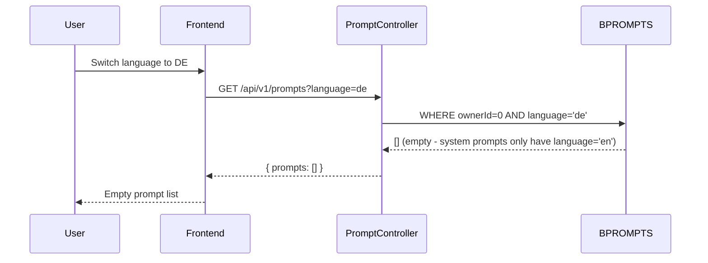

# Fix Prompt Language Filtering Bug

**Date:** 2026-02-09
**Branch:** fix/sorting-prompt
**Status:** In Progress

## Problem

System prompts (ownerId=0) are seeded only with `BLANG='en'` in `backend/src/DataFixtures/PromptFixtures.php`. When a user switches the UI to German/Spanish/Turkish, API calls include `?language=de` (etc.), and all listing queries apply `WHERE language = :lang` -- finding zero system prompts for non-English languages. This causes:

- Empty task list on `/config/sorting-prompt`
- Empty prompt dropdowns in widget creation/editing
- Missing categories in the sorting prompt's `[DYNAMICLIST]`

The **runtime message sorting** (`MessageSorter`) already works around this by looping through all supported languages, but the UI-facing endpoints are broken.

## Root Cause Flow



## Solution Strategy

**For system prompts (ownerId=0):** Remove the language filter -- they should always be visible regardless of the user's UI language. Their text stays in English.

**For user custom prompts:** Keep the language filter -- custom prompts are shown in the language they were created in.

**Frontend:** Use the current locale instead of hardcoding `'en'`, and watch for locale changes to reload data.

## Backend Changes

### 1. `PromptRepository.php` -- 3 methods

**`findAllForUser()`** (line 158-171): Split into two queries -- system prompts without language filter, user prompts with language filter. Merge results with user prompts overriding system ones.

```php
public function findAllForUser(int $userId, string $lang = 'en'): array
{
    // System prompts: no language filter
    $system = $this->createQueryBuilder('p')
        ->where('p.ownerId = 0')
        ->andWhere('p.topic NOT LIKE :toolsPrefix')
        ->setParameter('toolsPrefix', 'tools:%')
        ->orderBy('p.topic', 'ASC')
        ->getQuery()->getResult();

    // User prompts: filtered by language
    $user = $this->createQueryBuilder('p')
        ->where('p.ownerId = :userId')
        ->andWhere('p.language = :lang')
        ->andWhere('p.topic NOT LIKE :toolsPrefix')
        ->setParameter('userId', $userId)
        ->setParameter('lang', $lang)
        ->setParameter('toolsPrefix', 'tools:%')
        ->orderBy('p.topic', 'ASC')
        ->getQuery()->getResult();

    // Merge: user prompts override system for same topic
    $map = [];
    foreach ($system as $p) { $map[$p->getTopic()] = $p; }
    foreach ($user as $p) { $map[$p->getTopic()] = $p; }
    return array_values($map);
}
```

**`getTopicsWithDescriptions()`** (line 84-126): Same split -- system prompts always included, user prompts filtered by language.

**`findPromptsWithSelectionRules()`** (line 182-197): Same split pattern.

### 2. `PromptController.php` -- `list()` method

**`list()` action** (line 106-185): The system prompts query (line 117-125) currently has `->andWhere('p.language = :lang')`. Remove this language filter for system prompts. Keep it for user prompts query (line 128-137).

### 3. Simplify `MessageSorter.php` (optional cleanup)

The `MessageSorter` lines 106-115 loop through ALL supported languages as a workaround. After fixing the repository, this workaround can be simplified to a single call.

Similarly, the selection rules lookup (line 281-283) loops through languages and can be simplified.

## Frontend Changes

### 4. `TaskPromptsConfiguration.vue` -- line 903

Change `getPrompts('en')` to use current locale:

```typescript
const { locale } = useI18n()
// ...
const data = await promptsApi.getPrompts(locale.value || 'en')
```

Add a watcher to reload when language changes.

### 5. `SortingPromptConfiguration.vue` -- add locale watcher

Already passes `locale.value` on load (line 352), but does NOT watch for changes. Add:

```typescript
import { watch } from 'vue'
watch(locale, () => { loadSortingPrompt() })
```

### 6. `AdvancedWidgetConfig.vue` -- line 1415

Change `getPrompts('en')` to `getPrompts(locale.value || 'en')`.

### 7. `WidgetEditorModal.vue` -- line 851

Change `listPrompts()` (defaults to `'en'`) to `listPrompts(locale.value || 'en')`.

### 8. `WidgetCreationWizard.vue` -- line 986

Change `listPrompts()` to `listPrompts(locale.value || 'en')`.

## Files Affected Summary

- `backend/src/Repository/PromptRepository.php` -- 3 methods: remove lang filter for system prompts
- `backend/src/Controller/PromptController.php` -- `list()`: remove lang filter for system prompts query
- `backend/src/Service/Message/MessageSorter.php` -- Simplify language loop workaround (cleanup)
- `frontend/src/components/config/TaskPromptsConfiguration.vue` -- Use locale instead of hardcoded 'en', add watcher
- `frontend/src/components/config/SortingPromptConfiguration.vue` -- Add locale watcher for reload
- `frontend/src/components/widgets/AdvancedWidgetConfig.vue` -- Use locale instead of hardcoded 'en'
- `frontend/src/components/widgets/WidgetEditorModal.vue` -- Pass locale to listPrompts()
- `frontend/src/components/widgets/WidgetCreationWizard.vue` -- Pass locale to listPrompts()

## What Is NOT Affected

- **Runtime message sorting**: `findByTopic()` and `findByTopicAndUser()` do NOT filter by language -- the actual AI processing pipeline is unaffected
- **Prompt creation/update/delete**: These write operations are not affected by this change
- **Widget runtime**: Widgets reference prompts by `taskPromptTopic` (a topic key), not by language
- **WhatsApp flows**: WhatsApp uses the standard message pipeline which uses `findByTopicAndUser()` -- no language filter
- **SortX plugin**: Uses its own endpoints and references prompts by topic

## Phase 1 Testing Checklist (Language Filtering -- DONE)

- [x] Switch UI to DE, navigate to `/config/sorting-prompt` -- categories should show
- [x] Switch UI to DE, navigate to `/config/task-prompts` -- system prompts should appear
- [x] Create a custom prompt in DE, switch to EN -- custom prompt should not appear, system prompts should
- [x] Widget creation wizard in DE -- system prompts should appear in dropdown
- [x] Widget editor modal in DE -- prompt selection should work
- [x] Switch language while on sorting-prompt page -- content should reload

---

## Phase 2: Language Dropdown + Admin Editing

### Problem

1. **No language selector for custom prompts**: When creating a new task prompt, the language is hardcoded to `'en'` (line 1217 of TaskPromptsConfiguration.vue). Users cannot choose what language a custom prompt belongs to.

2. **System prompts are read-only**: Even admins cannot edit or delete system prompts (ownerId=0) via the UI. The backend ownership check blocks all modifications. Only `tools:sort` has a special admin endpoint.

3. **Admin editing gap**: The sorting prompt page (`/config/sorting-prompt`) shows system prompt categories (general, mediamaker, etc.) but clicking through to them in the prompt editor shows read-only views -- admins should be able to edit these.

### Solution

#### A. Language Dropdown for Prompt Creation

**Frontend (`TaskPromptsConfiguration.vue`):**
- Add a language dropdown to the create-prompt modal with options: `en`, `de`, `es`, `tr`
- Default to the current UI locale (`locale.value`)
- Send the selected language in the `createPrompt()` API call instead of hardcoded `'en'`
- When creating a user override of a system prompt, also use the current locale

**Supported languages for the dropdown:** `en`, `de`, `es`, `tr` (matching the frontend i18n config)

#### B. Admin Edit/Delete of System Prompts

**Backend (`PromptController.php`):**
- `update()` method: Add admin bypass to ownership check. If `$user->isAdmin()`, allow updating prompts with `ownerId = 0`.
- `delete()` method: Add admin bypass to ownership check. If `$user->isAdmin()`, allow deleting prompts with `ownerId = 0`.

**Frontend (`TaskPromptsConfiguration.vue`):**
- Import `useAuthStore` and check `isAdmin`
- When admin views a system prompt: enable the form fields (remove `disabled` when `isDefault && isAdmin`)
- Show delete button for system prompts when user is admin (with a confirmation warning)
- Add "(Admin)" badge next to the "System Prompt" badge when admin is editing
- Save directly updates the system prompt instead of creating a user override

### Files Affected (Phase 2)

- `backend/src/Controller/PromptController.php` -- admin bypass in `update()` and `delete()`
- `frontend/src/components/config/TaskPromptsConfiguration.vue` -- language dropdown + admin editing

### Phase 2 Testing Checklist

- [ ] Create a custom prompt and select "de" from language dropdown -- prompt should have language "de"
- [ ] Create a custom prompt with default locale (non-en) -- language should match locale
- [ ] Admin views system prompt -- fields should be editable
- [ ] Admin edits system prompt content and saves -- changes persist
- [ ] Admin deletes system prompt -- prompt is removed (with confirmation)
- [ ] Non-admin views system prompt -- fields remain read-only
- [ ] Non-admin cannot see delete button on system prompts
