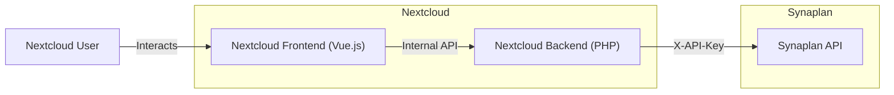

# Synaplan Nextcloud Integration

## Overview
A **Nextcloud App** that brings Synaplan's AI capabilities directly into the Nextcloud file manager.

## Features

| Feature | Description | Entry Point |
|---------|-------------|-------------|
| **Summarize** | Generate summaries of documents | File context menu |
| **Translate** | Translate documents to other languages | File context menu |
| **Document Chat** | Ask questions about a specific file (RAG) | File sidebar tab |
| **Research Chat** | General AI chat (web search, knowledge) | Top navigation / Sidebar |
| **Open in Synaplan** | Jump to full Synaplan web UI | Settings + Chat panels |

## User Experience Goals
- **Zero friction**: One click to summarize or translate.
- **Context-aware**: Document Chat knows what file you're looking at.
- **Escape hatch**: Users can always "Open in Synaplan" for the full experience.
- **Non-blocking**: Long operations show progress, don't freeze the UI.

## Architecture

## Planning Documents

1.  [**Setup Guide**](./01-SETUP.md) - Local dev environment.
2.  [**API Specs**](./02-API-SPECS.md) - Synaplan endpoints required.
3.  [**MVP Plan**](./03-MVP-PLAN.md) - Step-by-step implementation phases.
4.  [**UX Guide**](./04-UX-GUIDE.md) - Wireframes and user flows.
5.  [**Publishing**](./05-PUBLISHING.md) - App Store submission guide.
6.  [**Repo Structure**](./06-REPO-STRUCTURE.md) - `synaplan-nextcloud` layout.
7.  [**Generic Integration**](./07-GENERIC-INTEGRATION.md) - Strategy for "OpenCloud" and other platforms.

## Vibe Coding Instructions (Claude/Gemini)

When using AI agents to build this, follow this **Iterative Vibe Coding Protocol**:

### 1. Context Loading
Always start a session by loading:
- `@synaplan/AGENTS.md` (Core rules)
- `@synaplan/docs/API_PATTERNS.md` (API standards)
- `@synaplan/_devextras/planning/nextcloud-integration/` (This plan)

### 2. "One Feature, One Flow" Rule
Build in vertical slices, not horizontal layers:
1. **Skeleton**: Settings page that saves credentials.
2. **Summarize**: Context menu → API → Modal result.
3. **Translate**: Context menu → API → Modal result.
4. **Document Chat**: Sidebar → Streaming chat.
5. **Research Chat**: Navigation item → Full chat UI.

### 3. The "Check-Then-Code" Loop
1. **Check**: "What does the Nextcloud API expect?"
2. **Plan**: "I will create file X with content Y."
3. **Code**: Generate minimal working code.
4. **Verify**: Test in browser. Does it work?

### 4. Synaplan API First
Before touching Nextcloud code, verify the Synaplan endpoint works via `curl`. If missing, build the Synaplan backend first.

### 5. No Slop
- No huge libraries if fetch works.
- No abstractions for the MVP.
- Strict typing (PHP 8.3+, TS).
- Comments explain *why*, not *what*.
