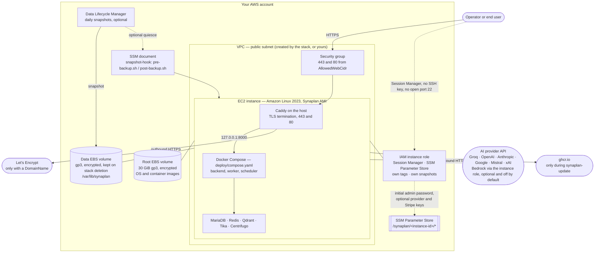

# Architecture of the Synaplan CloudFormation templates

AWS Marketplace requires an architecture diagram per CloudFormation template.
Both templates deploy the same thing; they differ only in who owns the network.

| Template | Creates the network | Use it when |
| -------- | ------------------- | ----------- |
| `synaplan-new-vpc.yaml` | Yes — VPC, public subnet, internet gateway, route table | You want a self-contained installation and have no VPC to fit it into. |
| `synaplan-existing-vpc.yaml` | No — you name a VPC and a subnet | You already run a VPC, a VPN, or a load balancer that Synaplan has to sit behind. |

`marketplace-roles.yaml` in this directory is not a delivery template and is not
part of the listing: it creates the two IAM roles in our own seller account, is
deployed once by hand, and is never launched by a buyer.

## The deployed stack

## What each resource is for

**EC2 instance.** The whole application. Minimum 4 vCPU and 8 GB of memory, so
`m7i.xlarge` is the default and `c7i.xlarge` the floor. Graviton
(`c7g`/`m7g`) works with the arm64 AMI. IMDSv2 is required; IMDSv1 is off.

**Two EBS volumes, both encrypted.** The root volume carries the operating
system and the pre-pulled container images and is destroyed with the instance.
The data volume carries the database, uploads, vectors, generated secrets and
`deploy/.env`; it is mounted at `/var/lib/synaplan` and is snapshotted, not
deleted, when the stack goes away. Replacing the instance therefore loses
nothing.

**Security group.** Port 443 for the application and port 80 for the redirect to
it and for the Let's Encrypt HTTP-01 challenge, both from `AllowedWebCidr`
only. No port 22: a shell comes from Session Manager instead.

**IAM instance role.** `AmazonSSMManagedInstanceCore` for Session Manager, plus
four narrow permissions: write and read parameters under `/synaplan/*`, read the
instance's own tags and volumes, and create a tagged snapshot of its own data
volume. Nothing here can reach another instance, another volume, or another
account's data. The parameter path cannot be narrowed further than the prefix,
because the instance id that would narrow it does not exist until after the role
that the instance needs in order to exist.

**SSM Parameter Store.** Where the generated administrator password is published
as a `SecureString`, and where an operator can put an AI provider key or their
own Stripe keys without signing in or opening a shell.

**SSM document and Data Lifecycle Manager.** The document quiesces Synaplan
through the portable `pre-backup.sh` / `post-backup.sh` hooks. DLM takes a daily
snapshot of the data volume; by default it is crash-consistent, and
`QuiesceForDailySnapshots` wires the document in front of it. That is off by
default because DLM allows a pre-script only 120 seconds, which a large
installation's database dump exceeds. `sudo synaplan-snapshot` on the instance
does the same thing with no time limit and is the recommended path before a
risky change.

## Deliberate omissions

Each of these is a service the architecture does **not** need, and the monthly
cost it does not incur:

| Not used | Instead | Saved |
| -------- | ------- | ----- |
| NAT gateway | Public subnet with an internet gateway | ~32 USD/month |
| Application Load Balancer | Caddy terminates TLS on the instance | ~18 USD/month |
| Secrets Manager | SSM Parameter Store, standard tier | 0.40 USD per secret/month |
| RDS, ElastiCache, OpenSearch, EFS | Containers on the instance | Substantial |
| ECR | Images come from ghcr.io | Storage and transfer |
| Route 53 hosted zone | Bring your own DNS record | 0.50 USD/month |

What remains is the instance, its two volumes, the snapshot storage, and the
public IPv4 address — all billed by AWS, none by us.

## Outbound connections the installation makes

Disclosed because AWS Marketplace requires every external dependency to be
named, and because a locked-down VPC has to allow them deliberately:

- **The AI provider you configure.** Synaplan cannot answer anything without a
  provider key. The key is yours, billed by that provider, and never leaves the
  instance.
- **Let's Encrypt**, only when `DomainName` is set, to issue and renew the
  certificate.
- **ghcr.io**, only while `synaplan-update` runs. A normal boot starts from the
  images baked into the AMI and reaches nothing.
- **raw.githubusercontent.com**, for the update manifest that tells the admin UI
  whether a newer release exists. A static file, fetched without an instance
  identifier; the check can be turned off.

## First launch

1. Create the stack. `AdminEmail` and `DomainName` are optional but recommended.
2. If you set a domain, create the A record from the `DnsRecordToCreate` output.
   Until it resolves, Synaplan serves a self-signed certificate.
3. Read the administrator password with the command in the
   `AdministratorPassword` output. It works once: the first sign-in has to
   replace it before the application does anything else.
4. Sign in at the `WebUrl` output and add an AI provider key under
   Admin > AI Providers.
