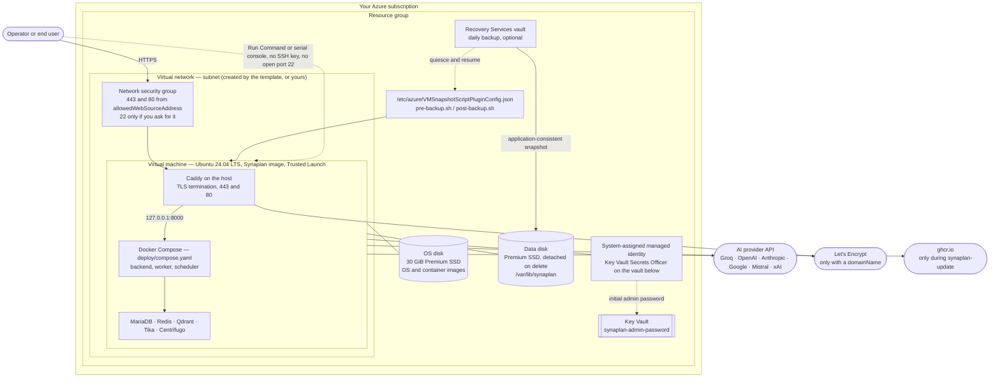

# Architecture of the Synaplan ARM template

Azure Marketplace requires an architecture diagram for a solution template offer,
and the "Deploy to Azure" button in [docs/INSTALLATION.md](../../../docs/INSTALLATION.md)
deploys exactly the template described here.

One template, not two: unlike CloudFormation, ARM can create a virtual network or
adopt an existing one from the same file, so `virtualNetworkNewOrExisting`
replaces the `synaplan-new-vpc` / `synaplan-existing-vpc` pair the AWS adapter
needs.

| File | What it is |
| ---- | ---------- |
| `mainTemplate.json` | The deployment itself. |
| `createUiDefinition.json` | The form the Azure portal renders instead of a raw parameter list. |

## The deployed resource group

## What each resource is for

**Virtual machine.** The whole application. Minimum 4 vCPU and 8 GB of memory, so
`Standard_D4s_v5` is the default. The `Standard_D*ps_v5` sizes are Arm64 and need
the `synaplan-arm64` image; the container images are multi-arch, so nothing else
changes. Trusted Launch with secure boot and a vTPM is on, which is also what the
enhanced backup policy below requires.

**Two managed disks.** The OS disk carries the operating system and the pre-pulled
container images and is destroyed with the VM. The data disk carries the database,
uploads, vectors, generated secrets and `deploy/.env`; it is attached at LUN 0,
mounted at `/var/lib/synaplan`, and set to `Detach` rather than `Delete`, so
replacing the VM loses nothing.

**Network security group.** Port 443 for the application and port 80 for the
redirect to it and for the Let's Encrypt HTTP-01 challenge, both from
`allowedWebSourceAddress` only. No port 22 unless `allowedSshSourceAddress` is
set: a shell comes from Azure Run Command or the serial console instead. The group
is attached to the network interface, not to the subnet, so an existing virtual
network keeps whatever rules it already has.

**System-assigned managed identity.** One role assignment, Key Vault Secrets
Officer, scoped to the one vault this deployment creates. It is how the first boot
publishes the generated administrator password without a credential on disk, and
how `synaplan-snapshot` authenticates the Azure CLI. Nothing here can reach
another VM, another vault, or another subscription.

**Key Vault.** Where the generated administrator password is published as
`synaplan-admin-password`. RBAC-authorised and soft-delete enabled. The same
password is also readable straight off the VM with
`sudo synaplan-admin-password`, so losing access to the vault never locks anyone
out of their own installation.

**Recovery Services vault.** A daily enhanced backup policy protecting the VM. The
image ships `/etc/azure/VMSnapshotScriptPluginConfig.json`, which points Azure
Backup at the portable `pre-backup.sh` / `post-backup.sh` hooks, so the snapshot
captures a quiesced installation that already carries its own restorable
artifacts rather than a copy taken mid-write. `sudo synaplan-snapshot` starts the
same job on demand.

## Deliberate omissions

Each of these is a service the architecture does **not** need, and the monthly
cost it does not incur:

| Not used | Instead | Saved |
| -------- | ------- | ----- |
| NAT gateway | Public IP with outbound access | ~32 EUR/month |
| Application Gateway or Load Balancer | Caddy terminates TLS on the VM | ~20 EUR/month |
| Azure Database for MySQL, Cache for Redis, AI Search | Containers on the VM | Substantial |
| Azure Container Registry | Images come from ghcr.io | Storage and transfer |
| Azure DNS zone | Bring your own DNS record | ~0.45 EUR/month |
| Bastion host | Run Command and the serial console | ~120 EUR/month |

What remains is the VM, its two disks, the backup storage and the public IPv4
address — all billed by Azure, none by us.

## Outbound connections the installation makes

Disclosed because Marketplace certification requires every external dependency to
be named, and because a locked-down virtual network has to allow them
deliberately:

- **The AI provider you configure.** Synaplan cannot answer anything without a
  provider key. The key is yours, billed by that provider, and never leaves the
  VM.
- **Let's Encrypt**, only when `domainName` is set, to issue and renew the
  certificate.
- **ghcr.io**, only while `synaplan-update` runs. A normal boot starts from the
  images baked into the marketplace image and reaches nothing.
- **raw.githubusercontent.com**, for the update manifest that tells the admin UI
  whether a newer release exists. A static file, fetched without an instance
  identifier; the check can be turned off.

## Customer usage attribution

`mainTemplate.json` contains an empty nested deployment named
`pid-bed9262c-702d-4475-b82e-13f054662a0d-partnercenter`. It creates nothing and
costs nothing; Azure records it so Microsoft can attribute the deployment to this
offer. The GUID has to be registered in Partner Center before the solution
template offer goes live — see
[docs/AZURE_MARKETPLACE_LISTING.md](../../../docs/AZURE_MARKETPLACE_LISTING.md).

## First deployment

1. Deploy the template. `adminEmail` and `domainName` are optional but
   recommended.
2. If you set a domain, create the A record from the `dnsRecordToCreate` output.
   Until it resolves, Synaplan serves a self-signed certificate.
3. Read the administrator password with the command in the
   `revealAdministratorCredentials` output, or with `sudo synaplan-admin-password`
   on the VM. It works once: the first sign-in has to replace it before the
   application does anything else.
4. Sign in at the `webUrl` output and add an AI provider key under
   Admin > AI Providers.
