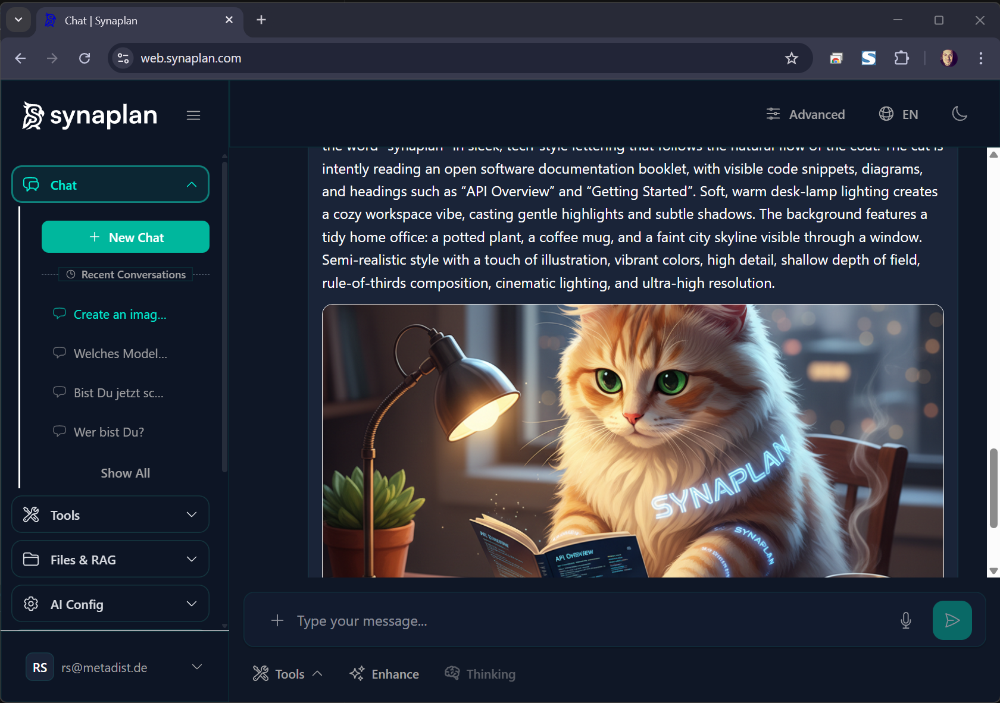

# Features Overview

Everything Synaplan can do.

## AI Chat



Multi-provider AI conversations:

- **Local**: Ollama (gpt-oss, llama, mistral, etc.)
- **Cloud**: OpenAI, Anthropic, Groq, Google Gemini
- **Switching**: Change models per conversation
- **Context**: Maintains conversation history

## RAG System

Semantic document search and retrieval:

- Upload any document format
- Automatic text extraction (Tika)
- Vector embeddings (bge-m3, 1024 dim)
- Cosine similarity search
- AI-augmented answers

→ [Full RAG documentation](RAG.md)

## Chat Widget

Embeddable chat for any website:

- Single script tag embed
- Customizable appearance
- Lazy loading
- Rate limiting
- Domain whitelisting

→ [Full Widget documentation](WIDGET.md)

## WhatsApp Integration

Meta Business API support:

- Send and receive messages
- Multi-phone number support
- Media handling
- Audio transcription
- Anonymous usage

→ [Full WhatsApp documentation](WHATSAPP.md)

## Email Channel

AI-powered email responses:

- Topic-based routing
- Chat context management
- Spam protection
- Rate limiting

→ [Full Email documentation](EMAIL.md)

## Document Processing

Extract content from:

| Format | Engine |
|--------|--------|
| PDF, Word, Excel, PowerPoint | Apache Tika |
| Images (PNG, JPEG, etc.) | Tesseract OCR |
| Audio (MP3, WAV, etc.) | Whisper.cpp |

## File Management

- Upload and organize files
- Private by default
- Public sharing with tokens
- Expiry dates
- Group organization

## User Management

- JWT authentication
- Role-based access
- Subscription tiers
- Rate limiting
- API keys for integrations

## App Modes

- **Easy Mode**: Simplified interface for casual users
- **Advanced Mode**: Full features for power users

## Optional: AI Memories

> **Requires separate installation**: [synaplan-memories](https://github.com/metadist/synaplan-memories) (Apache-2.0)

Enable the AI to remember user preferences and context across sessions:

- **User profiling** — Track preferences, interests, interaction patterns
- **Conversation memory** — Persistent context across chat sessions
- **Semantic search** — Vector-based memory retrieval via Qdrant

### Quick Setup

```bash
git clone https://github.com/metadist/synaplan-memories
cd synaplan-memories
docker compose up -d
```

Then configure in `synaplan/backend/.env`:

```bash
QDRANT_SERVICE_URL=http://synaplan-qdrant-service:8090
QDRANT_SERVICE_API_KEY=your_secret_key
```

**This is completely optional** — Synaplan works fully without it.
