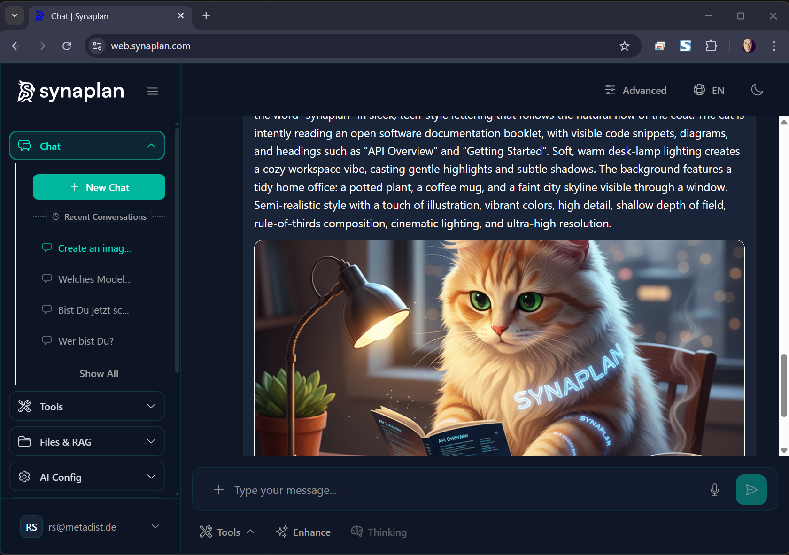

# Features Overview

Everything Synaplan can do.

## AI Chat

Multi-provider AI conversations:

- **Local**: Ollama (gpt-oss, llama, mistral, etc.)
- **Cloud**: OpenAI, Anthropic, Groq, Google Gemini
- **Switching**: Change models per conversation
- **Context**: Maintains conversation history
- **Streaming**: Token-by-token responses over SSE

## Multi-Task Routing

Complex requests are decomposed into a plan instead of a single AI call:

- **AI planner** — splits a message into capability nodes (extract → summarize → generate media → compose reply) as a small task DAG
- **Live task cards** — each step streams its progress into the chat UI while it runs
- **Smart classification** — rule-based routing (per-topic task prompts) plus an AI sorter for topic + language detection
- **Multi-file delivery** — a single request can return several generated files, across chat, WhatsApp, email, and webhooks
- **Safe rollout** — shadow mode plans without executing; existing installs keep the classic single-handler path until enabled

Configuration: [CONFIGURATION.md → Multi-Task Routing](CONFIGURATION.md#multi-task-routing-bconfig)

## RAG System

Semantic document search and retrieval:

- Upload any document format
- Automatic text extraction (Tika)
- Vector embeddings (bge-m3, 1024 dim)
- Cosine similarity search
- AI-augmented answers

→ [Full RAG documentation](RAG.md)

## Chat Widget

Embeddable chat for any website:

- Single script tag embed
- Customizable appearance
- Lazy loading
- Rate limiting
- Domain whitelisting
- Live support: human takeover + typing indicators (WebSockets)

→ [Full Widget documentation](WIDGET.md)

## Live Support & Realtime

WebSocket layer built on **Centrifugo + Redis**:

- **Human takeover** — operators can take over any widget conversation from the AI, live
- **Typing indicators** — visitors and operators see each other typing in real time
- **Operator notifications** — instant alerts for new widget messages
- **Same-origin WebSockets** — browsers connect via `/connection/websocket`, no CORS setup
- **Cluster-ready** — all nodes share one Redis, so events reach browsers on any node

→ [Full Realtime documentation](REALTIME.md)

## WhatsApp Integration

Meta Business API support:

- Send and receive messages
- Multi-phone number support
- Media handling
- Audio transcription
- Anonymous usage

→ [Full WhatsApp documentation](WHATSAPP.md)

## Email Channel

AI-powered email responses:

- Topic-based routing
- Chat context management
- Spam protection
- Rate limiting

→ [Full Email documentation](EMAIL.md)

## Document Processing

Extract content from:

| Format | Engine |
|--------|--------|
| PDF, Word, Excel, PowerPoint | Apache Tika |
| Images (PNG, JPEG, etc.) | Tesseract OCR |
| Audio (MP3, WAV, etc.) | Whisper.cpp |

## File Management

- Upload and organize files
- Private by default
- Public sharing with tokens
- Expiry dates
- Group organization

## User Management

- JWT authentication
- Role-based access
- Subscription tiers
- Rate limiting
- API keys for integrations

## App Modes

- **Easy Mode**: Simplified interface for casual users
- **Advanced Mode**: Full features for power users

## AI Memories & Qdrant

Qdrant is included in `docker-compose.yml` and powers:

- **User profiling** — Track preferences, interests, interaction patterns
- **Conversation memory** — Persistent context across chat sessions
- **Semantic search** — Vector-based memory and document retrieval
- **Feedback system** — False-positive detection and learning

### Configuration

In `backend/.env`:

Qdrant runs as an internal Docker service — no configuration needed beyond the default `QDRANT_URL=http://qdrant:6333` in `.env`.

**This is optional** — Synaplan works fully without it (memories and vector search will be disabled).
