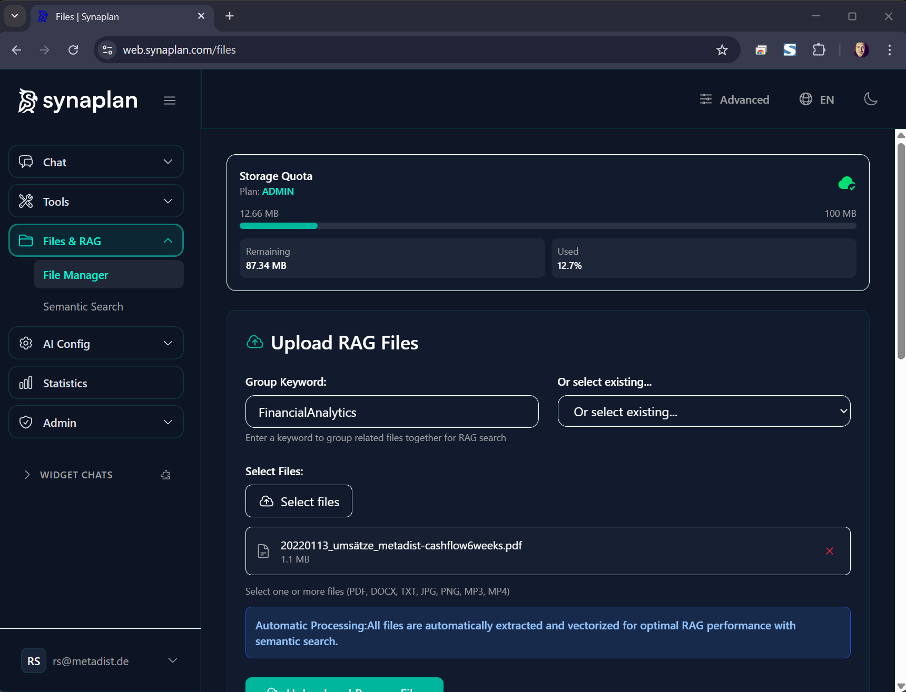

# RAG System

Retrieval-Augmented Generation (RAG) for semantic document search.



## Overview

Synaplan's RAG system lets you:
- Upload documents (PDF, Word, Excel, images, audio)
- Automatically extract and vectorize content
- Search semantically (by meaning, not just keywords)
- Use document context in AI conversations

---

## How It Works

```
Upload → Extract → Vectorize → Store → Search → Generate
```

1. **Upload** - Drop files into the system
2. **Extract** - Tika extracts text; OCR for images; Whisper for audio
3. **Vectorize** - bge-m3 creates 1024-dimensional embeddings
4. **Store** - MariaDB VECTOR type stores embeddings natively
5. **Search** - Cosine similarity finds relevant documents
6. **Generate** - AI uses retrieved context to answer questions

---

## Supported Formats

### Documents
- PDF, Word (.doc, .docx)
- Excel (.xls, .xlsx)
- PowerPoint (.ppt, .pptx)
- Plain text, Markdown, HTML

### Images (with OCR)
- PNG, JPEG, GIF, WebP
- TIFF, BMP

### Audio (with Whisper)
- MP3, WAV, OGG, M4A
- OPUS, FLAC, WebM, AAC, WMA

---

## Processing Levels

When uploading, choose a processing level:

| Level | What Happens | Use Case |
|-------|--------------|----------|
| **Extract Only** | Text extraction, no vectors | Quick preview |
| **Extract + Vectorize** | Full RAG indexing | Standard search |
| **Full Analysis** | AI summarization + vectors | Deep analysis |

---

## Searching

### Semantic Search
Type natural language queries. The system finds documents by meaning:

- "quarterly sales reports" → finds revenue docs
- "customer complaints about shipping" → finds support tickets
- "how to reset password" → finds help articles

### Search Options
- **Threshold** - Minimum similarity score (0.0-1.0)
- **Limit** - Max results to return
- **Groups** - Filter by document groups

---

## Sharing

Documents are **private by default**.

### Share Options
- **Public link** - Anyone with URL can view
- **Expiry** - Auto-revoke after date
- **Token-based** - Secure sharing tokens

---

## Configuration

In `backend/.env`:

```bash
# Embedding model (via Ollama)
# bge-m3 is pulled automatically

# Search defaults
RAG_DEFAULT_THRESHOLD=0.5
RAG_DEFAULT_LIMIT=10
```

---

## API Endpoints

```bash
# Upload document
POST /api/v1/files/upload

# Search documents
POST /api/v1/rag/search
{
  "query": "your search query",
  "threshold": 0.5,
  "limit": 10
}

# Get document
GET /api/v1/files/{id}
```

---

## Best Practices

1. **Organize with groups** - Tag documents for filtered search
2. **Use descriptive names** - Helps AI understand context
3. **Process audio** - Whisper transcription enables voice search
4. **Set thresholds** - Higher = more relevant, fewer results

---

## Technical Details

- **Embedding Model**: bge-m3 (1024 dimensions)
- **Vector Storage**: MariaDB 11.8 native VECTOR type
- **Similarity**: VEC_DISTANCE_COSINE function
- **Text Extraction**: Apache Tika
- **OCR**: Tesseract (via Tika)
- **Audio**: Whisper.cpp with FFmpeg
