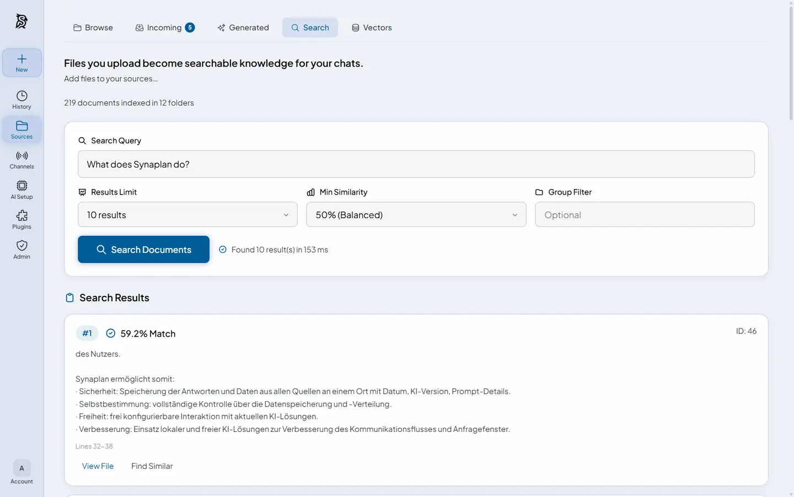

# RAG System

Retrieval-Augmented Generation (RAG) for semantic document search.



## Overview

Synaplan's RAG system lets you:
- Upload documents (PDF, Word, Excel, images, audio)
- Automatically extract and vectorize content
- Search semantically (by meaning, not just keywords)
- Use document context in AI conversations

---

## How It Works

```
Upload → Extract → Vectorize → Store → Search → Generate
```

1. **Upload** - Drop files into the system
2. **Extract** - Tika (default) or optional Docling extracts text; OCR for images; Whisper for audio
3. **Vectorize** - bge-m3 creates 1024-dimensional embeddings
4. **Store** - MariaDB VECTOR type stores embeddings natively
5. **Search** - Cosine similarity finds relevant documents
6. **Generate** - AI uses retrieved context to answer questions

---

## Supported Formats

### Documents
- PDF, Word (.doc, .docx, .rtf, .odt)
- Excel (.xls, .xlsx, .ods)
- PowerPoint (.ppt, .pptx, .odp)
- Apple iWork (.pages, .numbers, .key) — converted via the office engine when it is on
- Spreadsheets and decks are extracted sheet-by-sheet / slide-by-slide (A1 coordinates, speaker notes)
- Plain text, Markdown, HTML

### Images (with OCR)
- PNG, JPEG, GIF, WebP
- TIFF, BMP

### Audio (with Whisper)
- MP3, WAV, OGG, M4A
- OPUS, FLAC, WebM, AAC, WMA

---

## Processing Levels

When uploading, choose a processing level:

| Level | What Happens | Use Case |
|-------|--------------|----------|
| **Extract Only** | Text extraction, no vectors | Quick preview |
| **Extract + Vectorize** | Full RAG indexing | Standard search |
| **Full Analysis** | AI summarization + vectors | Deep analysis |

---

## Searching

### Semantic Search
Type natural language queries. The system finds documents by meaning:

- "quarterly sales reports" → finds revenue docs
- "customer complaints about shipping" → finds support tickets
- "how to reset password" → finds help articles

### Search Options
- **Threshold** - Minimum similarity score (0.0-1.0)
- **Limit** - Max results to return
- **Groups** - Filter by document groups

### Reranking
After embedding search, an optional rerank model can reorder a larger
candidate set and keep the top `k`. It is **off** by default.

1. Storage fetches `min(k × RERANK.CANDIDATES_MULTIPLIER, 100)` hits.
2. The bound catalog model (TEI, Jina, Cohere or Voyage) scores them
   within `RERANK.LATENCY_BUDGET_MS`.
3. On success the top `k` are returned with an extra `rerank_score`.
4. On timeout, HTTP error or empty output, the first `k` stay in
   embedding order. Chat still answers.

`RERANK.LLM_FALLBACK=1` uses the summary model only when **no** rerank
model is bound — not when the HTTP call fails. Configure and test under
**Operate → AI infrastructure → Reranking**.

Compare off vs on against a user's vector store:

```bash
docker compose exec -T backend php bin/console app:rag:eval-rerank \
  --user=<id> --k=5 --report=var/rerank-eval.md
```

The report lists recall@5, MRR, p50/p95 latency and fallback counts.
The seeded default stays `0` until a live report shows recall@5 up and
p95 inside the budget.

The command needs an active adapter for the "on" pass: bind a rerank model
(or enable the chat-model fallback) first, otherwise it exits with an error
instead of recording an "on" run that equals "off". It temporarily sets
`PLUGS.RERANK.ENABLED=1` while the "on" pass runs and restores the previous
value afterwards — on a busy instance, run it off-peak.

---

## Sharing

Documents are **private by default**.

### Share Options
- **Public link** - Anyone with URL can view
- **Expiry** - Auto-revoke after date
- **Token-based** - Secure sharing tokens

---

## Configuration

In `backend/.env`:

```bash
# Embedding model (via Ollama)
# bge-m3 is pulled automatically

# Search defaults
RAG_DEFAULT_THRESHOLD=0.5
RAG_DEFAULT_LIMIT=10
```

---

## API Endpoints

```bash
# Upload document
POST /api/v1/files/upload

# Search documents
POST /api/v1/rag/search
{
  "query": "your search query",
  "threshold": 0.5,
  "limit": 10
}

# Get document
GET /api/v1/files/{id}
```

---

## Best Practices

1. **Organize with groups** - Tag documents for filtered search
2. **Use descriptive names** - Helps AI understand context
3. **Process audio** - Whisper transcription enables voice search
4. **Set thresholds** - Higher = more relevant, fewer results

---

## Sharing and search scopes

A RAG query is always a non-empty list of **owner scopes**. Your own files
are one scope. When `IAM.SHARING_ENABLED` is on, each knowledge folder (or
referenced chat file) shared with you at **Can use** or higher becomes
another scope. There is never an unfiltered search.

Hits from someone else's files are marked `shared: true` and include the
owner's name. **Can view** alone never adds chunks to a search.

---

## Technical Details

- **Embedding Model**: bge-m3 (1024 dimensions)
- **Vector Storage**: MariaDB 11.8 native VECTOR type
- **Similarity**: VEC_DISTANCE_COSINE function
- **Text Extraction**: Apache Tika by default. Optional Docling (`docling` Compose profile + Extraction tab) returns markdown with tables and headings; those files are chunked heading-aware. See [CONFIGURATION.md](CONFIGURATION.md#ai-plugs-plugs).
- **OCR**: Tesseract (via Tika); Docling can OCR when the sidecar is on
- **Audio**: Whisper.cpp with FFmpeg
