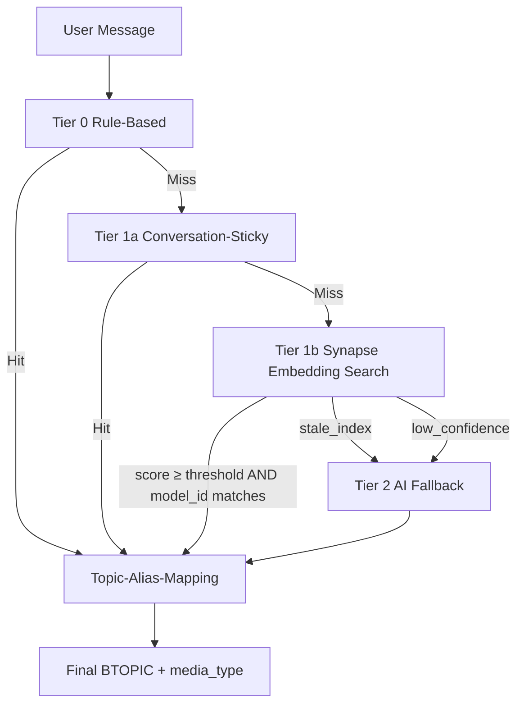

# Synapse Routing

Synapse Routing is Synaplan's intelligent message classification system that uses **vector similarity** to determine what a user is asking about — without making an expensive AI call for every single message.

## How It Works

When a user sends a message, Synaplan needs to figure out what kind of request it is (general chat, image generation, coding help, etc.) before routing it to the right AI handler. Previously, this required a full AI sorting call for every message (~500–2000ms, ~2000 tokens).

Synapse Routing replaces this with a multi-tier system:

### Tier 0: Rule-Based (~5ms)

If a topic defines explicit `BSELECTION_RULES` (hard if/then matchers), those win immediately and skip the embedding search and AI fallback. Use this only for unambiguous keyword cases (e.g. "always route messages containing 'invoice' to billing").

### Tier 1: Embedding Search (~50ms)

1. The user's message is converted to an embedding vector (active VECTORIZE model).
2. The vector is compared against pre-indexed topic embeddings in Qdrant.
3. Each indexed point carries the `embedding_model_id` it was produced with — hits from a different model than the active one are filtered as **stale** before scoring.
4. If the top fresh match has a confidence score ≥ `SYNAPSE_CONFIDENCE_THRESHOLD` (default `0.38`), the message is routed directly.
5. **Conversation-Sticky**: if the previously routed topic is still among the candidates with score ≥ `0.32`, it is preferred to avoid topic-thrashing mid-conversation.

### Tier 2: AI Fallback

When the embedding confidence is too low (`low_confidence`), no candidates remain after stale filtering (`stale_index`), there are no search results (`no_search_results`), or anything else goes wrong (`exception`, `empty_message`, `empty_embedding`), Synapse automatically falls back to the traditional AI-based sorting — so accuracy is never compromised.



## Topic Taxonomy (Synapse Routing v2)

Synapse v2 introduces **granular routing topics** for higher recall. Downstream handlers, file group keys (`TASKPROMPT:<topic>`) and historical `BMESSAGES.BTOPIC` values continue to use the **legacy canonical topics** — they are mapped automatically by `TopicAliasResolver`.

| Granular topic       | Canonical topic | Implied `BMEDIA` |
| -------------------- | --------------- | ---------------- |
| `general-chat`       | `general`       | —                |
| `coding`             | `general`       | —                |
| `image-generation`   | `mediamaker`    | `image`          |
| `video-generation`   | `mediamaker`    | `video`          |
| `audio-generation`   | `mediamaker`    | `audio`          |
| `docsummary`         | `docsummary`    | —                |
| `officemaker`        | `officemaker`   | —                |

The granular name is preserved on the routing result as `granular_topic` for analytics; downstream code only ever sees the canonical `topic`.

## Per-Topic Fields

Each routable prompt carries three independent text fields that the user controls in **Config → Task Prompts**:

| Field | Column | Used for | Help |
| ----- | ------ | -------- | ---- |
| **Description** | `BSHORTDESC` | AI sort + Synapse embedding | "When does this topic apply?" — keep it 1–2 sentences. |
| **Routing Rules** | `BSELECTION_RULES` | Tier-0 rule-based matching | Hard if/then matchers; overrides embedding + AI. Optional. |
| **Keywords / Synonyms** | `BKEYWORDS` | Synapse embedding only | Comma- or newline-separated terms folded into the embedding text. Boosts recall without bloating the AI sort prompt. |
| **Enabled** | `BENABLED` | Routing pool filter | Soft-disable. Disabled topics are removed from Qdrant on next reindex and never returned by the routing pool. |

### Embedding Text Preview

`SynapseIndexer::buildEmbeddingText()` concatenates these fields into the exact text that gets embedded:

```
Topic: coding
Description: User asks about programming, code review or debugging.
Keywords: php, python, javascript, debug, refactor, framework, ...
```

The same text is shown live in the prompt editor under **Synapse Embedding Text** so admins can verify what bge-m3 (or whatever VECTORIZE model is active) actually sees.

## Embedding Model Metadata

Every Qdrant point carries the metadata needed to detect a stale entry without re-embedding it:

| Payload field         | Purpose |
| --------------------- | ------- |
| `embedding_model_id`  | Active model id at index time. SynapseRouter compares this against the current active model and treats hits with different ids as stale. |
| `embedding_provider`  | Provider name (`cloudflare`, `openai`, `ollama`, …) for audit + admin UI. |
| `embedding_model`     | Model name (`@cf/baai/bge-m3`, `text-embedding-3-large`, …). |
| `vector_dim`          | Output dimensionality. |
| `source_hash`         | SHA-256 over `(text, model_id, dim)` — drives **idempotent re-indexing**: when neither the topic content nor the embedding stack changed, `synapse:index` short-circuits without calling the embedding API. |
| `indexed_at`          | ISO timestamp for the admin UI. |

## Model Switch Workflow

When you switch the default VECTORIZE model:

1. **Same dimensionality** (e.g. `bge-m3` 1024 → another 1024-dim model):
   ```bash
   php bin/console synapse:index --force
   ```
   Re-embeds every topic against the new model. The collection itself doesn't need to be touched.

2. **Different dimensionality** (e.g. `bge-m3` 1024 → `text-embedding-3-large` 3072):
   ```bash
   php bin/console synapse:index --recreate
   ```
   Drops the Qdrant collection, recreates it with the new dimension, and re-embeds every topic. `--recreate` implies `--force`.

Both flows are also available from the **Routing Configuration** admin page (one-click `Force Reindex` and `Recreate Collection` buttons, with a confirmation dialog for the destructive variant).

The admin status endpoint (`GET /api/v1/admin/synapse/status`) surfaces a `dimensionMismatch` flag and a per-model breakdown so dimension drift is impossible to miss.

## Test-Box / Dry-Run Endpoint

The **Routing Configuration** page exposes a "Test Routing" widget that POSTs to `/api/v1/prompts/test`:

```bash
curl -X POST /api/v1/prompts/test \
  -H 'Content-Type: application/json' \
  -d '{"text":"Wie schreibe ich eine Schleife in PHP?","limit":5}'
```

Response:

```json
{
  "success": true,
  "query": "Wie schreibe ich eine Schleife in PHP?",
  "model": { "provider": "cloudflare", "model": "@cf/baai/bge-m3", "model_id": 42 },
  "candidates": [
    { "topic": "coding", "score": 0.83, "stale": false, "alias_target": "general" },
    { "topic": "general-chat", "score": 0.61, "stale": false, "alias_target": "general" }
  ],
  "latency_ms": 12.4,
  "error": null
}
```

`alias_target` is filled in when the granular topic resolves to a different canonical topic. `stale` is `true` when the indexed point was embedded with a different model than the currently active one. The endpoint is read-only and does **not** mutate state.

The same logic powers `POST /api/v1/admin/synapse/dry-run` (admin-only, identical shape).

## Admin API

`SynapseAdminController` is mounted under `/api/v1/admin/synapse` and protected by `ROLE_ADMIN`:

| Endpoint                                | Description |
| --------------------------------------- | ----------- |
| `GET  /api/v1/admin/synapse/status`     | Active model, collection info, per-model counts, stale-count, dimension-mismatch flag and a per-topic status list. |
| `POST /api/v1/admin/synapse/reindex`    | Synchronous re-index. Body: `{ force?: bool, recreate?: bool, topic?: string }`. |
| `POST /api/v1/admin/synapse/dry-run`    | Dry-run a sample message. Body: `{ text: string, limit?: int }`. |

## CLI

```bash
# Status: collection state, active model, per-model counts, dim warning
php bin/console synapse:index --status

# Default run — re-embeds only topics whose source hash changed
php bin/console synapse:index

# Force re-embedding of every topic (ignore source-hash skip)
php bin/console synapse:index --force

# Dimension switch — drop + recreate collection, re-embed everything
php bin/console synapse:index --recreate

# Include a specific user's custom topics in the run
php bin/console synapse:index --user=42
```

## Configuration

Synapse Routing is a **beta feature and is OFF by default** — every install ships with the proven AI sorter as the active classifier. Operators must explicitly opt-in via the Admin panel under **Config → Routing Configuration** or by toggling the BCONFIG row directly.

| Setting                       | Default | Description |
| ----------------------------- | ------- | ----------- |
| `SYNAPSE_ROUTING_ENABLED`     | `false` | Enable/disable Synapse Routing entirely. While off, every message goes through `MessageSorter` (AI sort). |
| `SYNAPSE_CONFIDENCE_THRESHOLD`| `0.78`  | Minimum cosine similarity for Tier-1 to win over the AI fallback. Kept conservative on purpose so beta installs only short-circuit on high-confidence hits; lower carefully if you want more Tier-1 wins at the cost of accuracy. |

Changes take effect immediately — no restart required.

## Observability

Every routing decision is logged with:

- **source**: `synapse_rule`, `synapse_embedding`, `synapse_sticky` or `synapse_ai_fallback`
- **synapse_score**: The cosine similarity of the top match
- **synapse_fallback_reason**: `low_confidence`, `no_search_results`, `stale_index`, `empty_message`, `empty_embedding`, `exception`
- **synapse_latency_ms**: How long the routing took
- **granular_topic**: The pre-alias granular topic when the alias resolver fired (e.g. `coding` → `general`)

Discord notifications (if enabled) include these metrics alongside the regular classification data. Tier-1 hit-rate over the last 7 days can be derived from `BMESSAGES.BMETA.source` aggregations.

## Performance

| Metric                       | Before (AI Sort) | With Synapse |
| ---------------------------- | ---------------- | ------------ |
| Latency per classification   | 500–2000 ms      | 50–100 ms (Tier 1) |
| Cost per classification      | ~2000 tokens     | ~100 embedding tokens |
| AI calls saved               | 0%               | 70–90%       |

## Architecture

```
backend/src/Service/Message/
├── SynapseRouter.php          # Core routing logic (Tier 0/1 + AI fallback)
├── SynapseIndexer.php         # Topic embedding management + source_hash skip
├── TopicAliasResolver.php     # Granular ↔ canonical topic mapping
├── MessageClassifier.php      # Entry point (calls SynapseRouter)
└── MessageSorter.php          # AI-based sorting (Tier 2 fallback)

backend/src/Controller/
├── PromptController.php       # CRUD + POST /api/v1/prompts/test (dry-run)
└── AdminSynapseController.php # /api/v1/admin/synapse/{status,reindex,dry-run}

backend/src/Command/
└── SynapseIndexCommand.php    # CLI: --status, --force, --recreate, --user

backend/src/Service/VectorSearch/
└── QdrantClient*.php          # synapse_topics collection (recreatable)
```
