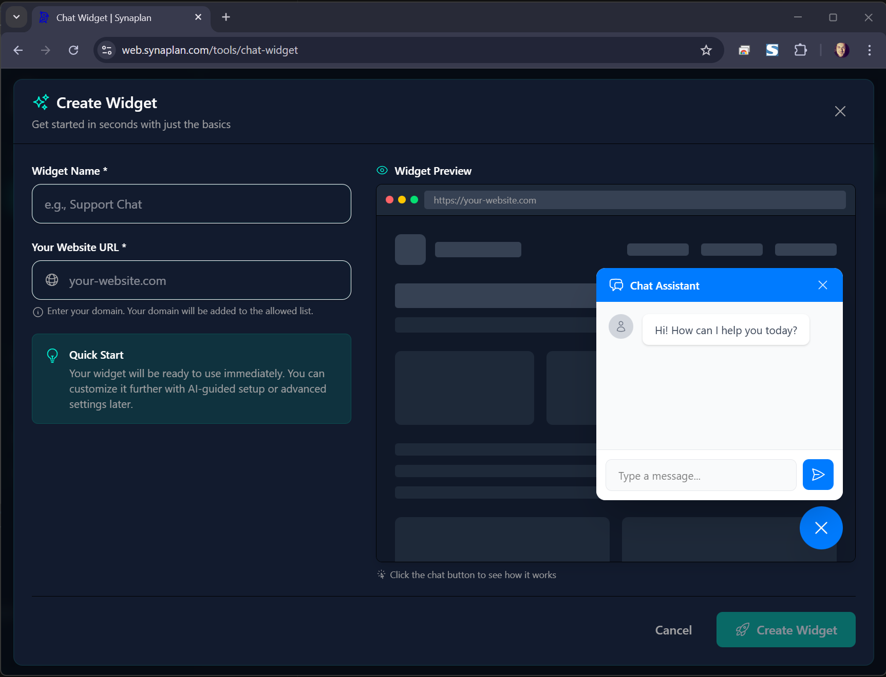

# Embeddable Chat Widget

Add AI chat to any website with a single script tag.



## Quick Start

```html
<script type="module">
  import SynaplanWidget from 'https://your-synaplan-instance.com/widget.js'

  SynaplanWidget.init({
    widgetId: 'wdg_abc123'
  })
</script>
```

That's it! A chat button appears on your page.

---

## Features

- **ES Module** with code-splitting (loads only what's needed)
- **Lazy loading** - Button loads first, chat on click
- **Auto-configuration** - Fetches settings from server
- **Customizable** - Colors, position, icons, themes
- **CORS-ready** - Works across domains
- **Rate limited** - Per subscription level

---

## Configuration Options

```javascript
SynaplanWidget.init({
  // Required
  widgetId: 'wdg_abc123',

  // Appearance
  primaryColor: '#007bff',
  position: 'bottom-right',  // bottom-right, bottom-left
  
  // Behavior
  lazy: true,                // Load chat on click
  autoOpen: false,           // Open chat immediately
  
  // Custom text
  welcomeMessage: 'Hi! How can I help?',
  placeholder: 'Type a message...'
})
```

---

## Creating Widgets

1. Log in to Synaplan
2. Go to **Widgets** section
3. Click **Create Widget**
4. Configure appearance and behavior
5. Copy the embed code

### Widget Settings

| Setting | Description |
|---------|-------------|
| Name | Internal identifier |
| Primary Color | Button and header color |
| Position | Screen corner placement |
| Welcome Message | First message shown |
| Domain Whitelist | Allowed embed domains |
| Rate Limits | Messages per session |

---

## Domain Whitelisting

For security, widgets can be restricted to specific domains:

- `example.com` - Exact match
- `*.example.com` - All subdomains
- Empty = Allow all domains

---

## Embed Code Examples

### Basic

```html
<script type="module">
  import SynaplanWidget from 'https://web.synaplan.com/widget.js'
  SynaplanWidget.init({ widgetId: 'wdg_abc123' })
</script>
```

### With Custom Styling

```html
<script type="module">
  import SynaplanWidget from 'https://web.synaplan.com/widget.js'
  
  SynaplanWidget.init({
    widgetId: 'wdg_abc123',
    primaryColor: '#4CAF50',
    position: 'bottom-left',
    welcomeMessage: 'Welcome! Ask me anything about our products.'
  })
</script>
```

### Deferred Loading

```html
<script type="module">
  import SynaplanWidget from 'https://web.synaplan.com/widget.js'
  
  // Initialize later (e.g., after user consent)
  window.startChat = () => {
    SynaplanWidget.init({
      widgetId: 'wdg_abc123',
      autoOpen: true
    })
  }
</script>

<button onclick="startChat()">Start Chat</button>
```

---

## API Methods

```javascript
// Initialize widget
SynaplanWidget.init(config)

// Open chat programmatically
SynaplanWidget.open()

// Close chat
SynaplanWidget.close()

// Toggle chat
SynaplanWidget.toggle()

// Destroy widget
SynaplanWidget.destroy()
```

---

## Events

```javascript
SynaplanWidget.init({
  widgetId: 'wdg_abc123',
  onOpen: () => console.log('Chat opened'),
  onClose: () => console.log('Chat closed'),
  onMessage: (msg) => console.log('Message:', msg)
})
```

---

## Rate Limits

Widgets respect subscription-level limits:

| Level | Messages/Session | Sessions/Day |
|-------|------------------|--------------|
| FREE | 5 | 10 |
| PRO | 20 | 50 |
| TEAM | 50 | 200 |
| BUSINESS | Unlimited | Unlimited |

---

## Building (Development)

```bash
cd frontend
npm run build:widget    # Outputs to dist-widget/
```

Test locally: open `/widget-test.html` on the dev server (Vite serves it from `frontend/tests/e2e/fixtures/widget-test.html` in dev; test stack mounts the same file).

---

## Troubleshooting

### Widget not appearing

1. Check widgetId is correct
2. Verify domain is whitelisted
3. Check browser console for errors

### CORS errors

1. Ensure `SYNAPLAN_URL` is set correctly in backend
2. Check domain whitelist includes your site

### Styling conflicts

Widget uses Shadow DOM to isolate styles. If issues persist, check for global CSS that might affect the widget container.

---

## Security

- Widget sessions are isolated from main app
- Rate limiting prevents abuse
- Domain whitelisting restricts usage
- No user data stored in widget (unless logged in)
